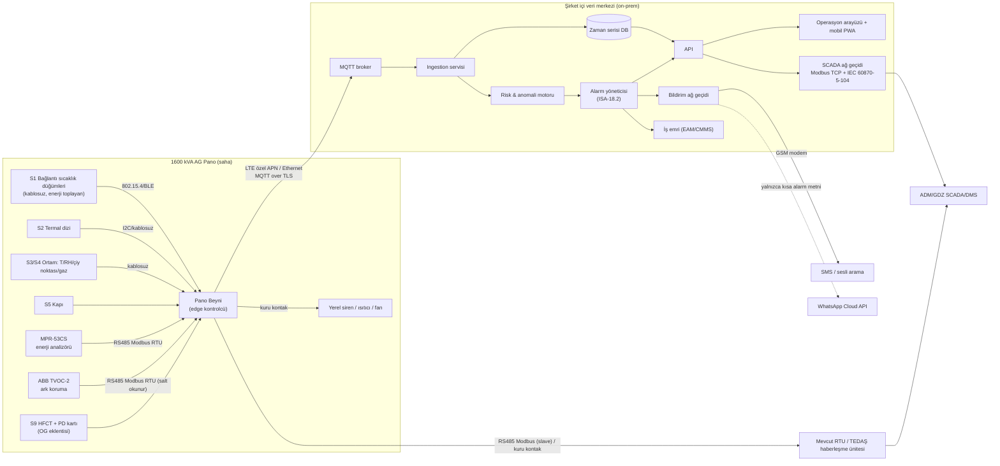
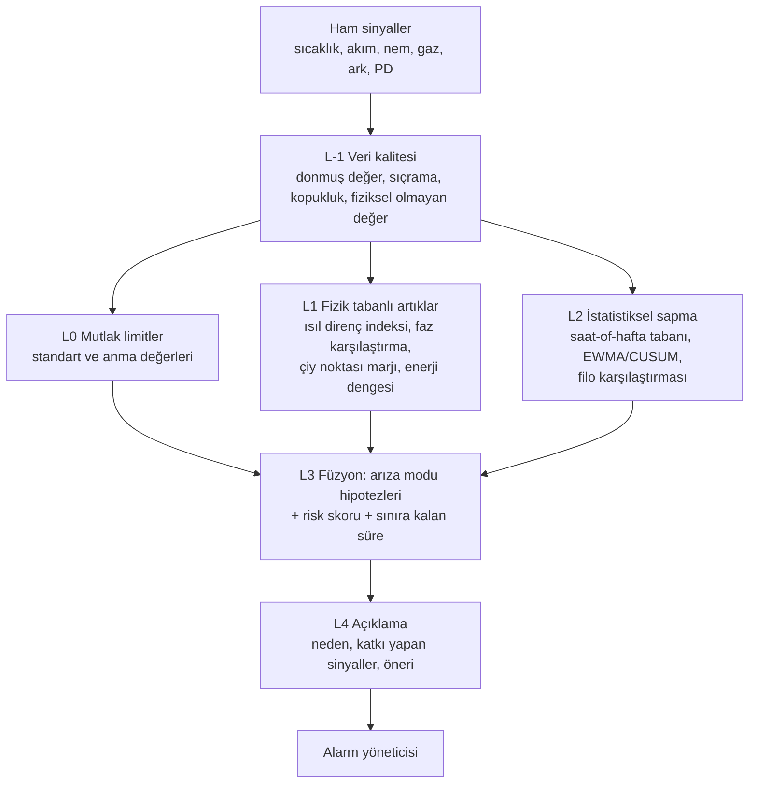

# Grid Up Hackathon — "Pano/Hücre İçi Anomali Erken Uyarı Sistemi"
## Kapsamlı Analiz, Gereksinim Çözümlemesi ve Kazanma Stratejisi Raporu

> **Hazırlanma tarihi:** 10 Eylül 2026 · **Güncelleme:** 11 Eylül 2026 — son teslim **20 Eylül 2026 23:59** olarak netleşti; zaman planı (Bölüm 11), kapsam önceliği, riskler ve yenilik öncelikleri buna göre revize edildi.
> **Kaynaklar:** Komitenin paylaştığı 10 dosyanın tamamı (proje konusu PDF, TEDAŞ AG pano şartnamesi, 1600 kVA teknik özellik tablosu ve çizimi, ABB TVOC-2 katalog + Modbus kılavuzu, ENTES MPR-53CS register haritası, Techimp HFCT30/HFCT50 veri sayfaları, "İstenen Veriler.xlsx") + web araştırması (kaynak listesi en sonda).
> **Gizlilik notu:** Proje konusu dökümanı **"Hizmete Özel | Restricted"** etiketli. GitHub repo'su dışarıdan erişimde 404 döndürüyor (private görünüyor) — **public yapmayın**, dökümanları sosyal medyada/public demo videolarında paylaşmayın.

---

## İçindekiler

0. [Yönetici Özeti (TL;DR)](#0-yönetici-özeti-tldr)
1. [Yarışma Bağlamı: Kim, Neden, Ne Zaman?](#1-yarışma-bağlamı-kim-neden-ne-zaman)
2. [Komite Tam Olarak Ne Talep Ediyor? — Gereksinim Matrisi](#2-komite-tam-olarak-ne-talep-ediyor--gereksinim-matrisi)
3. [Verilen Dökümanların Derin Analizi](#3-verilen-dökümanların-derin-analizi)
4. [Pazardaki Çözümler ve Boşluk Analizi](#4-pazardaki-çözümler-ve-boşluk-analizi)
5. [Diğer Takımlar Muhtemelen Ne Yapacak? (ve Nasıl Öne Geçeriz)](#5-diğer-takımlar-muhtemelen-ne-yapacak-ve-nasıl-öne-geçeriz)
6. [Önerilen Çözüm Mimarisi](#6-önerilen-çözüm-mimarisi)
7. [Saha Uygulanabilirliği, FMEA, Güvenlik ve Standartlar](#7-saha-uygulanabilirliği-fmea-güvenlik-ve-standartlar)
8. [Demo Senaryosu (Final Sunumu)](#8-demo-senaryosu-final-sunumu)
9. [Değerlendirme Kriterlerine Göre Kazanma Stratejisi](#9-değerlendirme-kriterlerine-göre-kazanma-stratejisi)
10. [Teslim Paketi ve Repo Yapısı](#10-teslim-paketi-ve-repo-yapısı)
11. [Zaman Planı ve Görev Dağılımı](#11-zaman-planı-ve-görev-dağılımı)
12. [Proje Riskleri ve Komiteye Sorulacak Sorular](#12-proje-riskleri-ve-komiteye-sorulacak-sorular)
13. [Jüri Soru Bankası](#13-jüri-soru-bankası)
14. [Yenilik Backlog'u (Öne Geçirecek Ekstralar)](#14-yenilik-backlogu-öne-geçirecek-ekstralar)
15. [Ekler: Formüller, Hesaplar, Sentetik Veri Spesifikasyonu](#15-ekler-formüller-hesaplar-sentetik-veri-spesifikasyonu)
16. [Kaynaklar](#16-kaynaklar)

---

## 0. Yönetici Özeti (TL;DR)

> ⏰ **Son teslim: 20 Eylül 2026 Pazar, 23:59** — 11 Eylül sabahından itibaren ~9,5 gün (~230 saat). **Hedef teslim saati 20 Eylül 18:00** (yükleme/erişim sorunlarına tampon). **Özellik dondurma: 17 Eylül 23:59.** Donanım siparişleri **bugün** verilmeli (hafta sonu kargo teslimatı yok). Gün gün plan: [Bölüm 11](#11-zaman-planı-ve-görev-dağılımı).

**Komitenin istediği tek cümlede:** 1600 kVA'lık bir TEDAŞ tipi AG dağıtım panosuna (ve mümkünse OG hücreye) kablo kalabalığını artırmadan eklenebilen, bakım gerektirmeyen, **donanım + gömülü yazılım + merkezi on‑premise izleme + SCADA (Modbus) entegrasyonu + SMS/WhatsApp alarmı** içeren, en az 100 modüle ölçeklenen, **uçtan uca çalışan (sentetik veriyle de olur) bir prototip.** Fikir/sunum seviyesi yeterli değil.

**Dökümanlardan çıkan ve çoğu takımın kaçıracağı 12 kritik içgörü:**

| # | İçgörü | Neden önemli |
|---|---|---|
| 1 | Verilen akım verisi (Excel) **tamamen rastgele gürültü**: lag‑1 otokorelasyon = **0,00**, günlük yük profili yok, 15 dakikada 438 A'ya varan sıçramalar var. | Bu veriyle "normal/anormal" öğrenilemez. Kazanan takım **fiziksel olarak tutarlı kendi sentetik veri üretecini** (yük profili + ısıl model + arıza enjeksiyonu) kuracak. |
| 2 | Aynı veride değerler 90–540 A; 400 A'lık bir DSYA çıkışı varsayılırsa örneklerin **%32'si** anma akımını aşıyor. | Basit eşik kuran takımlar **alarm seline** boğulur. Yük‑normalize tespit şart. |
| 3 | Panoda zaten **ENTES MPR-53CS enerji analizörü** (RS485/Modbus, faz akımları, nötr akımı, THD, min/max) ve **ABB TVOC-2 ark koruma** (Modbus RTU) var/öngörülüyor. | Ana giriş akımı için yeni sensör **gerekmez**; mevcut cihazları Modbus'tan okuyarak maliyet ve kablo kalabalığı düşer. |
| 4 | TVOC-2 bir **SIL-2 koruma cihazıdır** ve arkı <1 ms'de zaten keser. | Bizim değerimiz arkı "tespit etmek" değil: **koruma sisteminin sağlığını izlemek** (sensör arızası = sessizce korumasız pano), olayı konumla bildirmek ve **ark öncesi öncüleri** yakalamak. Koruma devresine **yazma yapılmamalı**. |
| 5 | TVOC-2 fabrikadan **Modbus ID 248 = haberleşme kapalı** gelir; 1–247 arası ayarlanmadan cevap vermez. | Demo/entegrasyon planında detay bilgisi = "problemi doğru anlama" puanı. |
| 6 | Kısmi deşarj (PD) için verilen HFCT sensörleri **topraklama iletkenine / kablo ekranına** takılır, 1–60/80 MHz bant genişliğindedir. 400 V AG sistemde PD fiziksel olarak nadirdir (hava için Paschen minimumu ≈327 V; pratikte 500 V altında beklenmez). | PD modülü **OG hücre / trafo / OG kablo başlığı eklentisi** olarak konumlanmalı; AG pano için ısıl + akım + nem + ark + gaz odaklı olunmalı. Bunu söyleyen takım "problemi doğru anladı" puanını alır. |
| 7 | TEDAŞ şartnamesi pano **üst bölümünde haberleşme üniteleri için bölme ve harici anten çıkışı** öngörüyor (Madde 2.2.8.1.iv) ve modem kullanımına izin veriyor (2.2.11.v). | Kontrol ünitesinin yeri hazır: baralardan uzak, üst bölme. Kablo kaosu ve manyetik alan sorununa şartnameye dayalı cevap. |
| 8 | Şartname, baraların önüne **saydam, alev almaz gözetleme pencereli kapak** istiyor. Polikarbonat/cam **uzun dalga kızılötesini (8–14 µm) geçirmez**. | Kapak dışına termal kamera koyan takımın çözümü sahada **çalışmaz**. Sensör kapak içine veya IR penceresiyle konumlanmalı. |
| 9 | Pano içindeki tüm yalıtkan malzemeler **IEC 60695-11-10 V-0** sınıfında olmalı; kısa devre akımı 1600 kVA'da **38 kA etken / 80 kA tepe**. | Sensör gövdeleri V-0 olmalı, montaj elektrodinamik kuvvetlere dayanmalı — saha uygulanabilirliği puanı. |
| 10 | WhatsApp Business **On-Premises API 23 Ekim 2025'te kapatıldı**; artık yalnızca Meta **Cloud API** var. | "Public cloud yok" şartıyla çelişki! Doğru cevap: birincil kanal **yerel GSM modem ile SMS (tam on-prem)**, WhatsApp ise yalnızca hassas olmayan kısa alarm metniyle ikincil kanal. |
| 11 | Modbus RTU **tek master** protokolüdür. Enerji analizörü zaten bir modem/RTU tarafından sorgulanıyorsa bizim modül aynı hatta ikinci master olamaz. | Mimari "Modbus ağ geçidi/proxy" veya "dinleme modu" olarak tasarlanmalı — entegrasyon puanı. |
| 12 | ADM Elektrik: **26.210 trafo**, SCADA merkezinden uzaktan yönetilen **616 trafo/dağıtım merkezi**. | Trafoların çok küçük bir kısmı uzaktan izleniyor → hedef pazar büyük, çözüm **ucuz** olmalı ve **mevcut RTU/fiber varsaymamalı** (hücresel/LPWAN backhaul). |

**Önerilen çözüm (özet):** *"Pano Beyni"* adını verebileceğimiz, pano üst bölmesine DIN rayına takılan düşük maliyetli MCU tabanlı kenar (edge) kontrolcü + pano içinde **kablosuz/enerji toplayan sıcaklık düğümleri**, **ortam (sıcaklık/nem/çiy noktası/gaz)** düğümü, mevcut **MPR-53CS ve TVOC-2'nin Modbus'tan okunması**, opsiyonel **HFCT tabanlı PD kartı**; kenarda **fizik tabanlı anomali tespiti** (bağlantı başına "ısıl direnç indeksi" + faz karşılaştırma + çiy noktası marjı), merkezde **on-prem** MQTT + zaman serisi DB + risk motoru + ISA-18.2 uyumlu alarm yönetimi + **SMS (GSM modem)/WhatsApp** + **Modbus TCP ve IEC 60870-5-104** SCADA ağ geçidi + pano çizimi üzerinde canlı ısı haritası gösteren operasyon arayüzü. Demo'da 1.000 sanal pano ile ölçek testi.

**Bizi öne geçirecek 5 farklılaştırıcı:**
1. **"Sınıra kalan süre" tahmini:** Mutlak sıcaklık henüz normalken yük‑normalize ısınma artışını yakalayıp *"L2 çıkış‑3 bağlantısı: tahmini 6 gün içinde 70 K sınırı"* diyebilmek (Bölüm 6.5).
2. **Koruma sisteminin sağlık izlemesi:** TVOC-2 sensör durumu/diagnostik register'larını okuyup "arıza koruması sessizce devre dışı" durumunu yakalamak (Bölüm 3.6).
3. **Gerçek register haritalarıyla çalışan simülatörler:** MPR-53CS ve TVOC-2'yi kendi dökümanlarındaki adreslerle pymodbus üzerinde taklit edip, jüriye gerçek bir Modbus istemcisinden (zaman kalırsa IEC 104 test istemcisinden de) okumak.
4. **Ölçülen performans:** Tespit öne alma süresi (saat), yanlış alarm/gün/100 pano, uçtan uca alarm gecikmesi (saniye), 1.000 pano yük testinde CPU/RAM — sayılarla sunmak.
5. **Sahaya hazır mühendislik:** TEDAŞ şartname maddelerine atıflı yerleşim, FMEA tablosu, tek planlı kesintide kurulum prosedürü, V-0 malzeme, manyetik alan ve EMC önlemleri.

---

## 1. Yarışma Bağlamı: Kim, Neden, Ne Zaman?

### 1.1 Organizatörler ve program

- **ADM Elektrik** (Aydın, Denizli, Muğla) ve **GDZ Elektrik** (İzmir, Manisa) — Aydem Enerji grubunun dağıtım şirketleri — **Patika.dev** iş birliğiyle.
- Hackathon, **GridUp Açık İnovasyon / Hızlandırma Programının** bir parçası. Program 9 aylık bir süreç: *ihtiyaç analizi → değerlendirme → girişimci buluşmaları → ideathon → hackathon → datathon → PoC → Demo Day*. İdeathon 20 Ağustos 2026'da İzmir'de yapıldı; Coderspace üzerinde ayrı bir "Grid Up Datathon" da var.
- Programın vaat ettiği: şirket ekipleriyle doğrudan çalışma, teknik/iş modeli mentorluğu, **saha erişimi, veri ve pilot desteği**, doğrulanmış çözümler için **uzun vadeli iş birliği modeli**.

> **Stratejik sonuç:** Jüri aslında "hangi takımla **PoC/pilot** yaparız?" sorusunu soruyor. Parlak ama sahaya taşınamayacak bir demo yerine **pilotlanabilir, maliyeti hesaplanmış, entegrasyonu düşünülmüş** bir çözüm kazanır.

### 1.2 Hackathon künyesi (Patika.dev sayfasına göre)

| Başlık | Bilgi |
|---|---|
| Format | Online |
| Takım | En fazla 4 kişi |
| Program tarihleri | 9 Şubat 2026 – 28 Eylül 2026 (Patika sayfasındaki program bitişi) |
| **Son teslim** | **20 Eylül 2026, 23:59** (takım tarafından teyit edildi) |
| Başvuru son tarihi | 31 Ağustos 2026 |
| Ödüller | 1.: 100.000 TL · 2.: 70.000 TL · 3.: 30.000 TL (toplam 200.000 TL) |
| Süreç | Başvuru → Takım oluşumu → Mentorluk & teknik destek → Demo Day/Final sunumu → Ödül töreni |

> ⚠️ **Takvim:** Son teslim **20 Eylül 2026 23:59**; 11 Eylül itibarıyla **~9,5 gün** var ve son iki gün (19–20 Eylül) hafta sonuna denk geliyor. Patika'daki 28 Eylül teslim değil, program bitişi — final sunumu/Demo Day tarihi ve formatı (canlı mı, video mu, süre) ayrıca teyit edilmeli. **Format online olduğu için jüri büyük ihtimalle önce videoyu ve repo'yu görecek** → demo videosu ve README teslim paketinin en kritik parçaları. Plan: Bölüm 11.

### 1.3 Müşterinin ölçeği (çözümün boyutlandırılması için)

| | ADM Elektrik | GDZ Elektrik |
|---|---|---|
| Bölge | Aydın, Denizli, Muğla | İzmir, Manisa (46 ilçe) |
| Tüketici/abone | ~2,4 milyon | ~2,6 milyon |
| Şebeke | 111.512 km hat, **26.210 trafo** | — |
| SCADA | SCADA merkezi **616 trafo ve dağıtım merkezini**, 3.406 OG fiderini 7/24 uzaktan yönetiyor | SCADA/DMS; **170 istasyon ve 1.970 fider** uzaktan kontrol; basında 863 trafo merkezi / 5.147 hattın gerçek zamanlı izlendiği, yapay zekâ destekli arıza riski öngörüsünün hedeflendiği belirtiliyor |

**Buradan çıkan tasarım kararları:**
1. **Hedef tabanı on binlerce pano.** "100 modül" yalnızca ilk faz. Birim maliyet, kurulum süresi ve uzaktan yönetilebilirlik belirleyici.
2. **Sahaların çoğunda RTU/fiber yok** (ADM'de kaba oranla uzaktan yönetilen merkez/trafo sayısı toplam trafonun ~%2–3'ü; kategoriler birebir aynı olmayabilir). Çözüm hem **SCADA'lı merkezlerde RTU'ya Modbus ile**, hem de **SCADA'sız sahalarda hücresel (özel APN) / LPWAN ile** çalışabilmeli.
3. GDZ'nin açıkça **"yapay zekâ destekli risk öngörüsü"** hedefi var → risk skoru + "sınıra kalan süre" gibi öngörücü çıktılar doğrudan stratejilerine oturuyor.
4. EPDK **Dağıtım ve Perakende Satış Faaliyetlerine İlişkin Kalite Yönetmeliği** (Ekim 2025 değişikliği) kapsamında yıllık kesinti süresi eşiklerini ve 12 saati aşan uzun kesintileri aşan dağıtım şirketi aboneye **başvuru beklemeden tazminat** öder → önlenen her pano arızası doğrudan **tazminat + ekipman + itibar** tasarrufu. Maliyet/fayda bölümünün dayanağı budur.

---

## 2. Komite Tam Olarak Ne Talep Ediyor? — Gereksinim Matrisi

### 2.1 Açık gereksinimler (dökümanda yazanlar)

Etiketler: **Z** = zorunlu/“beklenmektedir”, **G** = “mümkün olduğunca gösterilmeli”, **O** = opsiyonel.

| ID | Gereksinim (proje konusu PDF) | Seviye | Nasıl karşılarız | İlgili değerlendirme kriteri |
|---|---|---|---|---|
| R1 | Donanım + yazılımı birlikte içeren, **uçtan uca çalışan/gösterilebilir prototip** (sadece fikir değil) | Z | Fiziksel mini pano maketi + edge kart + sunucu + arayüz + telefonda alarm | Uçtan uca sistem |
| R2 | **Kabin içi fiziksel modül** tasarımı; **1600 kVA AG pano teknik çizimleri kullanılacak** | Z | EK-II/14 çizimi üzerinde yerleşim planı, 3D kutu (STEP/STL), montaj detayları | Saha uygulanabilirliği |
| R3 | **Elektronik tasarım dokümantasyonu:** PCB/kart yapısı, I/O, bağlantı şemaları, temel bileşenler | Z | KiCad şema + PCB (en azından şema + blok diyagram + BOM + I/O tablosu) | Saha uygulanabilirliği, Maliyet |
| R4 | **Yazılım mimarisi:** MCU kaynak kodu, çalışma mantığı, akış diyagramı, **frontend tasarımları ve kaynak kodu** | Z | Firmware repo + state machine/akış diyagramı (mermaid) + Figma/ekran görüntüleri + frontend kodu | Uçtan uca sistem, UX |
| R5 | **Monitoring:** modül verilerinin merkezde toplanıp izlenmesi; gerçek/örnek/sentetik veriyle gösterim | Z | On-prem backend + operasyon arayüzü + Grafana mühendislik görünümü | UX, Uçtan uca |
| R6 | **SCADA entegrasyonu – Modbus haritalama** | G→fiilen Z | Modülümüzün register haritası dokümanı + Modbus TCP sunucu + (bonus) IEC 60870-5-104 | Entegrasyon |
| R7 | **On-premise altyapı, public cloud yok** | Z | Docker Compose/K3s ile şirket sunucusunda çalışan yığın; dış bağımlılık yok | Entegrasyon, Saha |
| R8 | **SMS/WhatsApp alarm mekanizması** (ekranda göstermek yetmez) | Z | GSM modem SMS + WhatsApp Cloud API (ikincil) + eskalasyon + onay (ack) | UX, Uçtan uca |
| R9 | **En az 100 modülü işleyebilecek** tasarım + **kaynak kullanımının değerlendirilmesi** | Z | Hesap tablosu + 1.000 sanal pano yük testi + ölçülmüş CPU/RAM/disk | Ölçeklenebilirlik |
| R10 | Donanımın **yüksek maliyetli işlemci/geliştirme kartlarına bağımlı olmaması** | Z | Özel PCB üzerinde düşük maliyetli MCU (STM32/ESP32 modülü); Raspberry Pi/Jetson sahada yok | Maliyet, Ölçeklenebilirlik |
| R11 | Kablo kalabalığını artırmama; şebeke kablolaması ile kontrol ünitesinin birbirine zarar vermemesi; **kablosuz, tak‑çalıştır, bakım gerektirmeyen** | Z (örnek olarak verilmiş) | Kablosuz/enerji toplayan sensör düğümleri, üst bölmede izole kontrolcü, sıfır ek güç kablosu | Saha uygulanabilirliği, Yenilikçilik |
| R12 | Mission-critical: **kurulum sırasında ve sonrasında tüm hatalar, sorunlar, etkiler** düşünülmeli | Z | FMEA tablosu, kurulum prosedürü, fail-safe tasarım | Saha uygulanabilirliği |
| R13 | Yüksek/düşük sıcaklık, **yoğun manyetik alan** gibi olumsuz koşullar | Z | Bileşen sınıfları, bara mesafesi hesabı, conformal coating, EMC | Saha uygulanabilirliği |
| R14 | Farklı kaynaklardan gelen verilerle **normalden sapma** tespiti ve **erken uyarı** | Z | Çok katmanlı tespit: limitler + fizik tabanlı artıklar + istatistik + füzyon → risk skoru | Anomali/risk tespiti |
| R15 | Durumun **merkezi operasyon ekiplerince nasıl takip edileceği** | Z | Alarm konsolu, iş emri, eskalasyon, olay zaman çizelgesi | UX |
| R16 | **Farklı sahalara uygulanabilir, ölçeklenebilir, maliyet açısından sürdürülebilir** | Z | Modüler SKU'lar (Temel / Standart / OG+PD), birim maliyet ve ROI hesabı | Maliyet ve fayda |
| R17 | ADM/GDZ'nin **mevcut saha ve merkezi operasyon yapılarıyla** çalışabilirlik; **RTU/SCADA entegrasyon yaklaşımı (Modbus haritalama) göstermek yeterli** | Z | Modbus harita + gerçek istemciden okuma demosu | Entegrasyon |

### 2.2 Çözümün cevaplaması gereken 9 soru (PDF'teki liste) → rapordaki karşılığı

| Soru | Cevabın yeri |
|---|---|
| Hangi operasyonel ve çevresel veriler takip edilmeli? | 6.2 Sensör seti + 3.x cihaz analizleri |
| Normal ve anormal nasıl ayrıştırılacak? | 6.5 Katmanlı tespit (L0–L4) |
| Kritik durumdan önce risk nasıl tespit edilecek? | 6.5 Isıl direnç indeksi, sınıra kalan süre, çiy noktası marjı, PD trendi |
| Sahadan merkeze veri nasıl aktarılacak? | 6.3 Haberleşme katmanları, 6.4 Modbus/IEC 104/MQTT |
| Operasyon ekibinin izleme altyapısı? | 6.7 Arayüz ekranları |
| Hangi otomatik aksiyon ve bildirimler tetiklenecek? | 6.6 Alarm matrisi ve otomatik aksiyonlar |
| Gerçek sahada nasıl uygulanıp yönetilecek? | 7. Kurulum, devreye alma, FMEA, bakım |
| Farklı sahalara ölçeklenebilir ve maliyet açısından sürdürülebilir mi? | 6.8 Kaynak hesabı, 6.9 Maliyet |
| Yüksek/düşük sıcaklık, manyetik alan gibi koşullar? | 7.2 Çevresel ve elektriksel dayanım |

### 2.3 Final sunumunda gösterilmesi beklenenler (checklist)

- [ ] Fiziksel modül veya çalışan prototip
- [ ] Uçtan uca veri akışı
- [ ] Monitoring/SCADA ekranları
- [ ] Örnek **normal** ve **anormal** çalışma senaryoları
- [ ] Alarm oluşması ve bildirim mekanizması (telefonda gerçek SMS/WhatsApp)
- [ ] Sistem mimarisi
- [ ] Gerçek saha uygulaması ve ölçeklendirme yaklaşımı

### 2.4 Satır arası (yazılmamış ama puanlanacak) gereksinimler

1. **"Planlı kesinti" maliyeti:** Kontrol ünitesindeki ufak bir çalışma bile kesinti gerektiriyorsa, çözüm **ömür boyu sahaya dokunmadan** yönetilmeli: uzaktan konfigürasyon, imzalı OTA güncelleme, uzaktan diagnostik, pil değişimi gerektirmeyen sensörler. Kurulum **tek bir planlı kesinti penceresinde** bitmeli.
2. **Karşılıklı zarar:** "Şebeke kablolamasındaki çalışma kontrol ünitesine, kontrol ünitesindeki çalışma şebeke bağlantılarına zarar verebilir" → **galvanik izolasyon, fiziksel ayrım (üst bölme), fişli bağlantılar, kablosuz sensörler**, pano içinden geçen yeni iletken sayısını sıfıra yakın tutmak.
3. **Koruma ≠ izleme ayrımı:** İzleme sistemi hiçbir koşulda koruma fonksiyonunu (TVOC-2, termik röle, sigortalar) bozmamalı veya geciktirmemeli. Otomatik açma (trip) kararları insan onayında kalmalı.
4. **Yanlış alarm = güven kaybı:** Operasyon ekipleri alarm seline maruz kalırsa sistemi kapatır. Alarm yönetimi (ISA-18.2) bir UX gereksinimidir.
5. **Siber güvenlik ve KVKK:** Kritik altyapı + on-prem şartı → OT ağ ayrımı, cihaz kimlik doğrulama, telefon numaralarının kişisel veri olarak korunması.
6. **Gönderilmesi vaat edilip gelmeyen girdi:** PDF "kabin içi/dışı fotoğrafları" sağlanacağını söylüyor ama paylaşılan dosyalarda **fotoğraf yok** → komiteden isteyin (Bölüm 12.2).
7. **Veri boşlukları kasıtlı olabilir:** Excel'de "Sıcaklık_Nem" sayfası **boş**; sıcaklık/nem verisini ve sensör seçimini takımların tasarlaması bekleniyor.

---

## 3. Verilen Dökümanların Derin Analizi

| Dosya | Ne? | Komite neden verdi? (yorum) |
|---|---|---|
| `Grid Up Hackathon Proje Konusu.pdf` (5 s.) | Problem, beklenen çıktılar, kısıtlar, değerlendirme kriterleri | Görev tanımı |
| `AG PANO MALZEME ŞARTNAMESİ.pdf` (66 s.) | **TEDAŞ-MLZ/2003-06.B** Alçak Gerilim Dağıtım Panoları Teknik Şartnamesi (Haziran 2015 revizyonu) | Sahadaki panonun fiziksel/elektriksel gerçekliği, çalışma koşulları |
| `1600kVA AG Pano Teknik Özellikleri.pdf` | Şartname EK-I/8: AG Pano Donanım Listesi (Tablo 8) + tek hat şeması | Hangi ekipmanın nerede olduğu, akım değerleri |
| `AG Pano Teknik Çizim-1600kVA.pdf` | Şartname EK-II/14: 1250–1600 kVA dahili tip pano boyutları ve yerleşim | Modül yerleşim tasarımının zorunlu referansı |
| `İstenen Veriler.xlsx` | 4 sayfa: Akım Sensörü (sentetik), ARC, PD, Sıcaklık_Nem (boş) | Veri formatı ipucu + sensör seçimi yönlendirmesi |
| `tvoc.pdf` + `1SFC170017M0201_Rev_D_TVOC-2_Modbus_Manual.pdf` | ABB Arc Guard System TVOC-2 katalog (2016) + Modbus konfigürasyon kılavuzu (Rev. D, 2021) | Ark verisinin **Modbus'tan okunacağı** cihaz |
| `MPR-53CS_Modbus_Register_Map_EN.pdf` | ENTES MPR-53CS şebeke analizörü Modbus register haritası (2 s.) | Şartnamenin istediği enerji analizörü; elektriksel verinin kaynağı |
| `DS_HFCT30_eng.pdf`, `DS_HFCT50_eng.pdf` | Techimp HFCT kısmi deşarj sensörleri veri sayfaları | PD tespit yöntemi yönlendirmesi |

### 3.1 TEDAŞ AG Dağıtım Panoları Şartnamesi — tasarımı doğrudan etkileyen maddeler

**Çalışma koşulları (Madde 1.4, Tablo 1):**

| Parametre | Bina içi (dahili) | Bina dışı (harici) |
|---|---|---|
| Rakım | ≤ 2000 m | ≤ 2000 m |
| Ortam sıcaklığı en çok / 24 saat ort. | 40 °C / 35 °C | 40 °C / 35 °C |
| Ortam sıcaklığı en az | **−5 °C** | **−25 °C** |
| Kirlilik derecesi | Düzey II | Düzey III |
| Bağıl nem | +40 °C'de %50, +20 °C'de %90 | +25 °C'de **%100** |
| Buzlanma | — | Sınıf 10, 10 mm |
| Deprem | — | Yatay 0,5 g, düşey 0,4 g |
| Sistem topraklaması | Doğrudan topraklı | Doğrudan topraklı |

→ Elektronik: en az **−25…+70 °C** (pano içi baraların yanında ortamdan 15–30 K daha sıcak olabilir; bileşenler **85 °C+** sınıfı), **yoğuşmaya dayanıklı** (conformal coating), titreşime dayanıklı montaj.

**Elektriksel değerler (Madde 2.1.1, Tablo 2–3):** 231/400 V, 3 faz 4 telli, 50 Hz, **Uimp = 8 kV**. 1600 kVA için ana bara ve giriş anma akımı **2312 A**; pano girişinde beklenen kısa devre akımı **38 kA etken / 80 kA tepe** (%Uk = 6).

**Yapısal maddeler ve bizim için anlamı:**

| Madde | Şartname ne diyor | Tasarımımıza etkisi |
|---|---|---|
| 2.2.1.xiii | Tüm plastik yalıtkan malzemeler IEC 60695-11-10'a göre **V-0** | Sensör/kontrolcü gövdeleri, kablo bağları V-0 (UL94) olmalı |
| 2.2.2 | Koruma derecesi: dahili **IP2X**, harici **IP54** | Dahili panoda toz/nem girişi mümkün → coating şart |
| 2.2.3 | Sıcaklık artışları TS EN 61439-1 sınırlarını aşmayacak | L0 limit alarmlarının dayanağı (Bölüm 6.5) |
| 2.2.5 | İç ark oluşumunu önleyici ve süresini kısaltıcı önlemler | TVOC-2'nin varlık sebebi; bizim izleme değerimiz |
| 2.2.6.1 | Form 2B; dikey baraların önünde **alev almaz saydam gözetleme pencereli kapaklar** | Termal kamera kapak dışından göremez (polikarbonat LWIR geçirmez) |
| 2.2.8.1.iv | **Çatının iç tarafında veya panonun üst kısmında haberleşme üniteleri için uygun bölmeler**; talep halinde **harici anten çıkışı** | Kontrolcünün ve antenin şartnameye uygun yeri hazır |
| 2.2.8.5 | Sıcaklık artışı ve **terlemeyi önlemek** için havalandırma: altta hava girişi, üstte çıkış; dahili panoların üst kapağında açıklık yok | Nem/yoğuşma gerçek bir risk; **alt giriş ve üst çıkış hava sıcaklık farkı** panodaki toplam kaybın göstergesi olarak kullanılabilir |
| 2.2.10.1 | Cihazlar arası kablolar silikon yalıtımlı, kablo kanallarında; lehim/ek yok | Ek kablo gerekiyorsa aynı kurallar; kablosuz tercih |
| 2.2.10.2 | Ana baralar kalay kaplı elektrolitik bakır; 1600 kVA'da giriş **direkt bara bağlantılı** (ops. kayar bara) | Sıcak nokta adayları: bara ek noktaları, kayar bara civataları |
| 2.2.11.i | Ana girişte **Enerji Ölçer (Enerji Analizörü)** veya elektronik sayaç + ampermetre | MPR-53CS'nin yeri; akım verisinin kaynağı |
| 2.2.11.v | Panolarda **modem kullanılabilecek**, uygun bölmelerde | Haberleşme modülü şartnameye uygun |
| 2.2.11 (Enerji ölçer) | **RS485 + MODBUS**; faz akımlarının **min/max kaydı**, enerji kesilince silinmeme; **şifreli programlanabilir 2 dijital röle çıkışı** (ana bara anma akımı üzerinde set edilmez); 1–49. harmonik | Mevcut cihazdan THD, nötr akımı, min/max ve röle durumu okunabilir |
| 2.2.12 | İç ihtiyaç çıkışı: 10 A priz + iç aydınlatma | Kontrolcü beslemesi yeni hat çekmeden iç ihtiyaç devresinden alınabilir |
| 5.3 | İş güvenliği uyarıları: *Gerilimi kes, tekrar gelmesini engelle, gerilimi kontrol et, toprakla, çalışma alanını işaretle* (5 güvenlik kuralı) | Kurulum prosedürümüzün başlangıç adımları |

### 3.2 1600 kVA Donanım Listesi (EK-I/8, Tablo 8) ve tek hat şeması

| Kalem | 1600 kVA değeri |
|---|---|
| Ana bara | 2 × (100 × 10) mm² kalay kaplı elektrolitik bakır |
| Ana baraya bağlantı | Direkt bağlantı (aksi belirtilmedikçe) |
| Akım trafosu | **2500/5** |
| Besleme çıkışları | DSYA (dikey sigortalı yük ayırıcı), 250 A (1 boy) / 400 A (2 boy); **5 çıkış + 2 yedek**; bara terminalleri arası 185 mm |
| Sokak aydınlatma girişi | DSYA 160 A (00 boy) + kontaktör (AC-5a) + astronomik röle/fotosel |
| Sokak aydınlatma çıkışı | Eriyen telli/kartuş sigorta, ≤4 çıkış |
| TM iç ihtiyaç / iç ihtiyaç / ölçü | gG ≥20 A / ≥6 A / ≥2 A |

**Tek hat şemasında görülen ekipman:** Akım trafosu (AT), termik röle/aşırı akım rölesi (TR → OG tarafındaki yük ayırıcı/kesiciye açma sinyali), enerji analizörü, elektronik sayaç, voltmetre + komütatör, **sabit kompanzasyon** grubu, sokak aydınlatma sayacı + **MODEM**, astronomik röle (A.R.), kontaktör, **acil açtırma butonu (AAB)**, iç aydınlatma, priz.

**İzleme noktası adayları (bir 1600 kVA panoda):**
- Ana giriş bağlantıları: 3 faz + nötr = **4 nokta**
- 7 DSYA (5 + 2 yedek) × 3 faz × (giriş bara tarafı + çıkış kablo pabucu) = **42 nokta**
- Kompanzasyon kondansatörleri (ısınma/şişme), kontaktör, kayar bara civataları
- → Toplam **~46+ sıcak nokta**. Her noktaya sensör koymak pahalı; **nokta sensör + termal dizi (kamera) hibriti** mantıklı (Bölüm 6.2).

**Akım ölçümüne dair önemli çıkarım:** Tek hat şemasında ana girişte zaten **AT + enerji analizörü** var. Ana giriş faz/nötr akımları, THD ve güç faktörü **Modbus'tan okunur** — ek sensör gerekmez. Yalnızca **çıkış (fider) bazında** akım isteniyorsa ek ayrık çekirdekli (split-core) AT gerekir.

### 3.3 Teknik Çizim (EK-II/14) — 1250–1600 kVA dahili tip pano

| Boyut | Değer | Tolerans |
|---|---|---|
| A (Genişlik) | **1600 mm** | +100 / −0 |
| B (Yükseklik) | **1500 mm** | +100 / −0 |
| C (Derinlik) | **450 mm** | +50 / −0 |

Çizimdeki yerleşim (önden, kapaklar açık ve kapalı iki görünüş + yan görünüş):
- **Üst bölüm:** sabit kompanzasyon ("Sbt. Komp."), sigortalar, **"Modem"** kutusu, klemensler; kapaklı görünüşte **EÖ (enerji ölçer)**, voltmetre ve komütatör.
- **Orta bölüm:** DSYA sıraları (yatay baralar üzerinde), sağda ölçü/giriş bölmesi (T1 göstergesi, kontaktör, röle, sayaç).
- **Alt bölüm:** "En az 400 mm" kablo bölgesi (kablolar tabandan girer/çıkar).
- Üstte ana giriş bara çıkıntıları (dahili tipte giriş tavandan).

**Yerleşim önerisi (çizime atıfla):**
1. **Kontrolcü (Pano Beyni):** Üst bölmede, "Modem" kutusunun yanında DIN rayına — ana baralardan maksimum mesafe, şartname 2.2.8.1.iv'e uygun, harici anten çıkışı üst kapaktan.
2. **Termal dizi sensörü(leri):** DSYA sıralarına bakacak şekilde, **saydam kapağın iç tarafında**, yan dikmeye V-0 braket ile (kapak dışında çalışmaz).
3. **Nokta sıcaklık düğümleri:** Ana giriş bara bağlantıları ve kritik fider pabuçları üzerinde (kablosuz).
4. **Ortam düğümü:** Biri alt kablo bölgesinde (giriş havası, yoğuşma riski en yüksek yer), biri üst bölmede (çıkış havası).
5. **Kapı sensörü:** Kapak/kapıya manyetik reed (bakım modu ve yetkisiz erişim).

### 3.4 "İstenen Veriler.xlsx" — sayfa sayfa

**a) "Akım Sensörü" sayfası (tek sentetik veri seti)**

| Özellik | Bulgu |
|---|---|
| Başlık notları | "Sekonderi 125 mA olan akım sensörü"; "125 mA karşılığı 5 A başka bir akım TR sekonderi"; "Sekonderi 100 mA, primeri değişken olmakla beraber elimizdeki 600 A"; "L1 fazı için" |
| Kolonlar | Zaman, sekonder akım (mA), çarpan `=600000/100` (=6000), primer akım `=B×D/1000` (A) |
| Kapsam | Yalnızca **L1**, 15 dakikalık, **152 örnek = 38 saat** (00:00'dan ertesi gün 13:45'e; ikinci günde tarih hücresi 1900-01-01 formatına kayıyor) |
| Değer aralığı | 15–90 mA → **90–540 A**, ortalama 312,8 A |
| Zaman yapısı | **lag-1 otokorelasyon = 0,00**; saatlik ortalamalar 177–468 A arasında rastgele dalgalanıyor; ardışık 15 dk farkı ort. 155 A, maks. 438 A |
| Eşik analizi | >250 A: %63,8 · **>400 A: %32,2** |

**Yorum:**
- Veri **düzgün dağılımlı rastgele sayı** gibi davranıyor — gerçek bir fiderde yük yavaş değişir (günlük profil, sabah/akşam pikleri). Bu bir **format örneği**, eğitim verisi değil.
- 600 A / 100 mA ayrık çekirdekli AT, 1600 kVA ana girişe (2312 A) değil, **250/400 A'lık çıkış fiderlerine** uygun. 400 A çıkış varsayımında %32 aşım = basit eşik kuranlar için alarm seli.
- **"125 mA ↔ 5 A" notu önemli bir kurulum fikri veriyor:** Bara/kabloya dokunmadan, mevcut **x/5 A akım trafosunun sekonder devresi** üzerine küçük bir 5 A : 125 mA ayrık çekirdekli AT takmak. Yüksek akımlı primere yaklaşılmaz; sekonder devre **açılmaz** (AT sekonderi asla açık devre bırakılmamalı — ayrık çekirdek iletkeni kesmeden sarar).

**b) "ARC" sayfası:** "ABB TVOC-2 markası verilerinden **Modbus ile okunarak** alınacaktır." → Ark için kendi sensörümüzü değil, mevcut koruma cihazının Modbus arayüzünü kullanmamız bekleniyor (Bölüm 3.5).

**c) "PD" sayfası:** "DS_HFCT30" + "ÇALIŞMA MANTIĞI" + EA Technology'nin *"The power of permanently installed HFCT sensors"* makalesine bağlantı. Makalenin özü: HFCT'ler geleneksel olarak OG kablo başlığının **toprak ekranına** kelepçelenir; kalıcı montaj tutarlı/tekrarlanabilir ölçüm, trend analizi ve aralıklı PD'nin yakalanmasını sağlar; 191 adet 33 kV kablo çalışmasında yüksek PD'li ("kırmızı") kablolarda arıza oranı **%41**, orta ("amber") **%21**, PD'siz ("yeşil") **%1,9**. → Komite **kalıcı, trend tabanlı PD izleme** fikrini görmek istiyor; bu makale **OG/YG** odaklı.

**d) "Sıcaklık_Nem" sayfası:** **Boş.** → Sensör seçimi ve veri üretimi takıma bırakılmış. Burada fark yaratma alanı var.

### 3.5 ABB TVOC-2 Arc Guard System (katalog + Modbus kılavuzu)

**Ne yapar?** Ark flaşının **ışığını** fiber optik dedektörlerle algılar ve IGBT katı hal kontaklarıyla kesiciyi açtırır.

| Özellik | Değer |
|---|---|
| Tepki süresi (ışık → açma kontağı K4–K6) | **~1 ms** (ışık şiddetine bağlı); ışık → sinyal rölesi K2/K3 < 10 ms |
| Akım koşulu (CSU) ile | Aşırı akım → optik çıkış 2–8 ms (CSU yalnızca sık güçlü ışık beklenen yerlerde) |
| Dedektör sayısı | Ana ünite X1: 10, genişleme X2: 10, X3: 10 → **en fazla 30** |
| Dedektör menzili | ~3 m (yedeklilik için 1,5 m aralık önerisi); ortam ışığı toleransı 3000 lux |
| Fonksiyonel güvenlik | **SIL 2** (IEC 61508 / IEC 62061), PL d (EN ISO 13849-1); güvenlik fonksiyonu tamamen donanımda |
| Besleme / enerji depolama | 24–48 VDC veya 100–240 VAC; besleme kesilse de 0,2 s çalışır |
| Çevre | −25…+55 °C; Arc Monitor IP20, HMI ön yüz IP54 |
| Loglar | Son **7 trip** ve son **6 hata**, gerçek zaman saati damgalı |
| Haberleşme | **COM modülü: Modbus RTU slave, RS485 2 telli** |

**Modbus parametreleri (kılavuz Bölüm 1.3, 3.1, 4.2):**
- Fabrika: **ID 248 (= haberleşme devre dışı!)**, 19200 baud, **even parity**, 8 data, 1 stop.
- Geçerli ID aralığı **1–247** (HMI menü 3.4.1'den değiştirilir). Parity "none" seçilirse 2 stop bit gerekir.
- Desteklenen fonksiyonlar: **03/04** okuma (aynı adresler), **06/16** yazma. Hat sonlarında 120 Ω sonlandırma; önerilen kablo Belden 3105A.
- Adresler **PDU adresi** (0 tabanlı) olarak verilmiş; register numarası = PDU + 1.

**İzleme için kritik register'lar (PDU adresi, ondalık):**

| Adres | Register | Kullanım |
|---|---|---|
| **1300** | System state (bit0: aktif trip, bit1: aktif hata, bit2: başlangıç sekansı, bit3: diagnostik çalışıyor) | Ana durum sorgusu (kılavuzdaki modpoll örneği bunu okur) |
| 1301–1306 | Active DTC 1–6 | Aktif arıza kodu |
| **149** | Number of trips | Değişim = **yeni ark olayı** → P1 alarm |
| 100–105 | Trip 1: dedektör low/high (bit alanı X1:1…X3:10), röle (K4–K6), tarih (1970'ten beri gün), saat HHMM (MSB saat, LSB dakika), saniye | **Hangi dedektör → pano içindeki konum** |
| 107–147 | Trip 2–7 (7'şer register'lık bloklar) | Olay geçmişi |
| 200–212 | Aktif diagnostik hata/trip bilgisi | — |
| **222 / 223** | Sensor status X2 / X3 (bit: 1 = OK, 0 = hata) | **Koruma sağlığı**: arızalı dedektör = korumasız bölge |
| **224 / 225** | Ambient light warning X2 / X3 | Dedektör kirlenmesi/ortam ışığı sorunu |
| 220 / 221 | Son diagnostik tarihi/saati | Periyodik test uyumu |
| 213 (W) | Perform diagnostics (1 yaz) | *Yalnızca yetkili, insan onaylı komutla* |
| 368 | Number of errors; 300–340 hata logu | Bakım geçmişi |
| 500 / 600 | Takılı modüller / DIP switch durumu | Konfigürasyon denetimi (ör. CSU devre dışı mı?) |
| 1000 (W) | Reset trip | **Uzaktan yazmayın** — sahada insan kararı |
| 1100 / 1101 | Sistem tarihi / saati (RW) | Saat senkronu (NTP'den) — olay zaman damgası doğruluğu |
| 1200 | Modbus failure register | Entegrasyon hata ayıklama |

**Tarih/saat çözümleme örneği (kılavuzdan):** tarih `0x42B6` = 17078 gün → 4 Ekim 2016; saat `0x0922` → 09:34.

**Bizim için stratejik anlamı:**
1. **Ark bir öncü değil, olaydır.** TVOC-2 arkı zaten keser. "Ark flaşlarının izlenmesi ile yangın risklerinin önceden fark edilmesi" beklentisini karşılamanın yolu: (a) olayın **anında ve konumuyla** bildirilmesi, (b) olay öncesi 24–72 saatlik **ısıl/nem/akım kayıtlarının otomatik "kara kutu" raporu**, (c) arkı doğuran öncülerin (gevşek bağlantı ısınması, yoğuşma, izolasyon bozunma gazları) önceden yakalanması.
2. **Koruma sağlığı izleme** gerçek bir boşluk: dedektör fiberi kırılmış, kirlenmiş ya da modül çıkmışsa pano **sessizce korumasız** kalır. Register 222–225, 368 ve 1300/bit1 ile bunu yakalamak jüriye "operasyonu anlıyor" mesajı verir.
3. **Salt okunur entegrasyon:** SIL-2 cihaza izleme sisteminden yazma (reset, diagnostik) varsayılan olarak kapalı; ancak rol tabanlı yetki + çift onayla açılabilir.

### 3.6 ENTES MPR-53CS Şebeke Analizörü — Modbus register haritası

MPR-53CS; THD ölçümü, RS485, darbe sayacı, saat sayacı ve alarm kontaklı bir şebeke analizörü; 6 dijital çıkış, 50+ parametre; standart **Modbus RTU**, bir hatta 31 cihaz (repeater ile 247). CT oranı 1–2000 ayarlanır. Şartnamenin enerji analizörü maddesini karşılayan tipik cihaz.

**Haritanın yapısı (sayfa 1, `-table` çıkarımıyla doğrulandı):** Her ölçüm satırı **2 register** (32-bit) kaplıyor; enerji sayaçları 64-bit (4 register). Ham değer × çarpan × (UT/CT oranı) = mühendislik değeri. *Bayt/word sırası dökümanda yok → modpoll/QModMaster ile gerçek cihazda veya simülatörde doğrulanmalı.*

| Adres (dec / hex) | Büyüklük | Çarpan / Birim | Anomali tespitinde kullanımı |
|---|---|---|---|
| 0 / 2 / 4 (0x0000–0x0004) | L1/L2/L3 faz-nötr gerilimi | 0,1 V (×UT) | Düşük/yüksek gerilim, faz kaybı |
| **6 / 8 / 10** (0x0006–0x000A) | **L1/L2/L3 faz akımı** | 0,001 A (×CT) | Yük; ısıl modelin girdisi (I²) |
| **12** (0x000C) | **Nötr akımı** | 0,001 A (×CT) | Dengesizlik/harmonik kaynaklı nötr ısınması |
| 14 / 16 / 18 | Faz-faz gerilimleri | 0,1 V | — |
| 20–24 / 26–30 / 32–36 | Faz aktif / reaktif / görünür güç | 0,1 W / VAr / VA | Yük profili |
| 38 / 40 / 42 (0x0026–0x002A) | L1/L2/L3 cosφ | 0,001 | Kompanzasyon arızası |
| 44–52 | Toplam import/export aktif, endüktif/kapasitif reaktif, görünür güç | 0,1 | — |
| 58 (0x003A) | Frekans | 0,01 Hz | — |
| 60–70 | Gerilim/akım faz açıları | 1° | Bağlantı/ölçüm hatası tespiti |
| **72 / 74 / 76** (0x0048–0x004C) | **L1/L2/L3 gerilim THD** | 0,1 % | Güç kalitesi |
| **78 / 80 / 82** (0x004E–0x0052) | **L1/L2/L3 akım THD** | 0,1 % | Harmonik kaynaklı ek ısınma |
| 84 / 85 (0x0054 / 0x0055) | Dijital çıkış / giriş durumu | bit | Analizör alarm rölesi tetiklendi mi? |
| 86–116 | Enerji sayaçları (EC-1, EC-2) | 1 Wh / VArh (64-bit) | — |
| 118–128 / **130–134** | Min gerilimler / **min faz akımları** | — | — |
| 164–174 / **176–180** | Max gerilimler / **max faz akımları** (0x00B0–0x00B4) | — | Haberleşme kopukken olan pikleri yakalama |
| 210–214 | Max akım talebi (demand) | 0,001 A | Aşırı yük eğilimi |
| 260 / 264 | Çalışma saati / toplam saat | 0,01 h | Cihaz sağlığı |
| **32768 / 32769** (0x8000/0x8001) | **VT oranı** (0,1) / **CT oranı** (1–2000) | — | 2500/5 AT için **CT = 500** |
| 32777 (0x8009) | Haberleşme adresi (0–247) | — | — |
| 32778 (0x800A) | Baud: 1=38400, 2=19200, 3=9600, 4=4800, 5=2400 | — | TVOC-2 ile aynı hatta ortaklaştırma |
| 32779 (0x800B) | Parity: 0=yok, 1=tek, 2=çift | — | TVOC-2 varsayılanı "even" |
| 32782 (0x800E) | Bağlantı tipi 0=yıldız, 1=üçgen | — | — |
| 33280–33407 (0x8200–0x827F, sayfa 2) | **16 programlanabilir setpoint** × 8 register (aktivasyon, parametre tipi 0–75, üst/alt eşik, histerezis, çıkış no, arıza gecikmesi, geri dönüş gecikmesi) | — | **Yazılımdan bağımsız yerel donanım alarmı** (ör. nötr akımı aşımı → röle) |

**Stratejik anlamı:**
1. **Ücretsiz sensör:** Ana girişte 3 faz akımı, nötr akımı, THD, cosφ, min/max hazır. Tek bir RS485 hattıyla okunur → kablo kaosu yok.
2. **Anomali özellikleri:** faz dengesizliği `max|Ii − Iort| / Iort`, nötr/faz oranı, akım THD artışı, cosφ ani değişimi (kompanzasyon kondansatörü arızası), min/max ile haberleşme boşluğu doldurma.
3. **Tek master sorunu:** Şartname sokak aydınlatma sayacıyla bir **modem** öngörüyor; bu modem veya bir RTU zaten bu RS485'i sorguluyorsa bizim kontrolcü aynı hatta ikinci master olamaz. Çözüm seçenekleri Bölüm 6.4'te.
4. **İki cihaz, bir hat:** TVOC-2 (19200 8E1) ve MPR-53CS (baud/parity ayarlanabilir) aynı RS485 hattında **19200 baud, even parity** ile ortaklaştırılabilir; farklı slave ID'leri (ör. TVOC-2 = 10, MPR-53CS = 1).

### 3.7 Techimp HFCT30 / HFCT50 — Kısmi deşarj sensörleri

| Özellik | HFCT 30 mm | HFCT 50 mm |
|---|---|---|
| Bant genişliği | 1–60 MHz | 1–80 MHz (−6 dB) |
| Maks. hassasiyet (Vout/Iin @42 MHz, 50 Ω) | 17 mV/mA | 17 mV/mA |
| Yük empedansı | 50 Ω, BNC çıkış | 50 Ω |
| 50 Hz'de çıkış (yüksüz) | 0,6 Vpp @ 100 A | — |
| PD frekansında çıkış (yüksüz) | 0,4 Vpp @ 100 pC | — |
| Delik çapı / boyut | Ø30 mm, 34 mm kalınlık | Ø50 mm, 111 × 123 × 38 mm |
| Yalıtım | 25 kV tepe (1 saat) | — |
| Çalışma sıcaklığı | −20…+70 °C | −20…+70 °C |
| Montaj | Test edilen sistemin **topraklama bağlantısına**; ok toprak bağlantısı yönünde → Vout, Iin ile aynı faz | Topraklama/bonding kablosu |
| Uygulama alanları (veri sayfası) | OG/YG kablolar, trafolar, motor/jeneratör, GIS, **pano (switchboards)**, TA/TV | — |

**Mühendislik yorumu (problemin doğru anlaşılması için kritik):**
- **HFCT, faz iletkenine değil topraklama iletkenine** (kablo ekran toprağı, trafo tank toprağı, hücre toprak barası) takılır. Pano içindeki kablo yığınına ek bir yük getirmez, canlı iletkene temas etmez → **retrofit için güvenli**.
- 50 Hz'de 100 A için 0,6 Vpp üretmesi, topraklama akımının 50 Hz bileşeninin PD sinyalini boğabileceğini gösterir → ön uçta **yüksek geçiren filtre (>~500 kHz)** ve aşırı gerilim sınırlayıcı zorunlu.
- **AG (400 V) panoda PD:** Havada Paschen minimumu ~327 V; 400 V sistemin faz-faz tepe gerilimi ~566 V olsa da pratikte 500 V altında PD beklenmez. AG panoda baskın arıza mekanizmaları **gevşek/oksitlenmiş bağlantı ısınması, aşırı yük, yoğuşma kaynaklı yüzeysel kaçak (tracking) ve ark**tır. PD izleme asıl **OG hücre, trafo ve OG kablo başlıklarında** anlamlıdır (verilen EA Technology makalesi de 33 kV kablolar üzerine).
- **Sunumdaki doğru konumlandırma:** "Çekirdek ürün AG pano için ısıl-elektriksel-çevresel izleme; **PD kartı, aynı kontrolcüye takılan OG hücre/trafo eklentisi.** Böylece hem AG panoları hem de brifte geçen OG hücreleri tek platformla kapsıyoruz."
- **Düşük maliyetli PD ön ucu (tasarım önerisi):** HFCT → BNC → pasif HPF + TVS/limitleyici → **logaritmik yükselteç** (AD8310: DC–440 MHz, 95 dB dinamik aralık, 2,7–5,5 V, 8 mA) → tepe tutucu → (a) hızlı komparatör + MCU timer capture ile **darbe sayma**, (b) MCU ADC ile **tepe genliği** → 50 Hz sıfır geçişine senkron **faz çözümlü PD (PRPD) histogramı** (ör. 36 faz × 16 genlik kutusu). Gerçek PD darbeleri gerilim dalgasının belirli faz aralıklarında kümelenir; gürültü faza düzgün dağılır → basit ama güçlü bir **PD / gürültü ayrımı**. Tam dalga örneklemesi (100+ MSPS) gerektirmez, STM32 sınıfı MCU yeterli.

---

## 4. Pazardaki Çözümler ve Boşluk Analizi

| Ürün / yaklaşım | Ne yapar | Güçlü yanı | Zayıf yanı (bizim fırsatımız) |
|---|---|---|---|
| **Schneider Easergy TH110** | Pilsiz kablosuz sıcaklık sensörü; iletkenden geçen akımın manyetik alanından **enerji toplar**, Zigbee Green Power (2,4 GHz) ile ~60 s'de bir gönderir | Bakım gerektirmez, bağlantı noktasına doğrudan takılır | Çalışması için minimum akım gerekir (düşük yükte veri kesilebilir); Schneider ağ geçidi/ekosistemine bağımlı |
| **Schneider Easergy CL110** | Kablosuz ortam sıcaklığı + nem sensörü | Kolay montaj | Aynı ekosistem bağımlılığı |
| **Schneider PowerLogic HeatTag** | Pano havasındaki **gaz ve mikro partikülleri analiz ederek** kablo izolasyonunun (PVC, XLPE, EPR) **170–200 °C** bozunmasını duman/kararma başlamadan algılar; 3 seviyeli alarm, e-posta/SMS | Duman dedektöründen çok önce uyarı (≈300 °C'de duman/yangın) | Tek boyutlu; akım/ısıl bağlamı yok; ekosistem bağımlı |
| **ABB TVOC-2** | Optik ark tespiti ve <1 ms açma | SIL-2, kanıtlanmış | Koruma cihazı; öngörü/trend yok |
| **EA Technology UltraTEV** | TEV + ultrasonik PD tespiti (portatif ve kalıcı) | OG'de endüstri standardı yaklaşım | OG odaklı; mutlak dB eşiği yok, arka plan/trend ile yorumlanır; pahalı |
| **Techimp/Altanova HFCT + analizör** | Yüksek frekans akım trafosu ile PD | Hassas, trend + PD tipi ayrımı | Analizör pahalı; AG pano için aşırı |
| **Pasif SAW / RFID sıcaklık sensörleri** (ör. RFMicron tabanlı sistemler) | Pilsiz, çipsiz veya pasif RFID ile bara/kontak sıcaklığı | Pil yok, yüksek gerilim ortamına uygun | Okuyucu + anten altyapısı gerekir; entegrasyon kapalı |
| **Periyodik termal kamera taraması** | Yılda 1–2 kez termografi | Ucuz, yaygın | Aralıklı arızaları kaçırır; ölçüm anındaki yüke bağlı; saydam kapaklar arkasından görülemez |

**Boşluk (bizim konumlandırmamız):**
- Piyasadaki ürünler **tek bir fiziksel büyüklüğe** odaklı ve **üretici ekosistemine kilitli**. Dağıtım şirketinin ihtiyacı ise **tek platformda çoklu sinyal füzyonu**, **TEDAŞ tipi panoya uygunluk**, **Modbus/IEC 104 ile mevcut SCADA'ya açık entegrasyon**, **on-prem** ve **on binlerce sahaya yayılabilecek birim maliyet**.
- **Konumlandırma cümlesi:** *"Üretici bağımsız, TEDAŞ panosuna göre tasarlanmış, mevcut enerji analizörü ve ark korumasını da sensör olarak kullanan, fizik tabanlı öngörücü uyarı üreten, şirket içinde çalışan düşük maliyetli izleme platformu."*

---

## 5. Diğer Takımlar Muhtemelen Ne Yapacak? (ve Nasıl Öne Geçeriz)

| Tipik hackathon yaklaşımı | Neden puan kaybettirir | Bizim yaklaşımımız |
|---|---|---|
| ESP32/Arduino geliştirme kartı + breadboard'u **ürün tasarımı olarak** sunmak | "Dev board bağımlılığı olmamalı" maddesine aykırı; sahada dayanıksız | Özel PCB tasarımı (şema; zaman kalırsa layout), modül bazlı MCU, endüstriyel konnektörler. *Prototipte aynı MCU ailesinin geliştirme kiti kullanılabilir — önemli olan ürün şemasının ve BOM'un dev board'a bağımlı olmadığını açıkça göstermek.* |
| DHT11/DHT22 nem-sıcaklık | Doğruluk/uzun vadeli kararlılık zayıf, yoğuşmada bozulur | Kalibre dijital T/RH sensörü (ör. SHT4x sınıfı) + filtreli kapak + çiy noktası hesabı |
| ACS712 gibi Hall etkili akım sensörü, iletkeni keserek | Canlı devreye müdahale, 2312 A için uygunsuz, güçlü manyetik alanda doygunluk | Mevcut AT + MPR-53CS'yi Modbus'tan okuma; fider için ayrık çekirdekli AT; AT sekonderine 5 A:125 mA mini AT |
| Firebase/ThingSpeak/AWS + Telegram bot | **Public cloud yasak** | Tamamen on-prem yığın; SMS için yerel GSM modem |
| Sabit eşik (ör. >60 °C alarm) | Yüke bağlı ısınmayı arızadan ayıramaz; gece düşük yükte gevşek bağlantıyı kaçırır; alarm seli | Yük-normalize ısıl model + faz karşılaştırma + istatistiksel sapma + füzyon |
| "Yapay zekâ ile anomali tespiti" (Excel verisiyle eğitilmiş) | Veri rastgele gürültü → model anlamsız; açıklanamaz | Fizik tabanlı artıklar + açıklanabilir risk skoru; ML yalnızca üst katmanda |
| Mikrofonla "PD dinleme" | AG'de PD nadir; hatalı fizik | PD'yi OG eklentisi olarak HFCT + log-amp + PRPD ile doğru yöntemle konumlandırma |
| Genel amaçlı dashboard (çizgi grafikler) | Operasyon ekibinin iş akışını yansıtmaz | Alarm konsolu, onay/eskalasyon, pano çizimi üzerinde ısı haritası, iş emri |
| Modbus'u "destekliyoruz" diye geçmek | Haritalama yok | Register harita dokümanı + gerçek cihaz haritalarıyla simülatör + canlı istemci demosu |
| Kurulum/bakım/arıza senaryosu yok | Mission-critical vurgusunu ıskalar | FMEA + tek kesintide kurulum prosedürü + uzaktan yönetim |

---

## 6. Önerilen Çözüm Mimarisi

### 6.1 Tasarım ilkeleri

1. **Dokunmadan ölç (non-intrusive):** Canlı iletkeni kesmeden/açmadan ölçüm; mevcut cihazları (MPR-53CS, TVOC-2) sensör olarak kullan.
2. **Korumaya dokunma, sadece dinle:** İzleme sistemi koruma zincirine yazmaz, açma kararı vermez; önerir ve bildirir.
3. **Kenar önce (edge-first):** Merkezle bağlantı kopsa da yerel tespit, yerel röle çıkışı ve SMS/son nefes (last-gasp) alarmı çalışır; veriler tamponlanıp sonra gönderilir.
4. **Kendini denetleyen sistem:** Her sensörün ve kontrolcünün "yaşıyor" sinyali; sessiz arıza (sensör düştü, pil bitti, haberleşme koptu) kendisi bir alarmdır.
5. **Fizikle açıkla, istatistikle incelt:** Her alarmın bir "neden"i ve katkı yapan sinyalleri gösterilir.
6. **Açık protokoller:** Modbus RTU/TCP, IEC 60870-5-104, MQTT; üretici bağımsız.
7. **Birim maliyet ve sıfır bakım:** Her saha için pahalı işlemci yok; pil değişimi yok veya ≥10 yıl.

### 6.2 Fiziksel mimari ve sensör seti

**Katman 0 — Pano içi algılama**

| Kod | Düğüm | İçerik | Konum (EK-II/14) | Neden |
|---|---|---|---|---|
| S1 | **Kablosuz bağlantı sıcaklık düğümü** | Kablo pabucu/bara ek noktasına temaslı sensör (NTC/dijital), 802.15.4 veya BLE radyo; güç: akım trafosu tipi **enerji toplama** (TH110 benzeri) + süperkapasitör, alternatif olarak uzun ömürlü pil | Ana giriş bara bağlantıları (3F+N), kritik DSYA çıkışları | Gevşek bağlantı = en sık öncü; doğrudan temas en doğru ölçüm |
| S2 | **Termal dizi sensörü** | Düşük çözünürlüklü LWIR termal dizi (ör. 32×24 piksel sınıfı) | Saydam kapağın **iç** tarafında, DSYA sıralarını gören braket | Tek sensörle onlarca noktayı kapsar, faz karşılaştırması; nokta sensör sayısını azaltır |
| S3 | **Ortam düğümü (alt)** | Sıcaklık + bağıl nem → **çiy noktası**; ops. yüzey sıcaklığı (metal gövde) | Alt kablo bölgesi (hava girişi) | Yoğuşma → tracking/izolasyon zayıflığı öncüsü |
| S4 | **Ortam düğümü (üst)** | Sıcaklık + nem + **gaz/VOC** (izolasyon bozunma ürünleri, HeatTag benzeri) + ops. ultrasonik (~40 kHz) mikrofon | Üst bölme (hava çıkışı) | Aşırı ısınan izolasyonun duman öncesi imzası; üst-alt ΔT ile toplam kayıp göstergesi |
| S5 | **Kapı/kapak sensörü** | Manyetik reed | Kapı/ön kapak | Bakım modu (alarm bastırma) + yetkisiz erişim |
| S6 | **Mevcut enerji analizörü** | MPR-53CS (RS485/Modbus) | Üst ön kapak (EÖ) | Faz/nötr akımı, THD, cosφ, min/max — ek sensör yok |
| S7 | **Mevcut ark koruma** | TVOC-2 (RS485/Modbus, salt okunur) | Pano içi | Ark olayı + koruma sağlığı |
| S8 | **Fider akımı (ops.)** | Ayrık çekirdekli AT (ör. 600 A : 100 mA, Excel'deki gibi) veya AT sekonderine 5 A : 125 mA | Çıkış kabloları / AT sekonder devresi | Fider bazında I² — bağlantı ısıl modelini kesinleştirir |
| S9 | **PD kartı (OG eklentisi)** | HFCT30 → log-amp ön uç kartı | OG kablo başlığı ekran toprağı / trafo toprağı | OG hücre/trafo izolasyon bozulması |

**Katman 1 — "Pano Beyni" kenar kontrolcüsü (pano başına 1 adet)**

| Blok | Seçim (öneri) | Gerekçe |
|---|---|---|
| MCU | STM32 (F4/H5/L5 sınıfı) veya ESP32-S3/C6 **modülü**, özel PCB üzerinde | Düşük maliyet, RTOS, DSP; dev board değil |
| Radyo (pano içi) | IEEE 802.15.4 (Zigbee/Thread) veya BLE | Metal kabin içinde kısa menzil yeterli; düşük güç |
| Backhaul | Hücresel LTE Cat-1/LTE-M modem (**özel APN**) — veya Ethernet (SCADA'lı merkezlerde) — ops. LoRaWAN (özel ağ, ChirpStack) | Sahaların çoğunda fiber yok; veri operatörün özel ağından şirket içine, public cloud'a değil |
| RS485 #1 (master) | İzoleli transceiver | MPR-53CS + TVOC-2 okuma |
| RS485 #2 (slave) | İzoleli transceiver | RTU/SCADA'ya **bizim Modbus haritamızı** sunmak |
| Dijital çıkış | 2× kuru kontak röle | Yerel siren/flaşör; TEDAŞ haberleşme ünitesinin dijital girişlerine alarm; ısıtıcı/fan kumandası |
| Dijital giriş | 4× optokuplörlü | Kapı, ısıtıcı durumu, harici kontaklar |
| Analog giriş | 3–6× AT girişi (burden + ADC) | Fider akımları (ops.) |
| Genişleme | PD ön uç kartı konnektörü | OG eklentisi |
| Güç | İç ihtiyaç devresinden 230 VAC → izoleli SMPS; **süperkapasitör/LiFePO4** yedek | Şebeke kesildiğinde "son nefes" alarmı (kesintinin kendisi olaydır) |
| Depolama | Flash halka tampon (≥7 gün) | Haberleşme kopukluğunda veri kaybı yok |
| Güvenlik | Güvenli eleman (secure element), secure boot, imzalı OTA | Cihaz kimliği, IEC 62443 |
| Kutu | DIN ray, V-0 plastik, conformal coated kart | Şartname 2.2.1.xiii, nem |
| Zaman | NTP/GNSS'siz → sunucudan senkron; TVOC-2 saatini de senkronlar | Olay sıralaması |

**Katman 2 — Merkez (şirket içi veri merkezi)**



**Merkez yazılım yığını (öneri, tamamı açık kaynak ve on-prem):**

| Bileşen | Seçenek | Not |
|---|---|---|
| Mesajlaşma | Mosquitto (100 pano) / EMQX (binlerce pano, küme) | MQTT 3.1.1/5, TLS + istemci sertifikası |
| Zaman serisi DB | TimescaleDB (PostgreSQL) veya InfluxDB/VictoriaMetrics | Sıkıştırma + saklama politikaları |
| Risk motoru | Python (FastAPI worker) — kenardaki algoritmaların aynısı + filo karşılaştırması | Kenarla aynı kod mantığı (C/Python ortak test vektörleri) |
| Alarm yöneticisi | Kural motoru + durum makinesi (aktif/onaylı/bastırılmış/temizlendi) | ISA-18.2 yaşam döngüsü |
| Bildirim | GSM modem (ör. Quectel sınıfı) + Gammu SMSD/Kannel; operatör SMPP; WhatsApp Cloud API adaptörü; e-posta | Kanal eklentili yapı |
| SCADA ağ geçidi | Modbus TCP sunucu (pymodbus) + IEC 60870-5-104 slave (lib60870) | Gerçek entegrasyon senaryosu |
| Arayüz | React/Vue + WebSocket; mühendislik için Grafana | Türkçe, koyu tema (kontrol odası) |
| Kimlik/Yetki | LDAP/Active Directory, rol tabanlı yetki, denetim kaydı | KVKK, IEC 62443 |
| Dağıtım | Docker Compose (PoC) → K3s/Kubernetes (ölçek) | İnternete bağımlılık yok |

### 6.3 Haberleşme katmanları — seçenek karşılaştırması

| Katman | Seçenek | Artı | Eksi | Öneri |
|---|---|---|---|---|
| Pano içi sensör ↔ kontrolcü | IEEE 802.15.4 (Zigbee/Thread) | Düşük güç, mesh, TH110 ekosistemiyle aynı teknoloji | 2,4 GHz metal yansımaları | **Birincil** |
| | BLE | Ucuz, telefonla devreye alma kolay | Menzil kısa (pano içi yeterli) | Alternatif / devreye alma |
| | Kablolu (RS485/I²C) | Deterministik | Kablo kalabalığı, izolasyon riski | Yalnızca kontrolcü yakınındaki sensörler |
| Kontrolcü ↔ merkez | LTE Cat-1 / LTE-M, **özel APN** | Her sahada kapsama; public internet yok | Aylık SIM maliyeti | **SCADA'sız sahalar** |
| | Ethernet/fiber (mevcut SCADA ağı) | Güvenilir, maliyetsiz | Sahaların çok küçük kısmında var | **SCADA'lı merkezler** |
| | Özel LoRaWAN (ChirpStack on-prem) | Düşük maliyet, veri şirket içinde kalır | Düşük bant genişliği (PD/termal görüntü için yetersiz), ağ geçidi yatırımı | Yoğun kentsel kümeler için ops. |
| Kontrolcü ↔ RTU | Modbus RTU slave / kuru kontak | Mevcut RTU'lar okuyabilir | Modbus güvenliksiz | Entegrasyon demosu |
| Merkez ↔ SCADA | Modbus TCP / IEC 60870-5-104 | Dağıtım SCADA'larında IEC 104 yaygın | IEC 104 adresleme planı gerekir | Her ikisi |

> **Not:** Metal kabin bir Faraday kafesi gibi davranır. Pano içi radyo sorun değildir (sensör ve alıcı içeride); **dışarı çıkış** için şartnamenin öngördüğü **harici anten çıkışı** kullanılmalı.

### 6.4 Modbus haritalama ve SCADA entegrasyonu

**a) Tek master kısıtına çözüm (retrofit senaryoları):**

| Senaryo | Durum | Çözüm |
|---|---|---|
| A — Yeni kurulum | MPR-53CS/TVOC-2'yi sorgulayan başka master yok | Pano Beyni **master**; RTU'ya kendi slave portundan tüm verileri (analizör + TVOC-2 + bizim sensörler) **birleşik haritayla** sunar → RTU tek cihaz okur |
| B — RTU/modem zaten master | Mevcut sorgu bozulmamalı | Pano Beyni hatta **yalnızca dinleyici (sniffer)** olur, istek/cevapları çözümler; ya da RTU'nun ikinci portuna slave olarak eklenir |
| C — Analizörde ikinci port yok, dinleme istenmiyor | — | Hattı Pano Beyni üzerinden geçir (şeffaf ağ geçidi: RTU → bizim slave port → bizim master port → cihazlar) |

**b) Pano Beyni Modbus haritası (öneri — teslim dokümanında Excel + Markdown olarak):**

Tüm büyüklükler **Input Register (FC04)** ve **Holding Register (FC03)** olarak aynalanır; int16, ölçek belirtilmiş, büyük-endian.

| Blok | Adres aralığı | İçerik | Tip / ölçek |
|---|---|---|---|
| Cihaz bilgisi | 0–19 | Harita versiyonu, firmware, seri no, pano ID, kVA tipi | uint16 |
| Sağlık | 20–39 | Çalışma süresi, son senkron, besleme durumu, yedek enerji %, RSSI, bağlı düğüm sayısı, **heartbeat sayacı** | uint16 |
| Bağlantı sıcaklıkları | 100–199 | Nokta başına °C (ör. 100 = Giriş L1, 101 = L2, 102 = L3, 103 = N, 110–130 = DSYA1…7 × L1–L3) | int16, ×0,1 °C |
| Isıl direnç indeksi (K) | 200–299 | Aynı nokta sırasıyla, taban değere göre % | int16, ×0,1 % |
| Ortam | 300–319 | Alt/üst sıcaklık, bağıl nem, **çiy noktası**, çiy noktası marjı, gaz/VOC indeksi, üst-alt ΔT | int16, ×0,1 |
| Elektriksel (aynalanmış) | 400–449 | Faz akımları, nötr akımı, gerilimler, THD'ler, cosφ, dengesizlik % (MPR-53CS'den) | int16/uint16, ölçekli |
| Ark (aynalanmış) | 500–519 | TVOC-2 system state, trip sayısı, son trip dedektör bitleri, son trip zamanı, sensör durum X2/X3, ortam ışığı uyarıları, **koruma sağlığı özet biti** | uint16 |
| PD | 600–619 | Darbe/saniye, maks. genlik (dB), PRPD kümelenme skoru, trend eğimi | int16 |
| Risk | 700–719 | Toplam risk skoru (0–100), olası arıza modu kodu, **sınıra kalan süre (saat)** | uint16 |
| Alarmlar | 800–829 | Aktif alarm bit alanları (ısıl, nem, elektriksel, ark, PD, cihaz sağlığı) + mandallı (latched) kopyaları | bit alanı |
| Olay | 830–849 | Olay sayacı, son olay kodu, zaman damgası (Unix, 2 register) | uint16/uint32 |
| Komut | 900–909 (FC06/16) | Alarm onayı, mandal sıfırlama, bakım modu aç/kapa, test alarmı — **şifre register'ı + yetki** | uint16 |
| Coil / Discrete input | 0–31 | Özet: "Kritik alarm", "Uyarı var", "Haberleşme OK", "Bakım modu", "Koruma sağlığı OK" | bit |

**c) IEC 60870-5-104 eşlemesi (bonus):** Her pano bir ASDU ortak adresi (ör. trafo merkezi kodu); ölçümler `M_ME_NC_1`/`M_ME_TF_1` (zaman damgalı kısa kayan nokta), alarmlar `M_SP_TB_1` (zaman damgalı tek nokta), risk skoru `M_ME_NB_1`; IOA aralıkları Modbus bloklarıyla aynı mantıkla (ör. IOA 1100–1199 sıcaklıklar).

**d) Hat bütçesi hesabı (Modbus RTU, 19200 baud, 8E1 = 11 bit/karakter):**

| Okuma | Karakter | Hat süresi |
|---|---|---|
| 10 register | 33 | ~23 ms |
| 50 register | 113 | ~69 ms |
| 100 register | 213 | ~126 ms |

→ MPR-53CS (2 blok) + TVOC-2 (3 blok) + cihaz cevap süreleri dahil **tüm tur < 1 s**. 1 saniyelik yerel sorgu çevrimi rahatça mümkün; merkeze 10–60 s'lik özet yeterli, alarmlar anında.

### 6.5 Anomali ve risk tespiti — katmanlı yaklaşım (kazandıracak kısım)



**L-1 — Veri kalitesi ve sensör sağlığı:** Donmuş değer (N örnek aynı), fiziksel olmayan değişim hızı, bağlantı sıcaklığının ortamın altında kalması, RSSI düşüşü, enerji toplama yetersizliği, zaman damgası kayması. **Sensör arızası ayrı bir alarm sınıfıdır** — yanlış alarmı önler, sessiz arızayı yakalar.

**L0 — Mutlak limitler (standart dayanaklı):**

| Sinyal | Uyarı | Alarm | Dayanak |
|---|---|---|---|
| Harici iletken terminali sıcaklık **artışı** (ortama göre) | 50 K | **70 K** | IEC 61439-1 Tablo 6 (ortalama ortam ≤35 °C) |
| Çıplak bakır bara sıcaklık artışı | 85 K | **105 K** | IEC 61439-1 (tavlanma sınırı) |
| Benzer yükte benzer bileşenler arası fark | 4 K | **>15 K** (acil) | NETA MTS termografi rehberi |
| Bileşen – ortam farkı | 21 K | **>40 K** (acil) | NETA MTS termografi rehberi |
| Faz akımı | %90 Iₙ | %100 Iₙ (DSYA 250/400 A, giriş 2312 A) | Tablo 8 / şartname |
| Pano iç ortam sıcaklığı | 40 °C | 45 °C | Şartname Tablo 1 (maks. 40 °C) |
| Çiy noktası marjı (yüzey sıcaklığı − çiy noktası) | < 3 K | **< 1 K** | Yoğuşma fiziği |
| TVOC-2 trip | — | **Kritik** | — |
| TVOC-2 sensör/hata durumu | — | Alarm (koruma sağlığı) | Kılavuz reg. 222–225, 1300 |

**L1 — Fizik tabanlı artıklar (farklılaştırıcı çekirdek):**

1. **Isıl direnç indeksi (gevşek bağlantı dedektörü).** Bir bağlantının ortam üstü sıcaklık artışı ΔT, akımın karesiyle orantılı ısınır ve ısıl zaman sabitiyle yerleşir:

   `τ · dΔT/dt + ΔT = K · I²`   →   kararlı durumda `ΔT = K · I²`

   `K`, temas direnci × ısıl direnç ile orantılıdır. **Gevşeyen/oksitlenen bağlantıda K yükselir.** Kenarda **özyinelemeli en küçük kareler (RLS, unutma faktörlü)** ile her nokta için K ve τ çevrimiçi kestirilir. İlk 7 günlük taban K₀'a göre:
   - K/K₀ > 1,3 → **Uyarı** ("bağlantı direnci artışı şüphesi")
   - K/K₀ > 1,6 veya eğim sürekli pozitif → **Alarm**
   
   **Neden güçlü:** Gece düşük yükte mutlak sıcaklık "normal" görünürken K artışı görülür; aynı zamanda gündüz yüksek yükte sağlıklı bağlantının ısınması "arıza" sanılmaz (yük-normalize).

2. **Sınıra kalan süre (predictive).** K'nın trendi ve beklenen yük profiliyle (saat-of-hafta tabanı) gelecekteki ΔT tahmin edilir; 70 K sınırını ilk aşacağı zaman → *"L2 / DSYA-3 çıkışı: tahmini 6 gün içinde terminal sınırı. Öneri: planlı bakımda tork kontrolü."* Bu çıktı doğrudan **iş emrine** dönüşür.

3. **Faz karşılaştırması.** Aynı tip bağlantının L1/L2/L3 değerleri, faz akımlarıyla düzeltilerek karşılaştırılır: `ΔT_i / I_i²` fazlar arası oranı. Yayın literatürde fazlar arası sıcaklık farkı en güvenilir erken göstergelerden biri olarak geçer; akım düzeltmesi dengesiz yükte yanlış alarmı önler.

4. **Termal dizi sıcak nokta analizi.** Görüntüde DSYA bölgeleri maskelenir (devreye almada pano şeması üzerinde işaretlenir); bölge başına maksimum, fazlar arası fark ve komşu bölgelere göre anomali.

5. **Enerji dengesi (pano seviyesi).** Üst (çıkış havası) – alt (giriş havası) sıcaklık farkı panodaki toplam kayıpla orantılı; `ΔT_hava` ile `Σ I²` arasındaki ilişkinin kayması **tespit edilemeyen noktalardaki** ısınmayı da ele verir (sensör konmayan bağlantılar için "ağ").

6. **Çiy noktası ve yoğuşma riski.** Magnus formülüyle çiy noktası; metal yüzey sıcaklığı çiy noktasına yaklaştığında risk. Örnek: 20 °C ve %85 BN → çiy noktası 17,4 °C; soğuk bir gece sonrası 17 °C'deki bara/gövde yüzeyinde yoğuşma başlar. **Otomatik aksiyon:** anti-kondensasyon ısıtıcısı/fan rölesi.

7. **Elektriksel tutarlılık.** Nötr akımı / ortalama faz akımı oranı ve akım THD'si birlikte artıyorsa harmonik kaynaklı nötr ısınması; cosφ ani düşüşü + kompanzasyon bölgesinde sıcaklık artışı → kondansatör arızası.

**L2 — İstatistiksel sapma:**
- **Saat-of-hafta tabanı:** Her sinyal için 168 kutulu medyan/MAD; robust z-skoru.
- **EWMA / CUSUM:** Yavaş kaymaları (haftalar içinde yükselen K, artan PD darbe sayısı) yakalar; kenarda birkaç bayt RAM ile çalışır.
- **Filo karşılaştırması (merkezde):** Aynı tip (1600 kVA dahili) panolar arasında K dağılımı; bir panonun kendi geçmişi normal görünse bile filonun %99'unun dışındaysa işaretlenir.
- (Ops.) Çok değişkenli: Isolation Forest / Mahalanobis — yalnızca açıklanabilir özelliklerle ve L1'i destekleyici olarak.

**L3 — Füzyon: arıza modu hipotezleri ve risk skoru:**

| Hipotez | Kanıt örüntüsü | Önerilen aksiyon |
|---|---|---|
| **Gevşek/oksitlenmiş bağlantı** | Tek noktada K↑ + faz karşılaştırmada sapma + (ileri evrede) gaz/VOC↑ | Planlı bakımda tork/temizlik; kritik evrede yük azaltma önerisi |
| **Aşırı yük** | Tüm fazlarda uniform ΔT↑ + I > Iₙ; K normal | Yük transferi/fider düzenleme önerisi (arıza değil!) |
| **Yoğuşma / yüzeysel kaçak** | Çiy noktası marjı <1 K + (OG'de) PD darbe↑ / ultrasonik aktivite | Isıtıcı aç, havalandırma/conta kontrolü |
| **Harmonik kaynaklı nötr ısınması** | Nötr akımı↑ + akım THD↑ + nötr bağlantı ΔT↑ | Güç kalitesi incelemesi |
| **İzolasyon bozulması (OG)** | PD darbe sayısı ve genlik trendi↑, PRPD faz kümelenmesi | Offline test planla |
| **Kompanzasyon arızası** | cosφ ani değişim + kompanzasyon bölgesi ısınması | Kondansatör kontrolü |
| **Ark olayı** | TVOC-2 trip sayacı değişti | Kritik alarm, olay öncesi kara kutu raporu |
| **Koruma sağlığı kaybı** | TVOC-2 sensör durumu bit = 0 / aktif hata | Dedektör/fiber bakımı — "pano korumasız" |
| **İzleme sistemi arızası** | Heartbeat yok, sensör donmuş | Uzaktan diagnostik, gerekirse saha ziyareti |

**Risk skoru (0–100):** Her hipotez için normalize kanıt skorları × arıza modunun ciddiyet ağırlığı; sürekli artış hızına ek puan; en yüksek hipotez + toplam risk gösterilir. Basit, açıklanabilir, jüriye formül olarak gösterilebilir.

**L4 — Açıklama:** Her alarm kartında *"Neden?"* (katkı yapan sinyaller ve eşikleri), mini trend grafikleri (I² – ΔT dağılımı, K trendi), *"Ne yapmalı?"* ve *"Ne kadar acil?"* (sınıra kalan süre).

**Tespit başarısının ölçülmesi (demo ve raporda sayı vermek için):**
- Sentetik senaryo seti (etiketli): gevşek bağlantı rampası, aşırı yük, yoğuşma olayı, sensör arızası, ark, PD trendi, normal günler (yaz/kış, hafta içi/sonu).
- Metrikler: **tespit oranı (recall), kesinlik (precision), yanlış alarm / 100 pano / gün, öne alma süresi** (tespit anı ile L0 sınırının aşıldığı an arasındaki saat), uçtan uca alarm gecikmesi (sensör → telefon).
- Karşılaştırma tablosu: *"Sabit 70 K eşiği"* vs *"Bizim L1+L2+L3"* → aynı veride kaç saat önce ve kaç yanlış alarmla.

### 6.6 Alarm, bildirim ve otomatik aksiyonlar

**a) Öncelik matrisi ve kanallar**

| Öncelik | Örnek | Ekran | İş emri | SMS | WhatsApp | Sesli arama / eskalasyon | SCADA/RTU | Yerel aksiyon |
|---|---|---|---|---|---|---|---|---|
| **P1 Kritik** | Ark trip; >105 K bara; koruma sağlığı kaybı + yüksek risk | ✔ (sesli) | ✔ | ✔ saha ekibi + vardiya amiri | ✔ | 5 dk onay yoksa ara, 15 dk'da üst amire | Kuru kontak + IEC 104 tek nokta | Siren/flaşör |
| **P2 Alarm** | K/K₀ > 1,6; >70 K terminal; çiy marjı < 1 K | ✔ | ✔ | ✔ bölge ekibi | ✔ | 30 dk onay yoksa amire | IEC 104 | Isıtıcı/fan |
| **P3 Uyarı** | K/K₀ > 1,3; sınıra kalan süre < 14 gün; PD trendi↑ | ✔ | ✔ (planlı bakım) | — (günlük özet) | — | — | Ops. | — |
| **Bilgi** | Kapı açıldı (bakım modu), cihaz güncellendi | ✔ | — | — | — | — | — | — |
| **Sistem** | Sensör/kontrolcü sessiz, haberleşme kopuk | ✔ | ✔ | Toplu özet | — | — | Ops. | — |

Hedef dağılım (ISA-18.2 / EEMUA 191): **~%5 yüksek, %15 orta, %80 düşük** öncelik; operatör başına uzun vadede **~150 alarm/gün** "kabul edilebilir", ~300/gün "yönetilebilir üst sınır". Demo'da 100 pano simülasyonundaki alarm oranını bu hedefle karşılaştırın.

**b) Alarm seli önleme:** Açılma gecikmesi (on-delay) ve histerezis; aynı kök nedenden gelen alarmları tek olayda gruplama (ör. ark trip sonrası gelen sıcaklık/akım alarmları "olay"ın altına); **bakım modu** (kapı açık + planlı iş emri → bastırma, ama P1 asla bastırılmaz); raf/erteleme (shelving) süreli ve gerekçeli; tekrarlayan alarm istatistiği ("kötü aktör" raporu).

**c) Bildirim kanalı tasarımı (on-prem şartıyla uyumlu):**

| Kanal | Nasıl | On-prem uyumu | Not |
|---|---|---|---|
| **SMS (birincil)** | Veri merkezindeki GSM modem(ler) + SMS ağ geçidi yazılımı; yedek olarak operatörün SMPP hattı | **Tam uyumlu** — veri şirket dışına yalnızca operatör şebekesiyle çıkar | Çift yönlü onay: "1 = gördüm, 2 = ekip yönlendirildi" |
| **Sesli arama** | Aynı GSM modem, önceden kaydedilmiş/TTS mesaj | Uyumlu | P1 eskalasyonu |
| **WhatsApp (ikincil)** | Meta **Cloud API** (On-Premises API 23 Ekim 2025'te kapatıldı) | **Kısmi** — yalnızca giden, **hassas olmayan kısa metin**: saha kodu, öncelik, kısa açıklama, iç portal bağlantısı (VPN ile açılır). Telemetri asla gönderilmez | Test için Meta'nın test numarası en fazla **5 alıcı** ile doğrulamasız çalışır → demo için yeterli; üretimde işletme doğrulaması gerekir |
| **Mobil PWA bildirimi** | Şirket içi sunucu + kurumsal cihaz yönetimi | Uyumlu | Saha ekibinin iş emri ekranı |
| **SCADA** | IEC 104 / Modbus + RTU kuru kontak | Uyumlu | Kontrol odasının ana ekranına düşer |
| **Yerel** | Siren/flaşör rölesi | Tamamen yerel | Haberleşme yokken bile çalışır |

**d) Otomatik aksiyonlar (insan-döngüde prensibi):**

| Tetik | Otomatik (onaysız) | Önerilen (insan onaylı) |
|---|---|---|
| Çiy noktası marjı < 3 K | Anti-kondensasyon ısıtıcısı / fan rölesi | Conta/havalandırma kontrolü iş emri |
| K artışı / sınıra kalan süre < 14 gün | P3 uyarı + planlı bakım iş emri taslağı | Yük transferi |
| >70 K terminal veya K hızla artıyor | P2 + bölge ekibine SMS | SCADA operatörüne **yük azaltma/fider aktarma önerisi** |
| Ark trip (TVOC-2) | P1: SMS + WhatsApp + arama + SCADA + siren; olay öncesi 72 saatlik **kara kutu raporu** | Resetleme **sahada**, izleme sisteminden değil |
| Koruma sağlığı kaybı | P1/P2 "pano korumasız" | Acil bakım |
| Şebeke beslemesi kesildi | Son nefes (last-gasp) mesajı | — |
| Kapı açıldı, planlı iş yok | Bilgi → 2 dk içinde iş emri eşleşmezse P2 "yetkisiz erişim" | — |

> **Neden otomatik açma (trip) yok?** Koruma fonksiyonu röleler ve TVOC-2'ye ait; izleme sisteminin yanlış bir kararı binlerce aboneyi kesintiye uğratır (tazminat!). Jüriye bunun **bilinçli bir güvenlik kararı** olduğunu söyleyin.

### 6.7 Operasyon arayüzü (UX)

| # | Ekran | İçerik | Kullanıcı |
|---|---|---|---|
| 1 | **Bölge haritası** | Trafo merkezleri risk rengine göre; filtre: il/ilçe/pano tipi | Kontrol odası |
| 2 | **Filo listesi** | Risk skoruna göre sıralı panolar, trend okları, "sınıra kalan süre", son iletişim | Kontrol odası, bakım planlama |
| 3 | **Pano detay — dijital ikiz** | **EK-II/14 çizimi üzerinde** sensör konumları ve canlı ısı haritası; tıklanınca nokta trendi, K değeri, faz karşılaştırması | Mühendis |
| 4 | **Alarm konsolu** | Öncelik, zaman, konum, neden, onay/raf/yorum, eskalasyon durumu (ISA-18.2) | Kontrol odası |
| 5 | **Trend & korelasyon** | I² – ΔT dağılım grafiği (sağlıklı vs gevşek bağlantı iki farklı eğim), K trendi, çiy noktası marjı | Mühendis |
| 6 | **Olay analizi (kara kutu)** | Ark tripi: dedektör konumu + öncesindeki 72 saat sinyaller zaman çizelgesinde | Arıza analizi |
| 7 | **Cihaz sağlığı** | Düğüm başına RSSI, enerji toplama/pil durumu, son görülme, firmware | Sistem yöneticisi |
| 8 | **Mobil saha (PWA)** | İş emri, pano konumu, alarm açıklaması, bakım kontrol listesi, çevrimdışı çalışma, "işi kapattım" → bakım modu | Saha ekibi |
| 9 | **Devreye alma sihirbazı** | Sensörün QR kodunu okut → pano şemasında konumunu seç → otomatik eşleşme → 7 günlük taban öğrenme durumu | Kurulum ekibi |

**Tasarım ilkeleri:** "Yüksek performanslı HMI" yaklaşımı (gri zemin, **renk yalnızca anormal durumda**), kontrol odası için koyu tema, Türkçe arayüz, renk körlüğüne uygun palet + ikon/metin yedekli durum gösterimi, her ekranda "şimdi ne yapmalıyım?" sorusunun cevabı.

### 6.8 Ölçeklenebilirlik ve kaynak kullanımı

**Varsayımlar:** Pano başına ~40 etiket (≈21 bağlantı sıcaklığı + K değerleri özetleri, 6 ortam, 12 elektriksel, ark/PD özetleri); kenarda 1 s işleme, merkeze **10 s** özet (normalde 60 s'e düşürülebilir), alarmlar anında.

| Pano sayısı | Nokta/saniye | Nokta/gün | Ham (≈50 B/nokta) | Sıkıştırılmış (≈2 B/nokta) | Yıllık sıkıştırılmış |
|---|---|---|---|---|---|
| **100** | 400 | 34,6 milyon | 1,7 GB/gün | ~0,07 GB/gün | **~25 GB** |
| 1.000 | 4.000 | 346 milyon | 17,3 GB/gün | ~0,7 GB/gün | ~250 GB |
| 10.000 | 40.000 | 3,46 milyar | 173 GB/gün | ~6,9 GB/gün | ~2,5 TB |

**Saklama politikası önerisi:** ham 10 s veri 90 gün → 1 dk özet 2 yıl → 15 dk özet 10 yıl; olay pencereleri (kara kutu) süresiz.

**Sunucu boyutlandırma (öneri, yük testiyle doğrulanmalı):**

| Ölçek | Donanım | Not |
|---|---|---|
| 100 pano (Faz 1) | Tek VM: 4 vCPU, 16 GB RAM, 500 GB SSD | Büyük pay; MQTT ~40 mesaj/s bile değil |
| 1.000 pano | 2–3 VM (broker, DB, uygulama), 8 vCPU/32 GB DB | Yüksek erişilebilirlik için çift broker |
| 10.000 pano | Kümelenmiş MQTT (EMQX), TimescaleDB çoğaltma, K3s | Filo analitiği ayrı iş kuyruğunda |

**Saha başı veri kullanımı (hücresel):**

| Mesaj | Periyot | Aylık |
|---|---|---|
| 300 B (ikili/protobuf özet) | 10 s | ~78 MB |
| 300 B | **60 s** (olay bazlı ek gönderim) | **~13 MB** |
| 2 KB (JSON) | 10 s | ~518 MB → kaçının |

→ **İkili kodlama + olay bazlı raporlama** ile düşük kotalı M2M hatları yeterli.

**Kenar kaynakları:** RLS/EWMA/CUSUM nokta başına birkaç düzine bayt durum; 50 nokta için birkaç KB RAM → düşük maliyetli MCU yeterli. Termal dizi analizi bölge maskesiyle birkaç yüz piksel → MCU'da gerçek zamanlı. **Pahalı işlemci gerekmez** (R10).

**Demo kanıtı:** Kenar kod mantığıyla aynı mesaj formatını üreten **1.000 sanal pano simülatörü** + Grafana'da broker/DB CPU, RAM, mesaj/s, uçtan uca gecikme panelleri. "100 modül" şartını **10 kat aşarak** gösterin.

### 6.9 Maliyet ve fayda

**Pano başı ürün seçenekleri (SKU):**

| Paket | İçerik | Hedef |
|---|---|---|
| **Temel** | Pano Beyni + 2 ortam düğümü (T/RH/çiy/gaz) + kapı + MPR-53CS/TVOC-2 Modbus okuma + termal dizi (1–2 adet) | Tüm AG panolar (yaygınlaştırma) |
| **Standart** | Temel + ana giriş ve kritik fiderlerde kablosuz bağlantı sıcaklık düğümleri + fider AT'leri | Yüksek yüklü / kritik müşterili trafolar |
| **OG+PD** | Standart + PD kartı + HFCT | OG hücreli trafo merkezleri, eski kablo başlıkları |

**Maliyet yaklaşımı:** Rapor kesin fiyat vermiyor — takım BOM'u **güncel tedarikçi fiyatlarıyla** (USD bazında, adet 1 ve adet 1.000 için ayrı) çıkarmalı. Kalemler: MCU modülü, 2× izoleli RS485, izoleli AC/DC besleme, hücresel modem, süperkapasitör, röleler, V-0 DIN kutu, PCB + montaj, sensör düğümleri, termal dizi modülü, ayrık çekirdekli AT'ler, SIM/veri, kurulum işçiliği (tek kesinti penceresi), merkez yazılım lisansı (açık kaynak → sıfır).

**Fayda (ROI hesaplayıcısı olarak sunun — parametrik):**

`Yıllık beklenen fayda = Σ_pano [ P(arıza) × (ekipman maliyeti + arıza onarım işçiliği + kesinti tazminatı + enerji satışı kaybı) × tespit oranı ] + planlı bakım verimliliği (yıllık termografi turlarının azalması)`

- Kesinti tazminatı: EPDK kalite yönetmeliği kapsamında yıllık kesinti eşiği ve 12 saati aşan uzun kesintiler için **başvurusuz tazminat** — bir 1600 kVA trafo **yüzlerce aboneyi** besler.
- Hesaplayıcıda sürgülerle *arıza olasılığı, arıza maliyeti, etkilenen abone, kesinti süresi, tespit oranı, birim sistem maliyeti* değiştirilip **geri ödeme süresi** gösterilsin. Jüri kendi sayısını girebilsin — bu "maliyet ve sağlanan fayda" kriterini somutlaştırır.

---

## 7. Saha Uygulanabilirliği, FMEA, Güvenlik ve Standartlar

### 7.1 Kurulum ve devreye alma (tek planlı kesinti penceresi)

**Kesinti öncesi (enerjili, dokunmasız):**
1. Uzaktan hazırlık: pano ID'si, tip (1600 kVA dahili), SIM/APN, sertifika, Modbus adres planı sistemde oluşturulur.
2. Saha keşfi (mobil PWA): pano fotoğrafları, RS485 hattında mevcut master var mı (Senaryo A/B/C), anten çıkışı durumu.

**Planlı kesinti penceresi (hedef ≤ 45 dk, 2 kişilik ekip):**
1. **5 güvenlik kuralı** (şartname 5.3): gerilimi kes → tekrar gelmesini engelle (kilitle-etiketle) → gerilim yokluğunu kontrol et → toprakla ve kısa devre et → çalışma alanını işaretle.
2. Pano Beyni'ni üst bölmedeki DIN rayına tak; iç ihtiyaç devresinden **sigortalı** besleme (fişli klemens).
3. RS485'i MPR-53CS/TVOC-2 hattına bağla (izoleli port, hat sonu direnci kontrolü).
4. Bağlantı sıcaklık düğümlerini **V-0, yüksek sıcaklık sınıfı kablo bağı/kelepçe** ile pabuç/bara eklerine tak; **sensör gövdesi hiçbir fazlar arası/faz-toprak açıklığı (clearance) ve kaçak yolu (creepage) mesafesini azaltmamalı.**
5. Termal dizi braketini saydam kapağın iç tarafına, ortam düğümlerini alt ve üst bölgeye, reed kontağı kapıya monte et.
6. (Ops.) Fider AT'leri (ayrık çekirdek) veya AT sekonderine mini AT; **AT sekonderi hiçbir koşulda açık devre bırakılmaz.**
7. Anteni şartnamedeki harici anten çıkışından geçir.
8. Kapakları kapat, enerjiyi ver.

**Kesinti sonrası (enerjili, dokunmasız):**
1. QR ile her sensörü pano şemasındaki konumuna ata (devreye alma sihirbazı).
2. Otomatik testler: tüm düğümler raporluyor mu, Modbus okumaları makul mü (CT oranı = 500 kontrolü), TVOC-2 ID ≠ 248, test alarmı SMS'i geldi mi.
3. **7 günlük taban öğrenme** modu (yalnızca L0 alarmları aktif) → sonra L1/L2 devreye.

### 7.2 Çevresel ve elektriksel dayanım

| Risk | Nicel değer | Tasarım önlemi |
|---|---|---|
| **Güçlü manyetik alan** | 2312 A iletken çevresinde `B = μ₀I/(2πr)`: **5 cm'de ~9,2 mT, 10 cm'de ~4,6 mT, 20 cm'de ~2,3 mT, 30 cm'de ~1,5 mT** (tek iletken yaklaşımı; kısa devrede 80 kA tepe akımında ~35 kat) | Elektronik baralardan **≥20–30 cm** (üst bölme); Hall sensör/manyetometre ve açık manyetik devreli bileşen yok; ferrit/ekran; kablosuz düğümlerde bu alan **enerji kaynağı** olarak kullanılır |
| **Kısa devre kuvvetleri** | 38 kA etken / 80 kA tepe | Sensörler bara/pabuca sıkıca, sallanmayan montaj; kopsa bile iletken olmayan, faz aralarına düşmeyecek gövde |
| **Sıcaklık** | Ortam −25…+40 °C; bara yanında +100 °C'ye yakın bölgeler | Bağlantı düğümü elektroniği 105–125 °C sınıfı veya ısıl olarak ayrılmış; kontrolcü −25…+70 °C; elektrolitik kondansatör yerine seramik/süperkap sınıfı |
| **Nem/yoğuşma** | Harici panoda +25 °C'de %100 BN | Conformal coating, kutu içi nem alıcı, havalandırmalı sensör kapakları (hidrofobik membran) |
| **Kirlilik** | Düzey II–III | Temizlenebilir optik yüzey (termal dizi), toz filtreli gaz sensörü |
| **Yalıtım koordinasyonu** | Uimp 8 kV; 400 V sistem | Bara üstündeki düğümlerde **güçlendirilmiş yalıtım**; IEC 60664-1 açıklık/kaçak yolu |
| **Yangın dayanımı** | Şartname V-0 | Tüm plastikler UL94/IEC 60695-11-10 V-0 |
| **EMC / aşırı gerilim** | Anahtarlama geçici rejimleri, yıldırım | IEC 61000-6-5 (santral ve trafo merkezi ortamı bağışıklığı) hedefi; RS485 TVS + izolasyon; besleme girişinde parafudr koordinasyonu |
| **Titreşim** | Trafo uğultusu, deprem (0,5 g) | Kilitli konnektörler, DIN ray klipsi + vida |
| **Radyo** | Metal kabin | Pano içi 2,4 GHz kısa menzil; dış anten; paket tekrarları; RSSI izleme |

### 7.3 FMEA (Hata Türleri ve Etkileri Analizi) — başlangıç tablosu

Ş = şiddet, O = olasılık, D = tespit edilemezlik (1–10); RÖS = Ş×O×D.

| # | Hata türü | Etki | Ş | O | D | RÖS | Önlem | Önlem sonrası RÖS |
|---|---|---|---|---|---|---|---|---|
| 1 | Bağlantı sıcaklık düğümü yerinden düştü | Nokta izlenemez; düşerse fazlar arası kısa devre riski | 9 | 3 | 5 | 135 | İletken olmayan gövde, çift bağ, "sıcaklık ortama indi + ani düşüş" algoritması ile tespit | 9×2×2 = 36 |
| 2 | Düşük yükte enerji toplama yetersiz | Veri boşluğu | 4 | 6 | 3 | 72 | Süperkap + düşük yükte seyrek gönderim; "yetersiz enerji" durumu raporlanır | 4×3×2 = 24 |
| 3 | Kontrolcü beslemesi kesildi | İzleme durur | 7 | 4 | 3 | 84 | Süperkap/LiFePO4 ile son nefes mesajı; merkezde heartbeat kaybı alarmı | 7×4×1 = 28 |
| 4 | Hücresel bağlantı koptu | Merkez veri almaz | 6 | 5 | 2 | 60 | 7 gün yerel tampon; yerel röle çıkışı; SCADA'lı sahada kuru kontak yedek | 6×5×1 = 30 |
| 5 | Merkez sunucu arızası | Alarmlar iletilmez | 9 | 2 | 3 | 54 | Aktif-pasif çift sunucu; SMS modem yedeği; kenar P1'de doğrudan SMS (ops. kenar modemi) | 9×1×2 = 18 |
| 6 | **Bizim RS485 bağlantımız mevcut Modbus sorgusunu bozdu** | SCADA/OSOS verisi kaybı | 8 | 4 | 5 | 160 | Senaryo A/B/C analizi; izoleli port; dinleme modu; devreye almada mevcut master testi | 8×1×2 = 16 |
| 7 | Yanlış alarm seli | Operatör güveni kaybı, alarmların kapatılması | 7 | 6 | 3 | 126 | Yük-normalize tespit, histerezis, gruplama, taban öğrenme, ISA-18.2 KPI izleme | 7×2×2 = 28 |
| 8 | Kaçırılan alarm (gerçek arıza tespit edilmedi) | Yangın/kesinti | 10 | 3 | 7 | 210 | Çoklu bağımsız sinyal (nokta + termal dizi + gaz + hava ΔT); L0 limitleri her zaman aktif; periyodik sentetik test alarmı | 10×2×4 = 80 |
| 9 | Sensör kalibrasyon kayması | Yanlış ölçüm | 5 | 4 | 6 | 120 | Fazlar arası ve komşu sensör çapraz kontrolü; ortam sensörleriyle gece "eşitlenme" kontrolü | 5×3×3 = 45 |
| 10 | Kurulumda AT sekonderinin açık devre kalması | Aşırı gerilim, AT hasarı, tehlike | 10 | 2 | 4 | 80 | Yalnızca ayrık çekirdekli (devreyi açmayan) sensör; prosedür ve kontrol listesi | 10×1×2 = 20 |
| 11 | TVOC-2'ye yanlışlıkla yazma (reset/diagnostik) | Koruma işlevinin etkilenmesi | 10 | 2 | 4 | 80 | Varsayılan salt okunur; yazma yetkisi rol + çift onay; ağ geçidinde FC06/16 filtreleme | 10×1×2 = 20 |
| 12 | Siber saldırı (sahte veri/komut) | Yanlış aksiyon, gizlilik ihlali | 9 | 3 | 6 | 162 | Cihaz sertifikaları, mTLS, imzalı OTA, özel APN/VPN, sahada gelen port yok, OT segmentasyonu, denetim kaydı | 9×1×3 = 27 |
| 13 | Firmware güncellemesi başarısız | Cihaz çalışmaz | 7 | 3 | 3 | 63 | A/B bölümlü OTA + otomatik geri dönüş; aşamalı yayılım (%1 → %10 → %100) | 7×1×2 = 14 |
| 14 | Saat senkron kaybı | Olay sıralaması yanlış | 4 | 3 | 5 | 60 | Sunucudan periyodik senkron; TVOC-2 saatini de senkronlama; kayma alarmı | 4×2×2 = 16 |

### 7.4 Siber güvenlik ve veri gizliliği

- **IEC 62443 bölge/iletken (zones & conduits):** Saha cihazları OT bölgesi; merkez uygulamaları DMZ + OT; kurumsal BT'den ayrım.
- **Cihaz kimliği:** Üretimde güvenli elemana yüklenen sertifika; MQTT'de karşılıklı TLS; cihaz bazlı konu (topic) yetkisi.
- **Sahada gelen bağlantı yok:** Cihaz yalnızca dışarı bağlanır (özel APN/VPN).
- **Modbus güvensizdir:** Yalnızca izole OT ağında; Modbus TCP ağ geçidinde IP beyaz liste + salt okunur varsayılan.
- **İmzalı OTA, secure boot, debug portu kapalı.**
- **KVKK:** Telefon numaraları ve personel bilgileri kişisel veri → şifreli saklama, erişim kaydı, minimum veri; WhatsApp'a yalnızca gerekli minimum metin.
- **Denetim izi:** Alarm onayı, komut, konfigürasyon değişikliği — kim, ne zaman, neden.

### 7.5 İşletme ve bakım modeli

- **Uzaktan yönetim:** Konfigürasyon, eşikler, firmware, diagnostik — sahaya gitmeden.
- **Bakım gerektirmeyen donanım:** Enerji toplayan düğümler; pil kullanılan varyantta ≥10 yıl hedefi ve pil durumu telemetrisi.
- **Yaygınlaştırma yol haritası:** Pilot 10 pano (farklı yük tipleri, iç/dış) → 100 pano (bir ilçe) → bölge → iki şirket; her fazda yanlış alarm ve tespit KPI kapısı.
- **Entegrasyon:** Bakım iş emirleri için şirketin EAM/CMMS sistemine API; SCADA'ya IEC 104; raporlama için BI.

### 7.6 Atıf yapılacak standartlar ve rehberler

| Alan | Standart / rehber |
|---|---|
| AG panolar | TS EN / IEC 61439-1, -2, -5; TEDAŞ-MLZ/2003-06.B |
| OG hücreler | IEC 62271-200 (metal mahfazalı OG anahtarlama, iç ark sınıflandırması) |
| Kısmi deşarj | IEC 60270 (PD ölçümü); IEC TS 62478 (elektromanyetik ve akustik PD yöntemleri) |
| Yalıtım koordinasyonu | IEC 60664-1 |
| Koruma derecesi / yanıcılık | IEC 60529 (IP); IEC 60695-11-10 / UL94 (V-0) |
| EMC ve çevre | IEC 61000-6-5; IEC 60068-2 serisi |
| Fonksiyonel güvenlik (bağlam) | IEC 61508 / IEC 62061 (TVOC-2 SIL-2) |
| Haberleşme | Modbus Application Protocol v1.1b3; Modbus over Serial Line v1.02; IEC 60870-5-104; MQTT |
| Siber güvenlik | IEC 62443 |
| Alarm yönetimi | ANSI/ISA-18.2 / IEC 62682; EEMUA 191 |
| Termografi / bakım | NETA MTS; NFPA 70B |
| Türkiye mevzuatı | Elektrik Kuvvetli Akım Tesisleri Yön.; Elektrik İç Tesisleri Yön.; Topraklamalar Yön.; EPDK kalite yönetmeliği; KVKK; TEDAŞ-MLZ/2019-064.B Haberleşme Ünitesi Teknik Şartnamesi (1 Ocak 2025'ten itibaren zorunlu) |

---

## 8. Demo Senaryosu (Final Sunumu)

### 8.1 Fiziksel demo düzeneği ("mini pano")

| Parça | Amaç |
|---|---|
| 1600 × 1500 × 450 mm panonun **1:4 ölçekli maketi** (≈40 × 37,5 × 11 cm; akrilik/kontrplak), EK-II/14 yerleşimine sadık | Jüri ürünün panoya nasıl oturduğunu görür |
| Bakır/alüminyum lama parçası + **güç direnci/ısıtıcı** (MOSFET ile PWM kontrollü) | "Gevşek bağlantı" ısınmasını gerçekten üretmek |
| Nokta sıcaklık sensörü + termal dizi modülü | Gerçek ölçüm |
| T/RH sensörü + küçük ultrasonik nemlendirici | Yoğuşma senaryosu |
| Parlak LED/flaş | "Ark ışığı" (TVOC-2 simülatörüne tetik) |
| Sinyal üreteci / potansiyometre + AT girişi | Yük akımı |
| Pano Beyni prototip kartı (şema bizim, prototipte modül tabanlı olabilir) + RS485 dönüştürücü | Kenar kontrolcü |
| PC'de **pymodbus ile MPR-53CS ve TVOC-2 simülatörleri** — **gerçek register adresleriyle** | Entegrasyon gerçekçiliği |
| Mini sunucu (dizüstü) üzerinde on-prem yığın (Docker Compose), **internet kablosu çıkarılmış** | "Public cloud yok" kanıtı |
| USB GSM modem + SIM | Canlı SMS |
| Jüri tarafında görünen telefon (ekran yansıtma) | Alarmın gelişi |
| Modbus istemcisi (QModMaster/Modbus Poll) + IEC 104 test istemcisi | SCADA entegrasyonu kanıtı |

### 8.2 Senaryo akışı (7–10 dakika, zaman sıkıştırmalı)

| Adım | Süre | Ne olur | Ekranda / telefonda | Mesaj |
|---|---|---|---|---|
| **S0 Normal gün** | 60 s | 24 saatlik yük profili 60 s'de oynatılır; gündüz ısınma, gece soğuma | Filo yeşil; I² – ΔT grafiği tek eğim | "Yüksek yük ≠ arıza" |
| **S1 Gevşek bağlantı** | 90 s | L2 / DSYA-3 ısıtıcısı K'yı artıracak şekilde sürülür; mutlak sıcaklık **hâlâ limit altında** | K/K₀ = 1,4 → P3; "**tahmini 6 gün içinde 70 K**"; iş emri taslağı | "Sabit eşik bunu göremezdi" (yan yana karşılaştırma) |
| **S2 Aşırı yük** | 45 s | Üç fazda akım artırılır, tüm fazlar birlikte ısınır | "Aşırı yük — arıza değil"; yük aktarma önerisi | Yanlış alarm önleme |
| **S3 Yoğuşma** | 60 s | Nemlendirici çalışır; çiy noktası marjı düşer | P2 → **ısıtıcı rölesi otomatik açılır** → marj düzelir → alarm temizlenir | Otomatik aksiyon |
| **S4 Ark olayı** | 60 s | LED flaşı → TVOC-2 simülatöründe trip sayacı (reg. 149) ve dedektör bitleri değişir | **P1: telefona SMS + WhatsApp** (gecikme sayacı ekranda), SCADA istemcisinde alarm biti, kara kutu zaman çizelgesinde olay öncesi ısınma | Uçtan uca, konumlu bildirim |
| **S5 Koruma sağlığı** | 30 s | TVOC-2 simülatöründe sensör durum biti (reg. 222) 0 yapılır | "Pano korumasız: X2:4 dedektörü arızalı" | Operasyonu anlama |
| **S6 Haberleşme kopması** | 45 s | Ağ kablosu çekilir | Kenar tamponlar, heartbeat alarmı; kablo takılınca veri boşluksuz dolar | Dayanıklılık |
| **S7 Ölçek** | 45 s | 1.000 sanal pano simülatörü açık | Grafana: mesaj/s, CPU, RAM, DB boyutu, p95 gecikme | R9'u 10× aşmak |
| **S8 Entegrasyon** | 30 s | Modbus istemcisinden bizim haritamız okunur; IEC 104 istemcisinde noktalar | Canlı değerler | "RTU'nuz bunu yarın okuyabilir" |

**Sunumun iskeleti (≈12 dk):** Problem ve sahadan bir hikâye (30 s) → dökümanlardan çıkardığımız 4–5 kritik içgörü (1 dk) → mimari (1,5 dk) → canlı demo (7 dk) → ölçek + maliyet/ROI + saha kurulum planı (1,5 dk) → yol haritası ve PoC teklifi (30 s).

**Video ve yedek plan:** Demo videosu, teslimden sonra canlı sunum olsa bile **20 Eylül teslim paketinin parçası** olarak 19 Eylül'de çekilmeli. Kurgu **3–5 dk**: S0 → S1 → S3 → S4 → S5 akışı + S7/S8'den kısa kesitler + mimari ve ölçek slaytı. Canlı final olursa aynı video yedek olur; online Q&A'de ekran paylaşımıyla tek bir senaryoyu (S4) canlı gösterin. **10 günlük planda S7 (1.000 pano) basit tutulur; S8'deki IEC 104 kısmı yalnızca zaman kalırsa yapılır.**

---

## 9. Değerlendirme Kriterlerine Göre Kazanma Stratejisi

| Kriter | Jüri neye bakacak | Göstereceğimiz kanıt |
|---|---|---|
| **Problemin doğru anlaşılması** | Saha gerçekliği, doğru fizik, mevcut altyapıyı bilmek | Bölüm 0'daki içgörüler: AG'de PD'nin sınırlılığı, TVOC-2'nin koruma rolü ve ID 248 detayı, Excel verisinin rastgeleliği, polikarbonat/LWIR, tek master, WhatsApp on-prem sonu |
| **Anomali ve risk tespit başarısı** | Normal/anormal ayrımı, erken uyarı, yanlış alarm | Isıl direnç indeksi + sınıra kalan süre; etiketli senaryolarda recall/precision/öne alma süresi tablosu; sabit eşikle karşılaştırma |
| **Saha koşullarında uygulanabilirlik** | Kurulum, güvenlik, dayanıklılık | EK-II/14 üzerinde yerleşim, tek kesintide kurulum prosedürü, V-0, manyetik alan hesabı, FMEA |
| **Uçtan uca sistem** | Sensörden telefona kesintisiz akış | Canlı demo S0–S8, ölçülen uçtan uca gecikme |
| **Mevcut sistemlerle entegrasyon** | Modbus haritalama, SCADA | Register harita dokümanı; gerçek MPR-53CS/TVOC-2 adresleriyle simülatör; Modbus TCP + IEC 104 istemci demosu; RTU senaryoları A/B/C |
| **Ölçeklenebilirlik** | 100+ modül, kaynak hesabı | Kaynak tablosu + 1.000 pano yük testi grafikleri + hücresel veri bütçesi |
| **Kullanıcı/operasyon deneyimi** | Alarm yönetimi, iş akışı | ISA-18.2 uyumlu alarm konsolu, eskalasyon, pano dijital ikizi, mobil PWA, alarm KPI'ları |
| **Maliyet ve fayda** | Birim maliyet, geri dönüş | SKU'lar, BOM (adet 1 / 1.000), parametrik ROI hesaplayıcısı, mevcut cihazları sensör olarak kullanma tasarrufu |
| **Yenilikçilik** | Farklı ve değerli bir fikir | Fizik tabanlı öngörü, koruma sağlığı izleme, gaz tabanlı duman öncesi uyarı, hava ΔT enerji dengesi, filo karşılaştırması, QR ile tak-çalıştır devreye alma |

**Ağırlıklar dökümanda verilmemiş** → hepsine en az bir somut kanıt; en çok zamanı "anomali tespiti", "uçtan uca" ve "entegrasyon"a verin (teknik jürinin ADM/GDZ saha ve SCADA ekiplerinden olması muhtemel).

---

## 10. Teslim Paketi ve Repo Yapısı

```
griduphackathon/
├── README.md                      # 1 komutla demo: docker compose up + simülatör
├── docs/
│   ├── 01-problem-analizi.md      # bu raporun özeti
│   ├── 02-mimari.md               # diyagramlar (mermaid), veri akışı, sıralama diyagramları
│   ├── 03-modbus-haritasi.xlsx/md # Pano Beyni haritası + MPR-53CS/TVOC-2 okuma planı
│   ├── 04-iec104-haritasi.md
│   ├── 05-anomali-tespiti.md      # formüller, eşikler, doğrulama sonuçları
│   ├── 06-alarm-matrisi.md
│   ├── 07-fmea.xlsx
│   ├── 08-kurulum-proseduru.md
│   ├── 09-olceklenebilirlik.md    # hesap + yük testi sonuçları
│   ├── 10-bom-maliyet-roi.xlsx
│   └── 11-standartlar-uyum.md
├── hardware/
│   ├── pano-beyni/  (KiCad şema + PCB + 3D)
│   ├── sensor-dugumu/
│   ├── pd-karti/
│   ├── mekanik/     (DIN kutu, braketler STEP/STL)
│   └── yerlesim/    (EK-II/14 üzerinde sensör yerleşim çizimi)
├── firmware/
│   ├── pano-beyni/  (RTOS görevleri, Modbus master/slave, RLS/EWMA/CUSUM, MQTT)
│   ├── sensor-dugumu/
│   └── akis-diyagramlari/
├── edge-sim/        (sanal panolar, arıza enjeksiyonu, MPR-53CS & TVOC-2 Modbus simülatörleri)
├── backend/         (ingestion, risk motoru, alarm yöneticisi, bildirim, SCADA ağ geçidi)
├── frontend/        (operasyon arayüzü + mobil PWA)
├── deploy/          (docker-compose, k3s manifestleri, Grafana panoları)
├── data/            (sentetik veri üreteci + etiketli senaryolar + orijinal Excel)
└── demo/            (senaryo betikleri, sunum, yedek video)
```

**Jüri için "kanıt dosyaları":** doğrulama sonuç tablosu (`05`), yük testi grafikleri (`09`), FMEA (`07`), ROI hesaplayıcısı (`10`), Modbus haritası (`03`).

---

## 11. Zaman Planı ve Görev Dağılımı

> **Son teslim: 20 Eylül 2026 Pazar 23:59.** Plan 11 Eylül Cuma sabahı başlıyor (~230 saat). Varsayım: 4 kişilik takım. 3 kişiyseniz R3 ile R4'ü birleştirin ve "Should" listesinin yarısını "Could"a indirin.

**Roller:**
- **R1 Donanım/Elektronik:** sensör seçimi ve **bugünkü sipariş**, Pano Beyni şeması (PCB layout yalnızca zaman kalırsa), maket, EK-II/14 yerleşim çizimi, FMEA'nın donanım kısmı, kurulum prosedürü.
- **R2 Gömülü yazılım:** firmware (sensör okuma, Modbus master/slave, kenar algoritmaları, tamponlama), MPR-53CS/TVOC-2 simülatörleri, firmware akış diyagramı.
- **R3 Backend/Veri/Algoritma:** sentetik veri üreteci, risk motoru, alarm yöneticisi, bildirim (SMS/WhatsApp), Modbus TCP ağ geçidi, yük testi, doğrulama metrikleri.
- **R4 Frontend/UX/Sunum:** arayüz, basit dijital ikiz, dokümantasyon düzeni, komiteyle iletişim, sunum ve video.

**10 günlük sprint kuralları:**
1. **Önce uçtan uca, sonra derinlik:** 13 Eylül akşamı en basit haliyle *senaryo → alarm → telefona SMS* zinciri çalışmalı.
2. **Her akşam 21:00'de 15 dakikalık kontrol noktası:** ne çalışıyor, ne bloklu, ne kesiliyor.
3. **Donanım gecikirse durmayın:** gerçek sensör okuması ile simülatör aynı MQTT/Modbus arayüzünü kullansın; parça gelince yalnızca veri kaynağı değişsin.
4. **17 Eylül 23:59 özellik dondurma:** çalışmayan her şey kesilir veya simülasyonla gösterilir. 18–20 Eylül yalnızca dokümantasyon, video ve hata düzeltme.
5. **Teslim hedefi 20 Eylül 18:00** — 23:59'a bırakılmaz.

| Gün | Tarih | Görevler | Akşam kontrol noktası |
|---|---|---|---|
| D1 | **11 Eyl Cum** | **R1:** parça listesini kesinleştir, **öğlene kadar sipariş**, elektronik blok diyagram<br>**R2:** repo iskeleti, MCU geliştirme ortamı, MPR-53CS simülatörüne başlangıç<br>**R3:** MQTT topic/payload şeması, Docker Compose (broker + DB), veri üreteci tasarımı<br>**R4:** ekran listesi + wireframe; **komiteye teslim formatı ve diğer sorular** (12.2) | Mimari, veri modeli ve Modbus haritası v1 donduruldu |
| D2 | 12 Eyl Cmt | **R1:** EK-II/14 üzerinde yerleşim çizimi, maket malzemesi, şema başlangıcı (güç, RS485, MCU)<br>**R2:** MPR-53CS + TVOC-2 simülatörleri (gerçek adresler); PC üzerinde edge: Modbus master + MQTT<br>**R3:** sentetik veri üreteci + ısıl model + arıza enjeksiyonu; ingestion → DB<br>**R4:** arayüz iskeleti (filo listesi, pano detay) canlı veriye bağlı | Simülatör → edge → MQTT → DB → ekran akıyor |
| D3 | 13 Eyl Paz | **R1:** şema devam; GSM modem + SIM testi (R3 ile)<br>**R2:** L0 limitleri + veri kalitesi kuralları kenarda; yerel tampon<br>**R3:** alarm yöneticisi v1 (öncelik; aktif/onaylı/temizlendi) + **SMS gönderimi**<br>**R4:** alarm konsolu v1 | 🏁 **Kilometre taşı 1:** senaryo → alarm → **telefona SMS** |
| D4 | 14 Eyl Pzt | **R1:** gelen parçalarla sensör testleri (3× sıcaklık probu, T/RH), ısıtıcı + MOSFET devresi, maket gövdesi<br>**R2:** MCU firmware: sensör okuma + MQTT/seri köprü<br>**R3:** L1: K indeksi (RLS), faz karşılaştırma, çiy noktası; sabit eşik karşılaştırma betiği<br>**R4:** EK-II/14 SVG üzerinde sensör konumları ve renklendirme | S1 (gevşek bağlantı) simülasyonda K ile yakalanıyor |
| D5 | 15 Eyl Sal | **R1:** maket montajı; şema v1 PDF + I/O tablosu + BOM taslağı<br>**R2:** Pano Beyni Modbus slave haritası + Modbus TCP ağ geçidi; QModMaster ile okuma<br>**R3:** TVOC-2 trip + koruma sağlığı kuralları; WhatsApp (test numarası); çift yönlü SMS onayı<br>**R4:** trend/korelasyon ekranı (I²–ΔT), olay zaman çizelgesi | S2–S5 simülasyonda çalışıyor |
| D6 | 16 Eyl Çar | **Tüm ekip:** fiziksel maket entegrasyonu (gerçek sensör + ısıtıcı → MCU → sistem), S0–S5 fiziksel demo, hata listesi<br>**R3 ek:** 1.000 pano simülatörü + Grafana kaynak paneli | 🏁 **Kilometre taşı 2:** fiziksel demo S0–S5 |
| D7 | 17 Eyl Per | **R1:** FMEA, kurulum prosedürü, çevresel/manyetik alan notları<br>**R2:** S6 (haberleşme kopması + backfill), firmware akış diyagramı<br>**R3:** doğrulama metrikleri (recall, precision, öne alma süresi, yanlış alarm) + yük testi ölçümleri; zaman kalırsa sınıra kalan süre / IEC 104<br>**R4:** arayüz cilası, Türkçe metinler, sunum iskeleti | 🧊 **23:59 özellik dondurma** |
| D8 | 18 Eyl Cum | **Dokümantasyon günü:** `docs/` (bu raporun özetleri), elektronik dokümantasyon (şema PDF, I/O, bağlantı şeması, BOM), Modbus harita dokümanı, mimari diyagramlar, ölçek hesabı + yük testi grafikleri; README'deki "tek komutla demo"yu **temiz makinede** test; yalnızca kritik hata düzeltmeleri | Repo teslim edilebilir durumda |
| D9 | 19 Eyl Cmt | Sunum destesi; **demo videosu** (2 tam çekim + kurgu, 3–5 dk); prova ×2; jüri soru bankası çalışması | Video + sunum bitti |
| D10 | **20 Eyl Paz** | Sabah teslim kontrol listesi (aşağıda) ve erişim testleri → **18:00 teslim** → 23:59'a kadar yalnızca acil durum tamponu | ✅ Teslim edildi |

**Bugün (11 Eylül) verilecek sipariş — prototip için minimum set** (stoktan hızlı gönderim yapan yurt içi tedarikçileri seçin; hafta sonu teslimat olmadığı için Pazartesi–Salı gelir):

| Parça | Adet | Kullanım |
|---|---|---|
| MCU geliştirme kiti (ürün şemasındaki MCU ailesiyle aynı: ESP32-S3 veya STM32) | 2 | Pano Beyni prototipi (1 yedek) |
| USB–RS485 dönüştürücü | 2 | PC'deki MPR-53CS/TVOC-2 simülatörleri ↔ MCU Modbus hattı |
| RS485 transceiver modülü (mümkünse izoleli) | 2–3 | MCU tarafı |
| Su geçirmez dijital sıcaklık probu (DS18B20 sınıfı) veya NTC | 4 | L1/L2/L3 "bağlantı" + ortam — **faz karşılaştırmasını gerçek sensörle gösterir** |
| SHT4x sınıfı sıcaklık-nem modülü | 2 | Alt/üst ortam, çiy noktası |
| Alüminyum gövdeli güç direnci (ör. 10 Ω / 25–50 W) | 3 | "Gevşek bağlantı" ısıtıcıları |
| Lojik seviyeli MOSFET modülü | 3 | Isıtıcıların PWM kontrolü |
| 12 V / 5 A adaptör | 1 | Isıtıcı beslemesi |
| Bakır veya alüminyum lama parçası | 3 | Faz baraları maketi |
| 5 V röle modülü + küçük 12 V fan | 1 + 1 | Otomatik aksiyon (ısıtıcı/fan) demosu |
| Ultrasonik nemlendirici modülü | 1 | Yoğuşma senaryosu |
| Reed kontak + mıknatıs | 1 | Kapı sensörü |
| Parlak LED / flaş modülü | 1 | "Ark ışığı" tetiği |
| **4G USB modem veya LTE Cat-1 modül + SIM** (yurt içi distribütörden; IMEI kaydı sorunsuz) | 1 | Canlı SMS — 2G modüller yerine 4G tercih edin |
| Dekota/foreks levha, DIN ray parçası, vida | — | 1:4 maket |
| *(Could)* MLX90640 sınıfı termal dizi modülü | 1 | Termal dizi demosu — gelmezse simülasyon |

**Teslim kontrol listesi (20 Eylül sabahı):**
- [ ] Teslim platformu ve formatı teyit edildi (link/zip/video/sunum, boyut sınırları)
- [ ] Repo erişimi jüri gözüyle test edildi (gizli pencerede veya başka hesapla)
- [ ] **Public link isteniyorsa:** gizli dökümanları içermeyen **yeni, temiz bir repo** kullanıldı (mevcut git geçmişinde `Hackathon Verileri/` ve proje PDF'i var — dosyayı silmek geçmişten silmez)
- [ ] README: amaç, mimari görseli, tek komutla kurulum, demo senaryoları, ekip
- [ ] README'de **beklenen 7 teknik çıktı → dosya/klasör** eşleştirme tablosu
- [ ] Elektronik dokümantasyon: şema PDF, I/O tablosu, bağlantı şeması, BOM
- [ ] Firmware kaynak kodu + akış diyagramı; frontend kaynak kodu + ekran görüntüleri
- [ ] Modbus harita dokümanı, mimari, FMEA, ölçek hesabı + yük testi, maliyet/ROI
- [ ] Demo videosu (3–5 dk): link erişimi test edildi; gizli dökümanların sayfaları görünmüyor
- [ ] Sunum dosyası (PDF kopyasıyla birlikte)
- [ ] `.env`, API anahtarları (WhatsApp token), telefon numaraları, SIM PIN'i repodan temizlendi

**Kapsam önceliği (MoSCoW — 20 Eylül teslimine göre):**
- **Must (olmazsa teslim eksik kalır):** sentetik veri üreteci + ısıl model; L0 limitleri + L1 K indeksi + faz karşılaştırma + çiy noktası; sabit eşik karşılaştırma tablosu; alarm yöneticisi + alarm konsolu (öncelik/onay); **SMS (GSM modem)**; TVOC-2 trip + **koruma sağlığı** kuralları; MPR-53CS/TVOC-2 simülatörleri (gerçek adresler) + Pano Beyni Modbus haritası + Modbus TCP ile okuma; on-prem Docker Compose; maket + gerçek sıcaklık (3 faz) ve nem sensörü + ısıtıcı; firmware (sensör okuma, Modbus, MQTT) + akış diyagramı; elektronik şema PDF + I/O tablosu + BOM; mimari + FMEA + ölçek hesabı; demo videosu; README.
- **Should:** WhatsApp (test numarası); sınıra kalan süre; EK-II/14 üzerinde basit dijital ikiz (SVG renklendirme); 1.000 pano yük testi (basit simülatör + Grafana); olay zaman çizelgesi (kara kutu); çift yönlü SMS onayı; otomatik ısıtıcı/fan aksiyonu; haberleşme kopması + backfill.
- **Could:** IEC 60870-5-104; termal dizi sensörü; gaz/VOC sensörü; filo karşılaştırması; PCB layout (şema yeterli); ROI hesaplayıcısı arayüzü (tablo yeterli); sesli arama eskalasyonu; son nefes bildirimi.
- **Won't (bu teslimde):** PD kartı donanımı (yalnızca blok diyagram + Bölüm 3.7'deki tasarım notu), mobil PWA, QR ile devreye alma, dil modeli, ultrasonik algılama, gerçek OTA altyapısı (tasarımda anlatılır), gerçek pano kurulumu, sertifikasyon testleri.

---

## 12. Proje Riskleri ve Komiteye Sorulacak Sorular

### 12.1 Proje riskleri

| Risk | Olasılık | Etki | Önlem |
|---|---|---|---|
| **Süre (~9,5 gün) ve kapsam şişmesi** | Çok yüksek | Çok yüksek | MoSCoW'a sadakat; PD donanımı Won't; 17 Eylül 23:59 özellik dondurma; her akşam kesme kararı |
| Donanım teslim gecikmesi | Yüksek | Yüksek | **Bugün (Cuma) sipariş** — hafta sonu teslimat yok, Pazartesi–Salı gelir; stoktan gönderen yurt içi tedarikçi; simülatörle aynı arayüz sayesinde paralel ilerleme |
| Son dakika teslim/yükleme sorunu | Orta | Çok yüksek | Hedef 20 Eylül 18:00; video ve dosyalar önceden yüklenmiş; erişim testi |
| Teslim formatı belirsizliği (repo public mi, video şart mı?) | Orta | Yüksek | 11 Eylül'de komiteye sorun; iki senaryoya da hazırlıklı olun (private + davet / temiz public repo) |
| Git geçmişindeki gizli dökümanlar (public repo istenirse) | Orta | Yüksek | Gizli PDF'leri içermeyen **yeni temiz repo**; dosya silmek geçmişten silmez |
| Sırların repoya sızması (WhatsApp token, telefon numaraları, SIM PIN) | Orta | Yüksek | `.env` + `.gitignore`; teslim öncesi tarama |
| WhatsApp/Meta kurulum gecikmesi | Orta | Düşük | Test numarası (5 alıcı); SMS zaten birincil kanal |
| SIM/GSM modem sorunları | Orta | Yüksek | D3'te test; iki farklı operatör SIM'i; 4G modem |
| Entegrasyon sürprizleri | Yüksek | Yüksek | D3 (uçtan uca zincir) ve D6 (fiziksel entegrasyon) kilometre taşları |
| Demo videosu / canlı demo aksaması | Orta | Çok yüksek | Deterministik senaryo betikleri; D9'da 2 tam çekim; internetten bağımsız demo |
| Yorgunluk (10 günlük sprint) | Yüksek | Orta | Vardiyalı çalışma; 19–20 Eylül'e yeni özellik bırakmamak |
| Gizli dökümanların videoda görünmesi | Düşük | Yüksek | Videoda döküman sayfalarını göstermeyin; yalnızca kendi çizimlerinizi kullanın |

### 12.2 Mentorlara/komiteye hemen sorulacak sorular

1. 20 Eylül 23:59 teslimi **hangi platformdan ve hangi formatta** yapılacak (repo linki/zip/video/sunum; boyut sınırı)? Repo **public** mi olmalı? Teslimden sonra canlı sunum/Demo Day var mı; ne zaman ve kaç dakika? Kriterlerin ağırlıkları var mı?
2. PDF'te vaat edilen **kabin içi/dışı fotoğrafları ve kablolama şemaları** paylaşılacak mı? (Dosyalarda yok.)
3. Hedef öncelik **AG pano** mu, yoksa **OG hücre** de aynı ağırlıkta mı değerlendirilecek?
4. Mevcut RTU/SCADA protokolü nedir (IEC 60870-5-104, Modbus TCP, DNP3)? RTU'lar Modbus master olarak saha cihazı okuyabiliyor mu?
5. Sahadaki panolarda enerji analizörünün RS485 portu şu an bir **modem/RTU/OSOS** tarafından sorgulanıyor mu? (Tek master kısıtı.)
6. TVOC-2 tüm panolarda mı var, yoksa referans cihaz olarak mı verildi?
7. SCADA'sız trafo merkezlerinde hangi haberleşme altyapısı var (özel APN'li GPRS/LTE, fiber, OSOS modemi)?
8. WhatsApp için Meta Cloud API kullanımı (yalnızca kısa alarm metni) kabul edilebilir mi, yoksa yalnızca SMS mi beklenir? Kurumsal SMS altyapınız (SMPP) var mı?
9. Sentetik akım verisindeki **600 A / 100 mA** sensör hangi noktayı temsil ediyor (fider mi, ana giriş mi)? 125 mA ↔ 5 A notu AT sekonderinden ölçüm mü kastediyor?
10. Bakım iş emirleri için kullanılan sistem (ör. SAP PM/EAM) ile entegrasyon gösterimi değer katar mı?

---

## 13. Jüri Soru Bankası

| # | Muhtemel soru | Kısa, güçlü cevap |
|---|---|---|
| 1 | Neden yapay zekâ değil de fizik tabanlı model? | Sahada etiketli arıza verisi yok, verilen örnek veri de rastgele. Isıl model az veriyle çalışır, açıklanabilir, düşük maliyetli MCU'da koşar. Filo verisi biriktikçe ML üst katmanda (filo karşılaştırması, hipotez sınıflandırma) devreye girer. |
| 2 | Yanlış alarm oranınız ne? | Etiketli senaryo setinde ölçtüğümüz değer: *[demo sonucunu yazın]* yanlış alarm/100 pano/gün. Yük normalizasyonu, histerezis, 7 günlük taban öğrenme ve ISA-18.2 hedefleri (~150 alarm/operatör/gün) ile yönetiyoruz. |
| 3 | Kurulum kesinti gerektiriyor mu? | Bir kez, planlı bakım penceresinde, hedef ≤45 dk, 2 kişi. Sonrasında sahaya dokunmadan uzaktan yönetim ve OTA. |
| 4 | Sensörlerin enerjisi / pil ömrü? | Bağlantı düğümleri iletkenin manyetik alanından enerji toplar + süperkapasitör; düşük yükte seyrek gönderim. Pilli varyantta ≥10 yıl hedefi ve pil telemetrisi. |
| 5 | Mevcut SCADA'ya nasıl bağlanıyor? | Sahada RTU'ya Modbus slave portu veya kuru kontak; merkezden Modbus TCP ve IEC 60870-5-104. Register haritası hazır. RS485 tek master kısıtı için üç kurulum senaryomuz var. |
| 6 | "Public cloud yok" dediniz; WhatsApp? | WhatsApp On-Premises API 23 Ekim 2025'te kapandı. Bu yüzden **birincil kanal tamamen on-prem GSM SMS**. WhatsApp yalnızca hassas olmayan kısa metinle, kapatılabilir ikincil kanal. |
| 7 | TVOC-2 arkı zaten kesiyor; sizin katkınız ne? | (1) Konumlu anında bildirim, (2) olay öncesi 72 saatlik kara kutu, (3) **koruma sisteminin sağlığını izleme** — arızalı dedektör panoyu sessizce korumasız bırakır, (4) arkı doğuran öncülerin erken tespiti. Koruma devresine yazmıyoruz. |
| 8 | AG panoda PD neden öncelik değil? | Havada Paschen minimumu ~327 V; 400 V sistemde PD pratikte nadir. AG'de baskın mekanizmalar bağlantı ısınması, aşırı yük, yoğuşma ve ark. PD'yi OG hücre/trafo eklentisi olarak HFCT + faz çözümlü analizle ele alıyoruz. |
| 9 | Yoğun manyetik alan elektroniği etkilemez mi? | 2312 A'de 5 cm'de ~9 mT, 30 cm'de ~1,5 mT. Kontrolcü üst bölmede ≥20–30 cm uzakta; Hall sensör kullanmıyoruz; EMC hedefi IEC 61000-6-5. Bara üzerindeki düğümler bu alanı enerji kaynağı olarak kullanıyor. |
| 10 | Termal kamerayı kapak dışına koysanız? | Polikarbonat ve cam 8–14 µm'yi geçirmez; şartname saydam kapak istiyor. Sensör kapak içinde veya IR penceresi arkasında olmalı. |
| 11 | Maliyet ne kadar? | Mevcut enerji analizörü ve ark korumasını sensör olarak kullandığımız için ek sensör sayısı düşük. Temel/Standart/OG+PD paketleri ve adet 1.000 BOM'u; ROI hesaplayıcısında kendi arıza ve tazminat varsayımlarınızla geri ödeme süresini görebilirsiniz. |
| 12 | 10.000 panoya nasıl ölçeklenir? | Olay bazlı ikili mesajlar (~13 MB/ay/saha), MQTT kümesi, sıkıştırmalı zaman serisi DB (100 pano ≈ 25 GB/yıl); 1.000 pano yük testini canlı gösterdik. |
| 13 | Siber güvenlik? | IEC 62443 bölgeleri, cihaz sertifikası + mTLS, imzalı OTA, sahada gelen port yok, özel APN/VPN, Modbus yalnızca izole OT ağında, denetim izi. |
| 14 | Veri nerede, KVKK? | Tamamı şirket veri merkezinde. Kişisel veri (telefon numaraları) minimum, şifreli, erişim kayıtlı. |
| 15 | Enerji kesilince ne olur? | Süperkapasitörle son nefes mesajı; veri yerelde tamponlanır, enerji gelince boşluksuz gönderilir; kesinti olayı SCADA'ya düşer. |
| 16 | Sensör arızasını gerçek arızadan nasıl ayırıyorsunuz? | Veri kalitesi katmanı (donma, fiziksel olmayan değişim, çapraz sensör tutarlılığı) + birden fazla bağımsız sinyal (nokta sensör, termal dizi, gaz, hava ΔT). |
| 17 | PoC için ne öneriyorsunuz? | 3 ay, 10 pano (farklı yük tipleri, iç/dış). KPI: gerçek bulgu sayısı, yanlış alarm/pano/ay, veri erişilebilirliği %, kurulum süresi, saha ekibi memnuniyeti. |

---

## 14. Yenilik Backlog'u (Öne Geçirecek Ekstralar)

> Öncelikler 20 Eylül 23:59 teslimine göre güncellendi. "Won't" olanlar sunumda **gelecek yol haritası** olarak anlatılabilir.

| Fikir | Jüriye değeri | Efor | Öncelik (20 Eylül teslimi) |
|---|---|---|---|
| Isıl direnç indeksi (RLS) | Çok yüksek (öngörü) | Orta | **Must** |
| **Sınıra kalan süre** tahmini | Çok yüksek | Düşük (K indeksinin üstüne) | Should |
| **Koruma sağlığı izleme** (TVOC-2 sensör/hata register'ları) | Yüksek (operasyon bilgisi) | Düşük | **Must** |
| MPR-53CS ve TVOC-2'nin **gerçek register haritalarıyla** simülatörleri | Yüksek (entegrasyon) | Düşük | **Must** |
| Sabit eşik vs bizim yöntem **karşılaştırma tablosu** | Yüksek (kanıt) | Düşük | **Must** |
| Pano çizimi üzerinde **dijital ikiz** (basit SVG renklendirme) | Yüksek (UX) | Orta | Should |
| Ark olayı **kara kutu** zaman çizelgesi | Yüksek | Düşük | Should |
| **Çift yönlü SMS** ile alarm onayı | Orta (UX) | Düşük | Should |
| Parametrik **ROI hesabı** (tablo olarak) | Orta (maliyet kriteri) | Düşük | Should |
| **Gaz/VOC** ile duman öncesi izolasyon bozunma uyarısı | Orta–yüksek (yenilik) | Düşük–orta (sensör temini) | Could |
| Hava giriş-çıkış ΔT ile **pano enerji dengesi** | Orta (yenilik) | Düşük | Could |
| **Son nefes** kesinti bildirimi | Orta | Düşük (tasarımda anlatılır) | Could |
| **Filo karşılaştırması** (aynı tip panolar arası) | Yüksek (ölçekte) | Orta | Could |
| **QR ile tak-çalıştır** devreye alma | Orta (saha) | Orta | Won't (sunumda konsept) |
| **PRPD** tabanlı PD / gürültü ayrımı (OG eklentisi) | Orta | Yüksek | Won't (Bölüm 3.7 tasarım notu yeterli) |
| Ultrasonik (~40 kHz) yüzeysel kaçak/ark sesi dinleme | Orta | Orta | Won't |
| Şirket içinde çalışan küçük dil modeliyle Türkçe olay özeti ve saha talimatı | Orta | Orta–yüksek | Won't |

---

## 15. Ekler: Formüller, Hesaplar, Sentetik Veri Spesifikasyonu

### 15.1 Formüller ve hesaplar

**Nominal akım (1600 kVA, 400 V):** `I = S / (√3 · U) = 1.600.000 / (1,732 × 400) ≈ 2309 A` (şartname: 2312 A).

**Manyetik alan (tek iletken yaklaşımı):** `B = μ₀ · I / (2π · r)`, `μ₀ = 4π × 10⁻⁷ H/m` → 2312 A için 5 cm: 9,25 mT · 10 cm: 4,62 mT · 20 cm: 2,31 mT · 30 cm: 1,54 mT.

**Çiy noktası (Magnus):** `γ = ln(RH/100) + b·T/(c+T)`, `Td = c·γ / (b − γ)`, `b = 17,62`, `c = 243,12 °C`

| T (°C) | BN (%) | Çiy noktası (°C) |
|---|---|---|
| 25 | 60 | 16,7 |
| 20 | 85 | 17,4 |
| 15 | 95 | 14,2 |
| 35 | 50 | 23,0 |

**Isıl model ve RLS kestirimi:**
- Sürekli: `τ · dΔT/dt + ΔT = K · I²`
- Ayrık (örnekleme `Ts`): `ΔT[k+1] = a · ΔT[k] + β · I²[k]`, `a = e^(−Ts/τ)`, `K = β / (1 − a)`, `τ = −Ts / ln(a)`
- RLS (θ = [a, β]ᵀ, φ[k] = [ΔT[k], I²[k]]ᵀ, unutma faktörü λ ≈ 0,995–0,999):
  - `e = ΔT[k+1] − φᵀθ`
  - `g = Pφ / (λ + φᵀPφ)`
  - `θ ← θ + g·e`
  - `P ← (P − g·φᵀ·P) / λ`
- Sağlık göstergesi: `K/K₀` (K₀ = devreye almadan sonraki 7 günlük medyan).
- **Uyarı:** Yük çok düşük ve sabitken (I² ≈ sabit) RLS kestirimi zayıflar → yalnızca yeterli yük değişimi olan pencerelerde güncelle (kalıcı uyarım koşulu).

**Sınıra kalan süre:** `K(t) ≈ K_şimdi + K̇ · t` (EWMA ile eğim), `ΔT_tahmin(t) = K(t) · I²_profil(t)`; `ΔT_tahmin(t) ≥ 70 K` olan ilk `t`. Güven aralığıyla birlikte gösterin.

**Faz dengesizliği:** `%U = max|Iᵢ − I_ort| / I_ort × 100`.

**MPR-53CS dönüşümü:** `I_primer = ham × 0,001 × CT` (2500/5 A AT → CT register = 500).

**TVOC-2 zaman çözümleme:** tarih = 1970-01-01 + `reg` gün; saat = `reg >> 8`, dakika = `reg & 0xFF`.

**Modbus RTU hat süresi (19200 baud, 11 bit/karakter):** `t ≈ (8 + 5 + 2N + 7) × 11 / 19200 s` (N = register sayısı; 7 = iki adet 3,5 karakterlik sessizlik).

**Veri hacmi:** `nokta/gün = pano × etiket × 86400 / periyot`; saha başı `MB/ay = bayt × (86400/periyot) × 30 / 10⁶`.

**Birim notu:** `dBmV = dBµV − 60` (1 mV = 1000 µV = 60 dB).

### 15.2 Sentetik veri üreteci spesifikasyonu

| Bileşen | Model |
|---|---|
| Çözünürlük | Kenar 1 s → merkez 10 s özet; Excel formatıyla uyum için **15 dk dışa aktarım** (sekonder mA + çarpan + primer A kolonları) |
| Yük profili | Konut (07–09 ve 18–23 pikleri), ticari (09–18), karma; hafta içi/sonu; mevsim katsayısı (Ege yaz klima piki); **otokorelasyonlu gürültü** (AR(1)) — verilen Excel'deki bağımsız rastgele sayılar gibi değil |
| Faz dengesizliği | %2–15, yavaş değişen |
| Ortam sıcaklığı | Günlük sinüs + mevsim (İzmir/Aydın yaz 35–42 °C, kış 0–10 °C) + pano içi ısınma |
| Nem | Sıcaklıkla ters ilişkili günlük döngü; sabah yoğuşma olasılığı |
| Bağlantı ısıl modeli | Nokta başına K₀ (dağılımlı), τ = 10–30 dk, ölçüm gürültüsü σ ≈ 0,2 °C |
| Elektriksel | Faz akımları → nötr akımı (dengesizlik + 3. harmonik), THD, cosφ, gerilim |
| Ark | TVOC-2 register durum makinesi (trip sayacı, dedektör bitleri, tarih/saat, sensör durumu) |
| PD (OG) | Darbe/s ve genlik; PD'de faz kümelenmesi, gürültüde faz düzgün dağılımı |

**Etiketli arıza enjeksiyonları:**

| Senaryo | Enjeksiyon | Beklenen tespit |
|---|---|---|
| Gevşek bağlantı | K, 7–30 gün boyunca %0 → %200 artış; ileri evrede aralıklı sıçramalar | L1 K/K₀ + faz karşılaştırma, sınıra kalan süre |
| Aşırı yük | Günlerce %110–130 Iₙ, K sabit | "Aşırı yük" hipotezi, arıza değil |
| Yoğuşma | Gece BN > %95, yüzey < çiy noktası | Çiy noktası marjı + otomatik ısıtıcı |
| Harmonik | Akım THD %25+, nötr akımı ↑ | Nötr ısınması hipotezi |
| Kompanzasyon arızası | cosφ ani düşüş + bölge ısınması | Kompanzasyon hipotezi |
| Ark | TVOC-2 trip (opsiyonel öncü ısınmayla) | P1 + kara kutu |
| Koruma sağlığı | Sensör durum biti 0 | "Pano korumasız" |
| PD trendi (OG) | Darbe/s logaritmik artış | PD trend uyarısı |
| Sensör arızaları | Donma, sıfıra düşme, sürüklenme, kopukluk | Veri kalitesi alarmı (arıza alarmı değil) |
| Haberleşme kopması | Saatler süren boşluk | Heartbeat alarmı + backfill |

**Çıktılar:** CSV/Parquet + etiket dosyası (başlangıç, bitiş, tür, konum), Modbus simülatörlerine canlı besleme, N sanal pano için MQTT yayın modu, tekrarlanabilirlik için `seed`.

**Verilen Excel'in kullanımı:** Format uyumu için içe aktarın; ayrıca **veri kalitesi katmanının testi** olarak gösterebilirsiniz (15 dakikada 400 A'yı aşan sıçramalar "fiziksel olmayan değişim hızı" olarak işaretlenir). Bunu jüriye eleştiri gibi değil, *"sistemimiz gerçek dışı ölçümleri ayırt ediyor"* şeklinde sunun.

### 15.3 Sunum için yardımcı istatistikler (ikincil kaynak — dikkatli kullanın)

- Bir büyük sigorta şirketinin tahminine göre elektrik arızalarının **yaklaşık %25'i hatalı bağlantılardan** kaynaklanıyor (ikincil blog kaynağı; birincil kaynağı bulunursa onu kullanın).
- EA Technology'nin 33 kV kablo çalışması: yüksek PD'li kablolarda arıza oranı %41, orta %21, PD'siz %1,9.
- HeatTag: kablo izolasyonu 170–200 °C'de dönüşmeye başlar; ~300 °C'de duman/yangın — duman dedektörü devreye girdiğinde hasar olmuştur.

---

## 16. Kaynaklar

### 16.1 Komitenin paylaştığı dökümanlar (repo içinde)
- `Grid Up Hackathon Proje Konusu.pdf` — Adm ve Gdz Elektrik Hackathon Proje Konusu (Hizmete Özel)
- `Hackathon Verileri/AG PANO MALZEME ŞARTNAMESİ.pdf` — TEDAŞ-MLZ/2003-06.B Alçak Gerilim Dağıtım Panoları Teknik Şartnamesi (Şubat 2003, rev. Ocak 2006, Haziran 2015)
- `Hackathon Verileri/1600kVA AG Pano Teknik Özellikleri.pdf` — EK-I/8 AG Pano Donanım Listesi ve tek hat şeması
- `Hackathon Verileri/AG Pano Teknik Çizim-1600kVA.pdf` — EK-II/14 1250–1600 kVA dahili tip pano boyutları
- `Hackathon Verileri/tvoc.pdf` — ABB Arc Guard System TVOC-2 katalog (1SFC170001C0201 rev. I, 2016)
- `Hackathon Verileri/1SFC170017M0201_Rev_D_TVOC-2_Modbus_Manual.pdf` — TVOC-2-COM Modbus konfigürasyon kılavuzu (Rev. D, 2021)
- `Hackathon Verileri/MPR-53CS_Modbus_Register_Map_EN.pdf` — ENTES MPR-53CS Modbus register haritası (01.12.2019)
- `Hackathon Verileri/DS_HFCT30_eng.pdf`, `DS_HFCT50_eng.pdf` — Techimp HFCT veri sayfaları
- `Hackathon Verileri/İstenen Veriler.xlsx` — sentetik akım verisi ve sensör yönlendirmeleri

### 16.2 Web kaynakları

**Yarışma ve kurum**
- [Grid Up Hackathon | Patika.dev](https://www.patika.dev/bootcamp/grid-up-hackathon)
- [Grid Up Hackathon | Skillcamp](https://www.skillcamp.dev/programs/grid-up-hackathon)
- [Adm ve Gdz Elektrik'ten Açık İnovasyonla Elektrik Dağıtımında Yeni Dönem (basın bülteni)](https://www.admelektrik.com.tr/medya-merkezi/basin-bultenleri/Adm%20-ve-Gdz%20-Elektrik%E2%80%99ten-%20Ac%C4%B1k%20-Inovasyonla%20-Elektrik%20-Dag%C4%B1t%C4%B1m%C4%B1nda-%20Yeni%20-Donem)
- [Adm ve Gdz, GridUp ile Enerji İnovasyonuna Yeni Fikirler Kazandırıyor | Enerji Magazin](https://enerjimagazin.com/mobil?id=12549&islem=haber)
- [Grid Up Datathon | Coderspace](https://coderspace.io/en/events/grid-up-datathon/)
- [Adm Elektrik (EN)](https://www.admelektrik.com.tr/en) · [About Us](https://www.admelektrik.com.tr/en/corporate/about-us)
- [Gdz Elektrik — Dağıtım Sistemleri ve Yatırımlar](https://www.gdzelektrik.com.tr/hizmetler/dagitim-sistemleri-ve-yatirimlar)
- [Gdz Elektrik'ten 64 milyar TL yatırım | Dünya](https://www.dunya.com/sirketler/gdz-elektrikten-64-milyar-tl-yatirim-haberi-822281)
- [Manisa'nın enerji altyapısına 19 milyar TL'lik yatırım](https://www.manisaflashhaber.com/manisanin-enerji-altyapisina-19-milyar-tllik-yatirim)

**Cihazlar ve rakip ürünler**
- [ENTES MPR-53CS-96](https://www.entes.eu/mpr-53cs-96/) · [MPR-53CS Manual | ManualsLib](https://www.manualslib.com/manual/2116789/Entes-Mpr-53cs.html) · [MPR-53CS Register Map (ENTES)](https://www.entes.com.tr/uploads/files/MPR-53CS_Modbus_Register_Map_EN.pdf)
- [Easergy TH110 datasheet](https://www.scribd.com/document/410326040/TH110-datasheet) · [How to Pair Schneider TH110](https://www.interestingautomation.com/how-to-pair-schneider-th110-thermal-sensor/) · [Easergy CL110](https://www.se.com/uk/en/product/ZBRTT1/easergy-cl110-wireless-environmental-temperature-and-humidity-sensor)
- [PowerLogic HeatTag User Guide (PDF)](https://www.productinfo.schneider-electric.com/heattag/doca0171xx-00-heattag/English/DOCA0171EN-00.pdf) · [PowerLogic HeatTag | Schneider Electric](https://www.se.com/sg/en/product-range/38501657-powerlogic-heattag/)
- [UltraTEV Plus² | EA Technology](https://eatechnology.com/solutions/partial-discharge-solutions/partial-discharge-detection/ultratev-plus/)
- [Wireless Battery-Free Sensors in Switchgear Temperature | EEPower](https://eepower.com/news/wireless-battery-free-sensors-in-switchgear-temperature/) · [Temperature monitoring of switchgear utilizing SAW wireless sensors | IEEE](https://ieeexplore.ieee.org/document/5772525) · [TG Continuous Busbar Temperature Monitoring System](https://www.iothrifty.com/products/tg-continuous-busbar-temperature-monitoring-system)
- [AD8310 Datasheet](https://datasheet.octopart.com/AD8310ARMZ-Analog-Devices-datasheet-9932380.pdf) · [Low-Cost Online PD Monitoring System for Power Transformers](https://www.ncbi.nlm.nih.gov/pmc/articles/PMC10098812/)

**Kısmi deşarj, termal ve standartlar**
- [The power of permanently installed HFCT sensors | EA Technology](https://eatechnology.com/sea/resources/articles/the-power-of-permanently-installed-hfct-sensors/)
- [ZVEI — Measurement and diagnosis of partial discharges in low-voltage applications (2024)](https://www.zvei.org/fileadmin/user_upload/Presse_und_Medien/Publikationen/2024/Mai/Teilentladungs_Messung_im_Niederspannungsbereich/Measurement-in-low-voltage-applications-Guidleline-2024-EN.pdf) · [Air breakdown voltage calculations](https://industrialmonitordirect.com/blogs/knowledgebase/air-breakdown-voltage-and-clearance-distance-calculations)
- [PD Monitoring on Metal-Enclosed Switchgear with Distributed Non-Contact Sensors](https://www.ncbi.nlm.nih.gov/pmc/articles/PMC5855104/) · [TEV-ultrasonic integrated sensor for switchgear | AIP](https://pubs.aip.org/aip/rsi/article/95/8/084705/3307772/Partial-discharge-detection-diagnosis-and-location) · [Switchgear ultrasound dB interpretation](https://industrialmonitordirect.com/blogs/knowledgebase/ultrasound-partial-discharge-detection-on-switchgear-db-interpretation)
- [IEC 61439-1 Temperature Rise Limits (Table 6)](http://www.cognitor.com.br/IEC614391Table6.pdf) · [How to Size Busbars for Temperature Rise: IEC 61439](https://calcengineer.com/blog/how-to-size-busbars-temperature-rise-iec-61439/) · [ABB Technical Application Paper No.11](https://library.e.abb.com/public/851c5f31e1c142e89adc271788b45bbb/1SDC007110G0203.pdf)
- [Temperature Rise in MV Switchgears: the Role of Loose Connections | IMEKO](https://www.imeko.org/publications/tc4-2022/IMEKO-TC4-2022-10.pdf) · [How to Detect Thermal Hotspots in Switchgear](https://www.ruggedmonitoring.com/how-to-detect-thermal-hotspots-in-switchgear/) · [Switchgear Thermal Monitoring Guide](https://movitherm.com/feeds/blog/switchgear-thermal-monitoring)
- [Standard for Infrared Inspection of Electrical Systems (NETA kriterleri)](https://www.atlanticleak.com/wp-content/uploads/2019/08/Standard-for-Infrared-Inspection-of-Electrical-systems-and-Rotating-Equipment.pdf) · [Infrared thermography in energy audit of electrical installations](https://www.academia.edu/82354921/Infrared_thermography_in_energy_audit_of_electrical_installations)
- [Infrared Windows | Optris](https://optris.com/us/knowledge-library/infrared-windows/) · [Material selection for 8–14 µm FIR](https://www.fresnelfactory.com/guide-for-material-selection.html)
- [Why is Electrical Infrared Thermography Inspection Important?](https://powerquality.blog/2021/10/20/why-is-electrical-infrared-thermography-inspection-important/)

**Haberleşme, alarm yönetimi, mevzuat**
- [On-Premises API Sunset | Meta for Developers](https://developers.facebook.com/docs/whatsapp/on-premises/sunset) · [Test Phone Number Limitations | WANotifier](https://help.wanotifier.com/en/article/test-phone-number-limitations-in-direct-setup-kt0ly2/)
- [Power substation monitoring using LoRaWAN | LoRa Alliance](https://resources.lora-alliance.org/home/power-substation-monitoring-using-lorawan) · [Building a Private LoRaWAN Network with ChirpStack](https://robustel.com/building-a-private-lorawan-network-chirpstack-robustel-r1520lg/)
- [Elektrik dağıtım sistemlerinde SCADA uygulaması | EMO](https://www.emo.org.tr/ekler/bc2f2e2f38b0208_ek.pdf) · [IEC 61850, IEC 60870 ve DNP3 | Mikrodev](https://www.mikrodev.com/iec-61850-iec-60870-and-dnp3-strategic-protocol-selection-and-architecture-in-substation-scada-projects/)
- [TEDAŞ-MLZ/2019-064.B Haberleşme Ünitesi Teknik Şartnamesi | TEDAŞ](https://www.tedas.gov.tr/A/1/tedas-mlz2019-064b-isaretli-haberlesme-unitesi-teknik-sartnamesi/Details/666806b7a57c8e768a0addfc/63c51f30042ee4c94893d7a6/News/Details) · [Trafo İzleme Sistemi Teknik Şartnamesi | Etisan](https://etisan.net/blog/2011/11/10/trafo-izleme-sistemi-teknik-sartnamesi/)
- [Alarm Rationalization Explained: ISA-18.2, EEMUA 191](https://seqent.com/blog/alarm-rationalization-explained/) · [ISA-18.2 vs EEMUA 191](https://www.merobix.com/blog/isa-18-2-vs-eemua-191)
- [Kalite Yönetmeliğinde Değişiklik (Ekim 2025) | Alomaliye](https://www.alomaliye.com/2025/10/23/elektrik-piyasasinda-dagitim-ve-perakende-satis-kalite-yonetmeliginde-degisiklik/) · [EPDK Elektrik Piyasası SSS](https://www.epdk.gov.tr/Detay/Icerik/12-3/elektrik-piyasasi)

---

*Bu rapor, paylaşılan dökümanların tamamı ve açık web kaynakları üzerinden hazırlanmıştır. Fiyatlar, sunucu boyutları ve tespit eşikleri başlangıç önerileridir; prototip ve pilot verisiyle doğrulanmalıdır. Register adresleri dökümanlardan alınmıştır; bayt/word sırası gerçek cihaz veya simülatör üzerinde modpoll/QModMaster ile teyit edilmelidir.*
