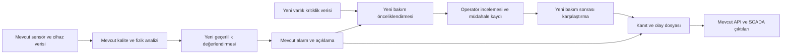

# Grid Up: sektör araştırması, farklılaşma ve tasarım önerileri

> **Araştırma tarihi:** 18 Eylül 2026 · **İncelenen depo:** `cd7c5f3` ve çalışma ağacındaki mevcut dosyalar.
> **Amaç:** Projenin mevcut yeteneklerini tekrar önermek yerine, jüriye gösterilebilir ve daha sonra ürüne dönüşebilir ek değer alanlarını belirlemek.
> **Kapsam:** Yerel yarışma PDF'i, kaynak kod, doğrulama raporları, önceki analizler ve birincil web kaynakları. Bu çalışma bir araştırma ve öneri belgesidir; önerilen özellikler uygulanmış sayılmaz.
> **Paylaşım:** Yerel yarışma belgesi “Hizmete Özel | Restricted” işaretli olduğundan bu rapor da ekip içi değerlendirme için hazırlanmıştır. Araştırmada özel dosyalar dış servislere yüklenmedi.

## 1. Karar özeti

**En güçlü yön: mevcut cihazlardan beslenen, yük değişimi ile bağlantı bozulmasını ayırmaya çalışan, şirket içinde çalışan pano sağlığı sistemi. En büyük fırsat: bu analitiği güvenilir ve sonuçları doğrulanabilir bakım kararlarına dönüştürmek.**

Sıcaklık ölçümü, IoT bağlantısı, alarm gönderimi, 3D pano ve “AI destekli bakım” başlıkları piyasada zaten var. ABB, Schneider, Siemens ve uzman izleme üreticileri bu alanlarda ürün sunuyor. Dolayısıyla bunları tek başına benzersiz yenilik olarak anlatmak savunulabilir değil. Ürünlerin kapsamları farklı; bu raporda hiçbir üretici için “bizdeki özellik kesinlikle onlarda yok” iddiası kurulmadı. [ABB SWICOM](https://electrification.us.abb.com/products/grid-automation/swicom), [Schneider sürekli termal izleme](https://www.productinfo.schneider-electric.com/esxp_digital_apps_iec/ctm/English/ESXP2GE007EN-05_Continuous_Thermal_Monitoring.pdf), [Dynamic Ratings SWGM](https://www.dynamicratings.com/products/switchgear-monitor/).

Önerilen değer cümlesi:

> **“Mevcut panonun verisini kullanarak bozulmayı erken fark eden; hangi bulguya ne kadar güvenilebileceğini, hangi panoya önce müdahale edileceğini ve bakımın sonucu değiştirip değiştirmediğini gösteren yerel karar destek katmanı.”**

Öncelikli üç yatırım:

1. **Tahmin güvenilirliği ve kanıt kartı:** mevcut erken uyarının yanına veri kalitesi, model geçerliliği ve gerektiğinde tahminden kaçınma davranışı eklemek.
2. **Müdahale sonrası doğrulama:** aynı yük koşullarında bakım öncesi/sonrası fiziksel değişimi karşılaştırmak; alarm kapanışını bakım başarısıyla karıştırmamak.
3. **Hizmet etkisine göre bakım önceliği:** mevcut alarm önceliğine gerçek varlık kritikliğini, beslenen yükü ve operasyonel kısıtları eklemek.

**18–20 Eylül için tercih:** yeni büyük modül yerine birinci başlığın dar kapsamlı, doğrulanabilir sürümü; güçlü bir karşılaştırmalı demo; ikinci ve üçüncü başlıklar için dürüstçe etiketlenmiş tasarım prototipi. Mevcut teslim akışı yeterince kararlı değilse ek geliştirmeden önce demo ve kanıt bütünlüğü gelir.

## 2. Araştırma yöntemi ve kanıt düzeyleri

Bu rapor dört tür ifadeyi ayırır:

| Etiket | Anlamı |
|---|---|
| **Kodda mevcut** | İlgili davranış veya veri yapısı kaynakta görüldü; bu oturumda çalışma zamanı doğrulaması yapıldığı anlamına gelmez. |
| **Depoda raporlanmış** | Önceden üretilmiş test/ölçüm belgesinde var; burada yeniden ölçülmedi. |
| **Dış kaynakta doğrulanmış** | Üretici, organizatör, standart kuruluşu veya araştırma kurumunun erişilebilir kaynağında görüldü. |
| **Öneri / çıkarım** | Bu araştırmanın ürün ve mühendislik değerlendirmesi; saha sonucu veya yarışma puanı garantisi değildir. |

İncelenen ana yerel kaynaklar: [yarışma PDF'i](Grid%20Up%20Hackathon%20Proje%20Konusu.pdf), [README](README.md), [ilk yarışma analizi](HACKATHON_ANALIZ_RAPORU.md), [önceki backlog](GELISTIRME-BACKLOGU.md), [konumlandırma](docs/18-konumlandirma-ve-standart-izi.md), [doğrulama sonuçları](docs/12-dogrulama-sonuclari.md), [maliyet](docs/10-bom-maliyet-roi.md), [tasarım araştırması](frontend/TASARIM-ARASTIRMASI-2026-09.md), algoritma, API ve arayüz kaynakları.

Tarihsel durum dosyalarının bazı maddeleri daha sonra kapanmış. Bu nedenle eski bir “eksik” listesi tek başına mevcut durum kabul edilmedi. Kaynak kod taraması tam bir kod denetimi değildir. Depodaki bir filo ekran görüntüsü de incelendi; görüntü eski üst menülü sürüme ait olduğundan güncel arayüzün birebir kanıtı sayılmadı. Tasarım önerilerinde güncel bileşenler ve `theme.css` esas alındı; canlı tarayıcı/kullanılabilirlik testi yapılmadı.

## 3. Yarışma neyi ödüllendiriyor?

### 3.1. Gerçek beklenti

Yerel proje PDF'inin 2–5. sayfaları; donanım konsepti, elektronik dokümantasyon, kaynak kod, merkezi izleme, Modbus entegrasyonu, şirket içi altyapı, bildirim ve en az 100 modülü kapsayan ölçek yaklaşımı istiyor. Gerçek sensör satın alma ve sahaya kurulum zorunlu değil; sentetik veriyle gösterilebilir prototip kabul ediliyor. Bütün sensör türlerini kullanmak da zorunlu değil. Kaynak: [yarışma PDF'i](Grid%20Up%20Hackathon%20Proje%20Konusu.pdf).

Bu çerçeveden çıkan stratejik sonuç: **çok sayıda sensör veya ekran değil, normal durumdan saha aksiyonuna kadar izlenebilir bir işleyiş** göstermek değerli.

| Resmî değerlendirme başlığı | Bu projede en ikna edici gösterim | Ek değer fırsatı |
|---|---|---|
| Problemin doğru anlaşılması | Yük artışı ile bağlantı bozulmasının ayrılması | Aynı sıcaklıkta farklı risk gösteren iki pano |
| Anomali/risk yaklaşımının başarısı | Etiketli senaryo ve karşılaştırma | Görülmemiş yük/mevsim/sensör sapmasında test |
| Sahada uygulanabilirlik | Yerleşim, kablo güzergâhı, mevcut cihaz okuma | Kurulum ve sensör kapsama doğrulaması |
| Uçtan uca yaklaşım | Simülatör → MQTT → API → alarm → bildirim | Müdahale kaydı → bakım sonrası doğrulama |
| Mevcut sistemlerle entegrasyon | Modbus haritası, protokol eşdeğerliği | ADMS varlık kimliğiyle eşlenebilir çıktı |
| Ölçeklenebilirlik | Çok sayıda sanal pano ve kaynak ölçümü | Alarm yükü ve veri güvenilirliğinin filo ölçeği |
| Kullanıcı/operasyon deneyimi | Neden, ne yapılmalı, ne kadar acil | Tek ekranda kanıt ve karar |
| Maliyet/fayda | Açık BOM ve varsayımlı hesap | İlk 100 pano için yatırım sıralaması |
| Yenilikçilik | Fizik tabanlı mevcut mimari | Tahminden kaçınma + müdahale etkisi + kapsama planı |

Kriterlerin sayısal ağırlıkları yerel belgede verilmedi; bu rapordaki öncelikler resmî puanlama değildir.

### 3.2. Takvimdeki fark

Patika'nın açık sayfası başlangıcı **2 Eylül**, bitişi **28 Eylül 2026** gösteriyor. Depodaki ekip planı ise teslimi **20 Eylül 23:59**, özellik dondurmayı **17 Eylül 23:59** olarak kaydediyor. Açık sayfa ara teslim saatini açıklamıyor; bunlar farklı aşamalar olabilir. **28 Eylül'ü ek geliştirme süresi olarak varsaymamak**, mevcut 20 Eylül iç teslim planıyla hareket etmek gerekir. Kesin aşama bilgisi komite duyurusundan teyit edilmelidir. [Patika yarışma sayfası](https://www.patika.dev/bootcamp/grid-up-hackathon).

### 3.3. Diğer yarışmacılar hakkında ne biliyoruz?

Bu araştırmada diğer ekiplerin güncel kodlarına, demolarına veya jüri puanlarına ilişkin doğrulanabilir bir envanter elde edilmedi. Aşağıdaki tablo **rakip istihbaratı değil, muhtemel çözüm tiplerine karşı strateji senaryosudur**.

| Muhtemel çözüm tipi | Jüride güçlü görünebileceği yer | Bizim karşılaştırmalı cevabımız |
|---|---|---|
| Sabit eşik + IoT paneli | Basit ve anlaşılır demo | Yükten kaynaklanan ısınma ile bozulmayı ayrı göster |
| Kara kutu anomali modeli | AI anlatısı, yüksek sentetik doğruluk | Görülmemiş senaryo, yanlış alarm ve açıklama kanıtı |
| Güçlü fiziksel prototip | Somut saha uygulanabilirliği | Mevcut cihaz entegrasyonu ve montaj/servis kolaylığı |
| Etkileyici 3D/termal gösterim | Görsel hatırlanabilirlik | Seçili noktadan ölçüme ve müdahale sonucuna izlenebilir geçiş |
| Chatbot/asistan | Doğal dil etkileşimi | Kaynaklı açıklama, yetki sınırı ve deterministik işlem akışı |

## 4. Projenin mevcut durumu: neleri yeniden önermemeliyiz?

| Yetenek | İncelemede görülen kanıt | Araştırma sonucu |
|---|---|---|
| Fizik tabanlı K/K₀ ve dinamik öğrenme | `libs/panoalgo/panoalgo/detect.py`, `edge.py` | Ana farklılaşma zemini zaten var. |
| Prognoz geri testi | `prognostics.py`, `docs/12` §4 | “RUL doğrulaması ekleyelim” artık yeni öneri değil; sonuçtan ürün davranışı çıkarmak gerekli. |
| Veri kalitesi ve öğrenme bilgisi | `quality.py`, `ConnPoint.q`, `excited`, `baseline_day` | Güven kartı sıfırdan başlamayacak; alanlar var, bütünleşik karar modeli eksik. |
| Alarm açıklaması ve eksik kanıt | `AlarmNedeni.tsx`, `AlarmVerify`, `backend/app/risk.py` | Açıklanabilirlik zaten var; sayısal karşılaştırma ve geçmiş karar iziyle büyütülebilir. |
| Öncelik listesi | `frontend/src/lib/worklist.ts` | P1/P2/SYS/P3, TTL ve risk ile sıralama var; hizmet kritiklik verisi yok. |
| Risk/süre grafiği | `RiskMatrisi.tsx` | Güncel eksenler risk skoru ve sınıra kalan süre; gerçek sonuç/etki ekseni değil. |
| 2D/3D pano | `OnGorunus.tsx`, `Ikiz3D.tsx`, `panelGeometry.ts` | Yeni 3D ekran önermek yerine ölçüm kapsamı ve müdahale karşılaştırması eklenmeli. |
| SCADA | `backend/app/scada/` | Modbus/IEC 104 kodu var; yeni protokol sayısından çok varlık/veri anlamı önemli. |
| Bildirim | `backend/app/notify/` | SMS, WhatsApp ve Telegram modülleri var; kod varlığı teslim edildi/okundu kanıtı değil. |
| Alarm KPI ve olay dosyası | Önceki backlog F-07/F-09, olay ekranı ve yazdırma dosyaları | Yenilik diye tekrar sayılmamalı. |
| İş emri, varlık kütüğü, akran analizi | Önceki backlog F-21/F-25/F-32/F-33 | Daha önce yol haritasına alınmış; burada kapsamı daraltılan ve kabul kriteri eklenen geliştirmeler. |

### 4.1. En önemli teknik bulgu: erken uyarı ile süre tahmini ayrı

[Depodaki 15 Eylül tarihli doğrulama raporu](docs/12-dogrulama-sonuclari.md) şu sonuçları veriyor:

- S1 gevşek bağlantı senaryosunda sabit 70 K sıcaklık artışı sınırına göre **209 saat erken uyarı**.
- Aynı senaryonun süre tahmininde ±%20 hata konisi içinde kalma **%5,2**; kalıcı prognostik ufuk **yok**.
- S1'de sınır ihlalinden sonra **587 tahmin** daha raporlanmış.
- S8 sensör arızasında sınır hiç aşılmadığı hâlde **99 süre tahmini**, bunlardan **89 TTL alarmı** raporlanmış.
- Bu prognoz değerlendirmesi **tek bozulma yörüngesine** dayanıyor; popülasyon güven aralığı değil.

Bu sayılar bu oturumda yeniden üretilmedi; mevcut sürüm için yeniden koşulmadan “hâlâ aynı hata var” sonucu çıkarılmamalı. Buna karşılık `detect.py` içinde tahminden kaçınmak için yük bilgisi, uyarım ve eğim sürekliliği kontrolleri mevcut; daha kapsamlı bir geçerlilik kapısı için iyi başlangıç.

**Ürün sonucu:** “8,7 gün önceden arıza zamanını biliyoruz” yerine “bu sentetik senaryoda sıcaklık sınırından 8,7 gün önce bozulma uyarısı veriyoruz” denmeli. TTL, bileşenin fiziksel ömrü veya kesin arıza zamanı değil, model koşulları altında belirli eşiğe erişim tahminidir. NASA'nın prognoz çalışmalarında da kalan ömür kestirimi ve belirsizlik yönetimi birlikte ele alınıyor. [NASA PCoE](https://www.nasa.gov/intelligent-systems-division/discovery-and-systems-health/pcoe/).

### 4.2. Alarm yükünü filo boyutuna taşımak

`docs/12` normal senaryoda **71,4 yanlış alarm / 100 pano / gün** raporluyor. Aynı oran 1.000 panoya doğrusal taşınırsa **714 olay/gün** eder. Bu bir saha tahmini değil, ölçek etkisini gösteren aritmetik örnektir. Bildirim özetleme, operatöre düşen mesaj sayısını azaltabilir; alttaki yanlış olay oluşumunu tek başına çözmez.

Bu nedenle başarım kartında ayrı ayrı bulunmalı: oluşan olay, operatöre sunulan vaka, gönderilen bildirim, onay gecikmesi ve sonradan yanlış olduğu doğrulanan olay. “İzin verilen eşik altında” olmak, operasyonun rahat kullanılabildiğini kanıtlamaz.

### 4.3. İddia tutarlılığı

README'deki toplam retrofit maliyeti `<120 USD` ifadesi ile [maliyet dokümanının](docs/10-bom-maliyet-roi.md) yalnızca kontrolcü için verdiği yaklaşık 37/56 USD rakamları aynı kapsam değil. Sensör sayısı, kutu, sertifikasyon, kurulum ve haberleşme dahil toplam maliyet ayrıca hesaplanmalı. Benzer şekilde bir STL modeli malzemenin alev sınıfını, sentetik güç kalitesi senaryosu da standarda uygun ölçüm zincirini kanıtlamaz. Bunları ayırmak, teknik jüri karşısında sunumu güçlendirir.

## 5. Sektör taraması

### 5.1. Pazar tek bir ürün kategorisinden oluşmuyor

Üç katman var: **sensör/izleme donanımı**, **varlık sağlığı ve bakım yazılımı**, **şebeke operasyon platformu**. Bir PD ölçüm cihazını ADMS ile aynı kapsamda kıyaslamak yanıltıcı olur. Bizim konumumuz sensörlerden gelen durumu yorumlayıp mevcut operasyon sistemlerine aktarabilecek dar bir pano sağlığı katmanı.

| Çözüm / kategori | Birincil kaynakta görülen yetenek | Bizim için anlamı |
|---|---|---|
| **Schneider PowerLogic + EcoStruxure** — termal izleme | TH110/CL110 ve HeatTag; ağ geçidi, yerel işleme ve opsiyonel uzaktan servis mimarisi | Sürekli sıcaklık, çevre ve izolasyon belirtisi izleme yeni değil. Yalnız bulut kullandıkları iddia edilemez. [Kaynak](https://www.productinfo.schneider-electric.com/esxp_digital_apps_iec/ctm/English/ESXP2GE007EN-05_Continuous_Thermal_Monitoring.pdf) |
| **ABB SWICOM** — OG durum izleme | IEC 61850 röle verisi, ek sensörler, kesici/termal/PD bilgisi, farklı markalı panolara uygulama | Çoklu sensör, mevcut cihaz kullanımı ve retrofit tek başına özgünlük değil. [Kaynak](https://electrification.us.abb.com/products/grid-automation/swicom) |
| **Siemens NXAIR + SICAM/NXpower** — ekipman ve izleme | NXAIR sayfası SICAM A8000 ve NXpower Monitor ile varlık sağlığı ve kestirimci bakımı ilişkilendiriyor | Donanım–izleme bütünlüğü önemli; bizim avantajımız belirli AG retrofit akışını küçük kapsamda kanıtlamak olabilir. [Kaynak](https://www.siemens.com/en-gb/products/energy-systems/nxairs/) |
| **Siemens Electrification X** — varlık yönetimi | Kullanım kılavuzunda varlık ağacı ve Sensformer kondisyon bilgisine geçiş | Filo → varlık → ayrıntı hiyerarşisi iyi tasarım referansı; mevcut kurulumda hangi modüllerin kullanıldığı bilinmiyor. [Kılavuz](https://support.industry.siemens.com/cs/attachments/109972744/Electrification_X_Asset_Management_User_Manual_V01.05_en_US.pdf) |
| **Dynamic Ratings SWGM** — şalt durumu | Sürekli izleme, SCM ile PD genişlemesi, masaüstü ve filo görünümü | OG ürünü için kesici davranışı ve PD uzmanlığı ayrı bir donanım/kanıt hattı gerektirir. [Kaynak](https://www.dynamicratings.com/products/switchgear-monitor/) |
| **EA Technology UltraTEV** — PD uzmanlığı | Sürekli PD izlemenin erken belirtileri gösterebildiği saha örneği | PD, yalnız trend grafiğiyle tamamlanan bir özellik değil. Üreticinin geçmiş vaka sonucu bizim tespit ufkumuza taşınamaz. [Üretici vaka yazısı](https://eatechnology.com/sea/news-blogs/blogs/2016/managing-your-supply-chain-must-include-the-monitoring-of-the-effective-delivery-of-energy/) |
| **Hitachi Energy Lumada APM** — bakım kararı | Varlık sağlığına göre onarım/değişim önceliği, öneri, aksiyon ve takip | Pazarın üst katmanında değer, alarmdan sonraki kararda. Daha küçük ve izlenebilir bir iş akışı geliştirmek anlamlı. [Kaynak](https://go.hitachienergy.com/Lumada-APM-introduction) |
| **ENTES uzaktan izleme** — yerel enerji yönetimi | Elektriksel parametreleri merkezden izleme, analiz ve kıyaslama | Sadece enerji panosu olarak konumlanmak yerel ürünlerle benzerlik yaratır; fiziksel bozulma ve bakım doğrulaması öne çıkarılmalı. [Kaynak](https://www.entes.com.tr/entes-enerji-izleme-yazilimlari/) |
| **Inavitas + Schneider + ADM/GDZ** — ADMS ekosistemi | SCADA/OMS yenilemesi, DMS/DERMS ve CBS entegrasyonu kapsamlı anlaşma | Projeyi mevcut stratejik yatırımın içine veri sağlayan tamamlayıcı katman olarak anlatmak daha uygun. [Inavitas duyurusu](https://www.inavitas.com/news/inavitas-schneider-electric-adm-elektrik-gdz-elektrik-strategic-partnership-in-grid-digital-transformation) |

Bu tablo ürün kataloglarının incelenmesine dayanır; performans laboratuvarı karşılaştırması, fiyat teklifi veya bütün özelliklerin tüketildiği bir satın alma analizi değildir. Kamuya açık kaynakta görünmeyen özellik “yok” sayılmadı. Liste fiyatı doğrulanmayan ürünler için maliyet üstünlüğü oranı üretilmedi.

### 5.2. Türkiye ve müşteri bağlamındaki en önemli bulgu

Schneider'ın **5 Haziran 2026** tarihli duyurusu, 20 Mayıs'taki anlaşma kapsamında ADM/GDZ'nin EcoStruxure ADMS tercih ettiğini; projenin SCADA, OMS, DMS, DERMS ve CBS entegrasyonunu kapsadığını bildiriyor. Bu, anlaşma duyurusudur; bütün bileşenlerin bugün devrede olduğunu kanıtlamaz. [Resmî duyuru](https://www.se.com/tr/tr/about-us/newsroom/news/press-releases/aydem-enerji-inavitas-ve-schneider-electric%E2%80%99ten-%C5%9Febeke-dijital-d%C3%B6n%C3%BC%C5%9F%C3%BCm%C3%BCne-stratejik-i%CC%87mza-6a2272f5d12a32403b0347b6/).

**Çıkarım:** jüriye “yeni bir şebeke yönetim platformu” satmak yerine, mevcut pano içi görünürlüğü artıran ve merkezi platforma ölçüm/kanıt sunan ürün anlatılmalı. İlk entegrasyon çıktısı; pano/CBS kimliği, zaman, kalite, alarm nedeni, ölçüm referansı ve operatör inceleme durumu olabilir. Canlı ADMS entegrasyonu varmış gibi gösterilmemeli.

### 5.3. Araştırmadan çıkan beş eğilim

1. **Tek sensörden birleşik duruma:** termal, çevresel, elektriksel ve mekanik bilgiler birlikte sunuluyor. Proje zaten bu yönde; bir sensör daha eklemek yerine çelişen sinyalleri açıklamak değerli. [ABB](https://electrification.us.abb.com/products/grid-automation/swicom).
2. **İzlemeden karara:** bakım/onarım/değişim önceliği ve sonuç takibi öne çıkıyor. [Hitachi Energy](https://go.hitachienergy.com/Lumada-APM-introduction).
3. **Sağlık ile hizmet kritikliğinin ayrılması:** varlığın bozulması ve bozulmanın sonucu farklı boyutlar. ENWL'nin düşük gerilim kablo projesi sağlık endeksleri ve durum temelli risk yönetimi geliştirmeyi hedefliyor; tamamlanmış başarı sonucu olarak alınmamalı. [ENWL proje sayfası](https://www.enwl.co.uk/future-energy/innovation/smaller-projects/network-innovation-allowance/enwl009---cable-health-assessment-for-low-voltage-cables/).
4. **Belirsizliği yönetme:** erken tespit metrikleri ile kalan ömür tahmininin doğruluğu ayrı değerlendiriliyor. [NASA metrik araştırması](https://data.nasa.gov/dataset/a-survey-of-metrics-for-performance-evaluation-of-prognostics).
5. **Endüstriyel UX:** kullanıcıya karmaşıklığı azaltan, erişilebilir ve tutarlı iş akışları sunmak. [Siemens iX ilkeleri](https://ix.siemens.io/docs/guidelines/overview).

## 6. Öncelikli inovasyonlar: somut özellik tasarımları

Aşağıdaki eforlar, mevcut mimariyi bilen bir geliştirici için **kişi-gün tahminidir**; sözleşme değişimi, entegrasyon ve test dahil belirsizlik taşır. Saha tedariki ve sertifikasyon süreleri dahil değildir. MVP süreleri seri biçimde toplanamaz; ortak veri modeli ve doğrulama bağımlılıkları vardır.

### I-01 — Tahmin güvenilirliği ve kanıt kartı

**Operatör sorusu:** “Bu uyarı gerçek bir bozulmaya mı, eksik veya hatalı ölçüme mi dayanıyor?”

**Mevcut temel:** kalite bitleri, uyarım bilgisi, taban öğrenme, alarm gerekçeleri, prognoz geri testi. **Yeni değer:** bunları tek bir açıklanabilir geçerlilik durumuna bağlamak.

Önerilen durumlar: `learning`, `insufficient_data`, `sensor_suspect`, `model_out_of_domain`, `valid_estimate`, `limit_exceeded`. Bunlar önerilen yeni alanlardır; mevcut API sözleşmesinde tanımlı oldukları varsayılmamalı.

- Sensör şüphesinde veya veri bayatken sonlu TTL göstermemek; ayrıca nedenini söylemek.
- Sınır zaten aşılmışsa geri sayım yerine “sınır aşıldı” durumu vermek.
- Başlangıçta “yüksek/orta/düşük güven” gibi kalibrasyonsuz bir olasılık üretmek yerine, sağlanan ve sağlanmayan koşulları göstermek.
- Sonraki aşamada bağımsız senaryo/yük profilleri üzerinde tahmin aralıklarını kalibre etmek; örnekler zamansal bağımlı olduğundan her ölçümü bağımsız deney saymamak.
- Bir tahmini geri çekmek, fiziksel sıcaklık/ark gibi bağımsız kritik alarmları bastırmamalı.

**MVP:** 1–2 kişi-gün. **Gelişmiş belirsizlik kalibrasyonu:** 5–10 ek kişi-gün ve yeterli veri.

**Kabul:** S8 benzeri sensör arızasında geçersiz TTL gösterimi engellenir; sınır aşımından sonra durum doğru değişir; geçerli S1 uyarısı korunur. Ekranda “neden tahmin yok” okunabilir. Mevcut hatanın güncel sürümde sürüp sürmediği önce yeniden ölçülür.

**Demo:** aynı bozulma eğrisine sensör sapması ekle; sistem rakam üretmekte ısrar etmek yerine kanıt eksikliğini açıklasın. Bu fikir, mevcut prognoz testinin bir ürün davranışına dönüşmesidir.

### I-02 — Bakım sonrası etki doğrulaması

**Operatör sorusu:** “Bağlantı yenilendi; gerçekten iyileşti mi?”

İşlem öncesi ve sonrası benzer yük/ortam aralıklarını karşılaştır: ΔT, K/K₀, model artığı ve veri kapsaması. Ham sıcaklık düşüşü tek başına başarı kabul edilmemeli; yük düşmüş olabilir. K parametresi de ısıl yol ve sensör yerleşiminden etkilenebilir; doğrudan elektriksel temas direnci ölçümü diye sunulmamalı.

**Dar veri modeli:** müdahale kimliği, pano/nokta, başlangıç/bitiş, müdahale türü, kişi, mevcut taban sürümü, karşılaştırma pencereleri, değerlendirme sonucu. Sonuçlar: “iyileşme gözlendi”, “iyileşme gösterilemedi”, “karşılaştırılabilir veri yetersiz”. Otomatik taban sıfırlama yapılmadan önce eski taban saklanmalı.

**MVP:** 2–4 kişi-gün; mevcut trend ve olay dosyasına bağlanır. Önceki backlog F-25/F-33'ün dar bir devamıdır, tamamen yeni bir CMMS değildir.

**Kabul:** yalnız yükün düştüğü bir kontrol örneği “başarılı bakım” sayılmaz; eşlenmiş koşullarda fiziksel iyileşme ayrı raporlanır. Gözlemsel sonuç kesin nedensellik kanıtı diye sunulmaz.

**Demo:** “bulduk → ekip inceledi → müdahale kaydedildi → benzer yükte iyileşme görüldü.” Jüriye algoritmanın operasyon döngüsünü tamamladığını gösterir.

### I-03 — Hizmet etkisine göre bakım sırası

**Operatör sorusu:** “İki pano aynı riskte; önce hangisine ekip gitsin?”

Mevcut P1/P2/SYS/P3 sıralamasını koruyarak aynı öncelik içindeki sıralamaya doğrulanmış varlık kritikliğini, kritik müşteri varlığını, alternatif besleme bilgisini ve iş planı durumunu ekle. P1 gibi koruma/acil durumlar ekonomik puan nedeniyle aşağı itilmemeli.

İlk sürümde kara kutu ağırlıklı toplam puan yerine sıralama nedenini yaz: “aynı alarm sınıfında; kritik yük besliyor; alternatif besleme bilgisi yok; daha önce incelenmedi.” Eksik abone/fider bilgisi tahminle doldurulmamalı.

**Veri bağımlılığı:** CBS/varlık kütüğü ve işletmenin onaylı kritiklik tanımı. Gerçek veri yoksa sentetik örnek açıkça işaretlenir. Coğrafi yakınlık elektriksel bağlılık yerine kullanılamaz.

**MVP:** 2–3 kişi-gün; kurumsal veriye bağlantı ayrı proje. **Kabul:** aynı teknik durumda farklı hizmet etkisi sıralamayı açıklanabilir biçimde değiştirir; eksik veride “etki bilinmiyor” görünür. Önceki F-21/F-25 ile ilişkili.

### I-04 — Fizik tabanlı “yük değişirse ne olur?” deneyi

**Operatör sorusu:** “Aynı bağlantı durumunda yük azalırsa öngörülen ısınma nasıl değişir?”

Mevcut ısıl modelin etrafına yalnız simülasyon amaçlı bir karşılaştırma ekle. Örneğin sabit K ve kararlı durum varsayımı altında `ΔT ≈ K·I²`; akımın %10 azalması ısınma bileşenini yaklaşık %19 azaltır (`0,9² = 0,81`). Bu, geçici rejimde anlık sıcaklık düşüşü veya sahada yük aktarımı yapılabilirliği değildir. Gerçek zamansal eğri için τ ve ortam koşulları kullanılmalı.

**Yenilik farkı:** mevcut “eksik kanıt” açıklamasından farklı olarak sayısal model senaryosu sunar. Bir saha kontrol komutu üretmez. Yük azaltmak gevşek bağlantıyı onarmış sayılmaz.

**MVP:** 2–4 kişi-gün. **Kabul:** varsayımlar görünür; değişen akım/ortam ayrı; tahmin çizgisi ölçümle karışmaz; geçersiz modelde deney sonucu verilmez.

**Demo:** ölçülen eğri ve iki açıkça etiketlenmiş model eğrisi. Arayüzde “işletme talimatı” yerine “mühendislik senaryosu” ifadesi.

### I-05 — Sensör kapsaması ve kurulum doğrulama haritası

**Operatör sorusu:** “Pano normal mi, yoksa kritik noktayı hiç ölçmüyor muyuz?”

Mevcut 2D/3D noktalarını şu ayrımla göster: fiziksel ölçüm, modelden çıkarım, bayat veri, sensör bulunmayan nokta. “25 sensör bağlı” yerine “tanımlı kritik noktaların 18/25'inden geçerli ölçüm var” gibi paydası tanımlı kapsama ver.

Devreye almada sensör kimliği → fiziksel nokta → faz eşleşmesi → örnek veri → kalite kontrolü zinciri oluştur. Donanım için fotoğraflı etiketleme ve sökülüp takılabilir bağlantı tasarımıyla bağlanabilir.

**MVP:** mevcut geometri üzerinde 1–2 kişi-gün; otomatik sensör yerleşimi optimizasyonu ayrı çalışma. **Kabul:** ölçülmeyen nokta yeşil gösterilmez; bağlantı kesildiğinde kapsama azalır; sensör listesi ile çizim eşleşir.

**Farklılaşma:** kablo kalabalığı ve kurulum doğruluğunu yarışmanın fiziksel modül beklentisine doğrudan bağlar. 3D görünümü karar aracına dönüştürür.

### I-06 — Filo olayı: ortak çevre etkisi mi, yerel arıza mı?

**Operatör sorusu:** “Aynı saatte çıkan 30 nem alarmı aynı olayın parçaları mı?”

Önce deterministik gruplama: aynı zaman aralığı, aynı olay türü, aynı saha/çevre grubu. Sonra akran analizi: benzer pano tipi, yük oranı, yerleşim ve ortam koşulları. “Bölge genelinde çiy marjı azaldı; şu pano akranlarından ayrıca sapıyor” açıklaması üret.

**Sınır:** ortak hava koşulu alarmları gereksiz yapmaz; gerçek toplu risk de olabilir. P1 olaylar sessizce bastırılmaz; alt olaylara erişim korunur. Fider kaynaklı kesinti ilişkilendirmesi gerçek topoloji gerektirir.

**MVP:** 2–4 kişi-gün; akran/model katmanı 5–10 ek kişi-gün. **Kabul:** 30 olay tek incelenebilir vaka altında görünür, sayım kaybolmaz; bağımsız kritik arıza ayrı kalır. Önceki F-22/F-32'nin daha dar başlangıcı.

### I-07 — Bağımsız stres testi ve “jürinin seçtiği senaryo”

Mevcut sabit senaryoların yanına seed, yük, ortam, sensör sapması, veri kaybı ve arıza şiddeti değişebilen kontrollü deney aracı ekle. Model ayarında kullanılan veriden ayrı bir test kümesi tut. Üreteç ve dedektörün aynı varsayımları paylaşmasından doğan iyimserlik için farklı model parametreleri ve mümkünse bağımsız üreteç kullan.

**MVP:** 2–4 kişi-gün. **Kabul:** tespit gecikmesi, yanlış olay/pano-gün, tahminden kaçınma oranı ve geçersiz tahmin sayısı birlikte raporlanır. Tek bir iyi senaryo seçilip sonuç genellenmez.

**Demo:** jüri önceden doğrulanmış aralıktan yük/mevsim seçsin; aynı iz üzerinde sabit eşik ve fizik modeli gösterilsin. Arızasız kontrol örneği de mutlaka yer alsın. Yeni rastgele senaryonun sonucu teslimden önce doğrulanmadan canlı başarı sözü verilmez.

### I-08 — İlk 100 pano için sensör ve yatırım planı

“Bütün panolara aynı paketi takalım” yerine bütçeye göre hangi noktalara hangi ölçümün ekleneceğini öneren planlayıcı. Girdiler: mevcut analizör/koruma, pano tipi, erişim koşulu, kritik bağlantılar, alarm geçmişi, kablo ve güç kısıtları. Çıktı: kapsama açığı, önerilen paket, ölçülemeyecek riskler ve toplam maliyet aralığı.

**MVP:** 3–5 kişi-gün, kural tabanlı seçim; saha mühendisliği doğrulaması ayrıca gerekir. **Kabul:** mevcut sensör yeniden satın alınmaz; donanım, montaj, kesinti planı, işletim ve yedek parça ayrı kalemlerdir. Bu bir ürünleştirme önerisidir; optimizasyonun küresel optimum olduğu iddia edilmez.

**Farklılaşma:** düşük maliyet iddiasını gerçek kurulum tercihine dönüştürür; problem belgesindeki kablo/erişim kısıtını doğrudan ele alır.

## 7. Daha sonraki aşama için fikir havuzu

| Fikir | Kullanıcı değeri / yenilik | Bağımlılık ve risk | Tahmini kapsam |
|---|---|---|---|
| **Pano termal parmak izi** | Bakım, kapak/ventilasyon değişimi veya sensör taşınması sonrası model geçerliliğini sorgular | Bozulmayı yeni normal diye öğrenmemeli; taban sürümü ve insan incelemesi gerekir | 4–8 kişi-gün |
| **Ölçüm öneren teşhis** | Belirsiz bir alarmda “hangi ek ölçüm hipotezleri ayırır?” sorusunu yanıtlar | Onaylı mühendislik prosedürlerinden beslenmeli; enerjili ekipmanda serbest talimat üretmemeli | Kural tabanlı 3–5 kişi-gün |
| **Çevrimdışı saha iş kartı** | QR ile pano doğrulama, fotoğraf/not, senkronizasyon ve çakışma çözümü | Kimlik/yetki, cihaz güvenliği ve iş emri veri modeli | 5–10 kişi-gün |
| **Olay ve model sürümü pasaportu** | Aynı kararın hangi ölçüm, kural ve model sürümüyle verildiğini yeniden üretir | Mevcut olay dosyasının genişlemesi; saat ve sürüm yönetimi | 2–4 kişi-gün |
| **Kenar–merkez karar karşılaştırması** | Merkez/edge sürümü veya eşik uyuşmazlığını görünür kılar | Aynı zaman penceresi ve aynı girişin eşlenmesi gerekir | 3–5 kişi-gün |
| **Uyarlanabilir örnekleme** | Normalde az veri; belirti sırasında yüksek zaman çözünürlüğü | Donanım ve tampon sınırı; olay öncesi veri kaybolmamalı | Önceki F-36 devamı, 5–10 kişi-gün |
| **OG kesici davranış imzası** | Açma zamanı/işlem sayısı/titreşim gibi bilgilerle mekanik durumu izler | Yeni donanım ve saha etiketleri; mevcut AG ana kapsamını büyütür | Pilot/ürün aşaması |
| **Kaynak gösteren yerel bakım asistanı** | Onaylı dokümandan ilgili paragrafı bulur, olay özetini hazırlar | Model işletimi, erişim kontrolü, kaynak/sürüm doğrulaması; komut vermez | Önce veri ve yetki altyapısı |

Son üç başlık hackathon için öncelikli değil. “Yeni AI” anlatısından önce güvenilir veri, karşılaştırılabilir ölçüm ve doğru iş akışı gerekir.

## 8. Önceliklendirme

Değer ve gösterilebilirlik 1–5 arasında **bu raporun öznel ürün değerlendirmesidir**. Süreler garanti değil; iki günlük pencere bütün listeyi uygulamaya yetmez.

| Sıra | Öneri | Jüriye açıklanabilir değer | Demo açıklığı | MVP kişi-gün | Ana bağımlılık | Zamanlama |
|---:|---|---:|---:|---:|---|---|
| 1 | I-01 Güvenilirlik/kanıt kartı | 5 | 5 | 1–2 | Güncel prognoz testi, API/UI | Teslim öncesi dar kapsam adayı |
| 2 | I-05 Sensör kapsaması | 5 | 5 | 1–2 | Nokta envanteri | Birinci iş biterse aday |
| 3 | I-07 Bağımsız stres demosu | 5 | 5 | 2–4 | Üreteç ve değerlendirme | Önce mevcut senaryolarla daralt |
| 4 | I-02 Bakım etkisi | 5 | 5 | 2–4 | Müdahale kaydı | Final tasarım prototipi / pilot |
| 5 | I-03 Hizmet etkisi | 5 | 4 | 2–3 | Gerçek varlık kritiklik verisi | Veri yoksa açıkça sentetik prototip |
| 6 | I-04 Fiziksel senaryo deneyi | 4 | 5 | 2–4 | Geçerli termal model | Pilot öncesi |
| 7 | I-06 Filo olay gruplama | 4 | 4 | 2–4 | Saha/zaman bağlamı | Pilot |
| 8 | I-08 İlk 100 pano planı | 4 | 4 | 3–5 | Envanter ve maliyet | Pilot/ürün |

Önceki backlog'daki tamamlanmış F-01–F-18 maddelerini yeni kazanım gibi yeniden sunmak yerine, bu rapordaki fikirleri onların üzerine bağlamak gerekir. F-19 sonrası kurumsal altyapı başlıkları da bu önerilerden bağımsız “tamamlandı” sayılmamalı.

## 9. Tasarım önerileri

### 9.1. Görsel yön: mevcut dili koru, karar hiyerarşisini güçlendir

Güncel `theme.css`; açık çalışma yüzeyi, grafit gezinme, ADM/GDZ turuncusu ve Barlow kullanıyor. Mevcut çalışma bu yönde ilerlemiş. Baştan tema veya font değiştirmek yerine veri güvenilirliği ve aksiyon hiyerarşisi eklenmeli. Siemens iX'in sadelik, esneklik ve kullanıcı işini hızlandırma ilkeleri bu yaklaşımı destekliyor. [iX rehberi](https://ix.siemens.io/docs/guidelines/overview).

| Katman | Öneri | Neden |
|---|---|---|
| Marka | Turuncuyu gezinme, seçili görünüm ve marka imzasında tut | Alarm renginden görev olarak ayrılır |
| Normal durum | Nötr yüzey, küçük metin/durum işareti | Çok sayıda yeşil kart alarmın fark edilmesini zorlaştırmasın |
| Alarm | Renk + şekil + P seviyesi + açık durum adı | Renk görme farklılıklarında anlaşılır |
| Veri güvenilirliği | Ayrı rozet: güncel, bayat, ölçüm yok, sensör şüphesi | Risk ile gözlem kalitesi karışmaz |
| Sayısal ölçüm | Tabular rakam, sabit birim, açık ölçüm zamanı | Değerler hızlı karşılaştırılır |
| Gelecek tahmini | Kesikli çizgi; yalnız kalibre edilmişse aralık bandı | Model çıktısı ölçüm gibi görünmez |

P1/P2/P3 renklerini yeniden tanımlamak bu çalışmanın önerisi değil. Mevcut değerler arka plan/etkileşim durumlarıyla birlikte ölçülmeli. WCAG 2.2'de normal metin için 4,5:1, büyük metin için 3:1 kontrast ve durumun yalnız renkle aktarılmaması gibi kriterler bulunur; tek renk çifti kontrolü bütün uygulamanın uyumunu kanıtlamaz. [WCAG 2.2](https://www.w3.org/TR/WCAG22/).

### 9.2. Ana ekran: “bu vardiyada hangi kararlar bekliyor?”

Mevcut filo ekranının üst alanı aşağıdaki sırayla düzenlenebilir:

1. **Kapsam:** şirket/bölge, son veri zamanı, canlı/sentetik mod.
2. **Özet:** acil inceleme, planlanacak bakım, gözlem kaybı, inceleme bekleyen vaka. Değerler gerçek veri modelinden gelmeli.
3. **Öncelik listesi:** pano, durum, neden bu sırada, veri yeterliliği, son işlem ve sorumlu.
4. **Seçilen varlık ayrıntısı:** ölçüm kanıtı ve tek ana işlem.
5. **İkincil inceleme:** filo grafiği, harita ve zaman ekseni.

Küçük filoda kartlar kullanılabilir; yoğun vardiya ekranında hizalı tablo daha hızlı kıyas sağlar. Mevcut grafiğin adı “risk–süre dağılımı” olmalı; hizmet etkisi eklenmeden “sağlık–kritiklik matrisi” denmemeli. Süre bilinmeyen panolar sonsuz süreli veya sağlıklı kabul edilmemeli.

### 9.3. Alarm ayrıntısı: beş soruluk kanıt paneli

Önerilen düzen; mevcut `AlarmNedeni` bileşenindeki bilgiyi büyütür, ayrı bir chatbot gerektirmez:

```text
ADM-00014 · Ana giriş L2                       P2 · İnceleme gerekli
Bağlantı bozulması şüphesi                     Veri: güncel / yeterli

NE GÖRDÜK?        Yükle açıklanamayan sıcaklık artışı
DAYANAK           Ölçülen ΔT | Beklenen ΔT | K/K₀ | Son veri zamanı
ALTERNATİFLER     Ortam etkisi / sensör sapması / yük değişimi
BELİRSİZLİK       Süre tahmini verilemiyor: model geçerliliği yetersiz
SONRAKİ ADIM      Onaylı inceleme adımı ve ilgili prosedür bağlantısı

[İnceleme kaydı aç]   [Ölçüm kanıtını aç]   [Olay geçmişi]
```

Bu bir tasarım taslağıdır; örnek metinler doğrulanmış pano durumu değildir. Her alarmda bütün alternatifler uydurularak sıralanmamalı; desteklenen hipotez ve eksik ölçüm ayrılmalı. “%95 güven” yalnız gerçek kalibrasyon varsa gösterilmeli.

### 9.4. Dijital ikiz: ölçüm haritası ve değişim merceği

- **Varsayılan 2D:** nokta seçimi ve hızlı inceleme; 3D mekanik yerleşimi anlamak için ikincil görünüm.
- **Kapsama modu:** fiziksel ölçüm, model çıkarımı, veri yok ve bayat veri ayrı doku/ikonla.
- **Önce/sonra modu:** müdahale öncesi ve sonrası eşlenmiş zaman pencereleri; aynı renk ölçeği.
- **Kanıt bağlantısı:** nokta seçildiğinde aynı noktanın trendi, sensör kimliği ve olayları açılır.
- **Geçmiş zaman:** kalıcı “geçmiş görünüm” etiketi ve kolay “şimdiye dön” işlemi.
- **Temsili yüzey:** ölçülmeyen bölgeleri termal kameradan elde edilmiş gibi boyamamak; interpolasyon varsa etiketlemek.

3D'nin ekran alanını büyütmekten daha değerli olan, operatörün seçtiği bir fiziksel noktayı doğru ölçüm ve aksiyona bağlamak.

### 9.5. Grafikler

| Grafik | Gösterilecek şey | Önlenmesi gereken hata |
|---|---|---|
| Ölçülen/beklenen sıcaklık | Yük ve ortamla açıklanan bölüm ile artık | Aynı birimde olmayan değerleri tek eksende belirsizce çizmek |
| K/K₀ | Öğrenme bitişi, taban sürümü, bakım işareti | Yeniden öğrenmede bozulma geçmişini silmek |
| ΔT–I² karşılaştırması | Benzer yük aralıklarında önce/sonra | Akım düşünce sıcaklığın azalmasını bakım başarısı sanmak |
| Tahmin | Üretim anı, model varsayımı, doğrulanmış aralık | Kesin arıza zamanı gibi geri sayım |
| Alarm yükü | Olay, vaka, bildirim ve yanlış olay ayrı | Özetleme ile model isabetinin arttığını iddia etmek |

Ortak zaman imleci ve olay işaretleri mevcut grafik sisteminin üzerine eklenebilir. Veri boşluklarında çizgiyi birleştirmemek ve birimleri görünür tutmak korunmalı. Carbon rehberi de eksenlerin açık adlandırılmasını ve veri olmayan zaman aralıklarında interpolasyon yapılmamasını öneriyor. [Carbon veri görselleştirme rehberi](https://carbondesignsystem.com/data-visualization/axes-and-labels/).

### 9.6. Harita ve mobil saha kullanımı

Haritanın görevi “nerede?” sorusunu yanıtlamak; alarm listesiyle aynı seçimi ve filtreyi paylaşmalı. Koordinatı olmayan pano ayrı listede kalmalı. Yakın noktalar gruplanabilir; grupta en yüksek alarm ve gözlem kaybı sayısı ayrı görünmeli. İlçe sınırı veya coğrafi komşuluk fider bağlantısı gibi sunulmamalı.

Mobil iş kartında varlık kimliği, son veri zamanı, ilgili nokta, kanıt özeti ve not/fotoğraf kaydı öne çıkmalı. Çevrimdışı kayıt sunucuya ulaşmadıysa “kaydedildi” ve “senkronize edildi” ayrı durumlar olmalı. QR etiketi kimlik eşlemeye yarar; yetkilendirme yerine geçmez.

Saha kullanımı için 44–48 px dokunma alanı ürün hedefi olarak seçilebilir. WCAG 2.2 AA minimum hedef boyutu kriteri, istisnalarıyla birlikte **24×24 CSS px**; 44 px'i bütün durumlarda AA zorunluluğu diye sunmamak gerekir. [W3C hedef boyutu açıklaması](https://www.w3.org/WAI/WCAG22/Understanding/target-size-minimum.html).

### 9.7. Donanımın endüstriyel tasarımı

Yarışmanın kablo ve bakım erişimi problemine doğrudan yanıt verecek öneriler:

- Güç/haberleşme/sensör bağlantılarını etiketli bölgelere ayıran ön yüz; aynı etiketler arayüzde ve I/O tablosunda.
- Kurulum yönü ve modül kimliğini kapak açmadan görebilen işaretleme.
- Servis sırasında sensör kablolarının yeniden eşlenmesini azaltan anahtarlı/sökülebilir konnektör yaklaşımı.
- Tek “yeşil LED” yerine güç, haberleşme ve ölçüm yeterliliğini ayıran anlaşılır durum göstergeleri.
- Modülün sökülme alanı, kablo bükülme payı ve anten güzergâhını yerleşim çiziminde gösterme.
- Tasarım dosyasını sertifikalı ürün olarak sunmama; izolasyon, EMC, sıcaklık ve malzeme doğrulamasını pilot kabul planına bağlama.

### 9.8. Tasarımın başarısını nasıl ölçeceğiz?

3–5 temsilî kullanıcıyla, aynı veri üzerinde mevcut ve önerilen görünümü karşılaştıran küçük bir görev testi önerilir. Bu sayı istatistiksel saha kanıtı değil, erken kullanılabilirlik araştırmasıdır.

| Görev | Önerilen kabul hedefi |
|---|---|
| En acil panoyu bul | 10 saniye içinde doğru seçim |
| Alarmın nedenini anlat | 30 saniye içinde ölçüm/model ayrımını doğru açıklama |
| Verinin bayat olduğunu fark et | Bayat panoyu sağlıklı diye işaretlememe |
| Tahminin anlamını anlat | “Kesin arıza zamanı” olarak yorumlamama |
| Bakım sonrası sonucu değerlendir | Yük düşüşünü tek başına iyileşme sanmama |
| Klavyeyle inceleme | Filtre → kayıt → kanıt → geri dönüş akışını tamamlayabilme |

## 10. Uygulama mimarisi: öneriler nereye oturur?



| Alan | Başlangıç dosyaları | Önerilen değişiklik sınırı |
|---|---|---|
| Geçerlilik | `detect.py`, `edge.py`, `quality.py`, `prognostics.py` | Mevcut tespiti bozmadan tahminin geçerliliğini ayrı üret |
| Sözleşme | `contracts/openapi.yaml`, `contracts/mqtt-telemetry.schema.json`, `contracts/changes/` | Yeni alanların anlamı/sürümü; mevcut alanı sessizce farklı anlamda kullanma |
| Öncelik | `frontend/src/lib/worklist.ts`, `backend/app/api/views.py` | Kurumsal kritiklik varsa sunucuda açıklanabilir sıra; yoksa mevcut sıra |
| Kanıt kartı | `AlarmNedeni.tsx`, `PanoDetay.tsx` | Kalite, kaynak, zaman ve model durumu |
| Kapsama | `panelGeometry.ts`, `OnGorunus.tsx`, `Ikiz3D.tsx` | Nokta envanteri ile ölçüm varlığını eşle |
| Bakım sonucu | Trend/olay ekranları ve yeni müdahale kaydı | Kim yaptı, ne değişti, hangi veri karşılaştırıldı |

Yeni kurumsal uçlar gerçek yetkilendirme ve denetim iziyle tasarlanmalı. Depoda SCADA erişim kısıtları bulunması, bütün REST/mobil iş akışlarının kurumsal yetki yönetiminin tamamlandığı anlamına gelmez. Bu rapor bir güvenlik denetimi yapmadı.

## 11. Demo: beş dakikada tek hikâye

İleri fikirler uygulanmadıysa “tasarım önerisi” olarak ayrı gösterilir; çalışan prototip içine varmış gibi karıştırılmaz.

| Süre | Gösterim | Jürinin alacağı mesaj |
|---|---|---|
| 0:00–0:35 | Pano yerleşimi ve kullanılan mevcut cihazlar | Gerçek saha problemi ve retrofit yaklaşımı |
| 0:35–1:20 | Yük artışı yaşayan sağlıklı pano ile bozulan bağlantıyı kıyasla | Aynı ısınma farklı anlama gelebilir |
| 1:20–2:05 | Fiziksel gösterge, ölçüm kanıtı ve sabit eşik karşılaştırması | Erken uyarı somut olarak gösteriliyor |
| 2:05–2:40 | Sensör sapması/veri kaybı; geçersiz tahminin geri çekilmesi | Sistem neyi bilmediğini açıklıyor |
| 2:40–3:20 | Aynı olayın API/SCADA/bildirim izi | Uçtan uca entegrasyon |
| 3:20–4:15 | Varsa çalışan bakım sonucu karşılaştırması; yoksa etiketli prototip | Alarmdan sonraki ürün yönü |
| 4:15–5:00 | Ölçüm sınırları, pilot planı, maliyet kapsamı | Saha için test edilebilir bir sonraki adım |

Sunumda kullanılabilecek savunulabilir cümleler:

- “Erken uyarı performansını ve süre tahmininin doğruluğunu ayrı ölçüyoruz.”
- “Ölçüm yoksa sağlıklı demiyoruz; veri yeterliliğini ayrıca gösteriyoruz.”
- “ADMS yatırımına pano içi durum ve kanıt sağlayabilecek bir katman tasarlıyoruz.”
- “Bakım sonrası değişimi benzer yük koşullarında doğrulamayı hedefliyoruz.”

Kaçınılacak ifadeler: “dünyada ilk”, “sıfır yanlış alarm”, “arıza zamanını kesin biliyoruz”, “yangını sıfıra indirir”, “sertifikalı”, “tam saha uyumlu”, “rakiplerden %X ucuz”. Bunlar mevcut araştırma/kanıt setinden çıkmıyor.

## 12. Teslim ve pilot yol haritası

### 12.1. 18–20 Eylül: dar kapsam

**İlk blok — kanıt bütünlüğü:** mevcut prognoz ölçümünü tekrar üret; README/sunum ile teknik rapordaki kapsam farklarını düzelt; canlı/sentetik ayrımını her demo adımında göster; bildirim kanalının gerçek teslim kanıtını kontrol et.

**İkinci blok — tek küçük ürün eklemesi:** I-01'in geçerlilik durumu ve açıklamasını uçtan uca ele al. Sözleşme/algoritma kapsamı büyürse bu işi daralt; yalnız görünümde saklamak yerine kaynağında doğru durum üretimini hedefle.

**Üçüncü blok — demo ve yedek:** normal kontrol + gevşek bağlantı + sensör şüphesi akışını kaydet; aynı yapılandırma/seed ile tekrarlanabilir kıl. Yeni altyapı bağımlılığı eklemekten kaçın. Kullanıcı/ekip değişiklikleri üzerine kontrolsüz düzenleme yapılmamalı.

### 12.2. İlk pilot: 4–6 haftalık örnek plan

Bu süre öneridir; saha erişimi ve işletme onayına bağlıdır. İlk pilotun hedefi nadir arızalarda istatistiksel başarı ilan etmek değil, ölçüm ve iş akışı uygulanabilirliğini öğrenmek.

| Aşama | İş | Çıktı |
|---|---|---|
| 1. hafta | 10–20 pano için envanter, mevcut cihaz ve kapsama kontrolü | Hangi panoda hangi veri güvenilir? |
| 2. hafta | Gölge izleme, veri kalitesi ve taban değerlendirmesi | Yanlış alarm ve gözlem kaybı nedenleri |
| 3–4. hafta | Operatör incelemesi, etiketleme, planlı bakım kayıtları | İncelenen vaka başına yararlı çıktı oranı |
| 5–6. hafta | Benzer yükte bakım öncesi/sonrası değerlendirme | İyileşme gözlendi/veri yetersiz ayrımı |

Pilot başarı ölçütleri birlikte belirlenmeli: veri kapsaması, yanlış olay/pano-gün, alarm inceleme süresi, doğrulanan arıza bulgusu oranı, ekip başına gereksiz ziyaret, karşılaştırılabilir bakım vakası sayısı. Kısa pilotta gerçek arıza yoksa saha recall değeri hesaplanmış gibi sunulmamalı.

## 13. Maliyet ve ürünleştirme

Ürün paketleri mevcut maliyet dokümanındaki Temel/Standart/OG+PD ayrımını koruyabilir. Ek değer; bütün müşterilere aynı donanımı satmak yerine mevcut ekipman ve ölçüm boşluğuna göre paket seçmek.

```text
Toplam sahip olma maliyeti =
  kontrolcü + sensörler + kutu/bağlantı + montaj/devreye alma
  + entegrasyon + haberleşme + sunucu/işletim
  + kalibrasyon/bakım + yedek parça + ürün doğrulama giderleri
```

Fayda hesabında “tespit edildi” ile “arıza önlendi” ayrılmalı. Müdahale edilme ihtimali ve müdahalenin etkisi de gerekir. Aynı kesinti zararını farklı kalemlerde iki kez saymamak; yalnız kontrolcü BOM'u ile tam sistem geri ödeme süresi hesaplamamak gerekir. Bu rapor yeni fiyat teklifi veya mevzuata dayalı tazminat hesabı üretmez.

İlk ticari değer hipotezi: **güvenilir inceleme sırası ve daha az gereksiz saha ziyareti**. Yangın/kesinti önleme etkisi daha uzun dönemli, bağımsız saha verisiyle değerlendirilmelidir. Operatör geri bildirimi ve bakım sonucu etiketleri biriktikçe ürünün kopyalanması zorlaşan kısmı oluşur: doğrulanmış ölçüm–bulgu–müdahale geçmişi.

## 14. Şimdilik öncelik vermememiz gerekenler

| Fikir | Neden geri planda? | Hangi koşulda yeniden ele alınır? |
|---|---|---|
| Genel amaçlı LLM sohbet ekranı | Mevcut eksik veri ve tahmin güvenilirliğini çözmez | Kaynaklı doküman arama ve kayıt özetleme ihtiyacı ölçülürse |
| Büyük yeni 3D sahne | Zaten mevcut; karar değerine katkısı sınırlı kalabilir | Kapsama/önce-sonra gibi açık bir görev varsa |
| Otomatik yük aktarımı veya kesici kontrolü | Şebeke topolojisi, işletme prosedürü ve yetki bağlamı gerekir | Kurumsal entegrasyon ve ayrı doğrulama projesi |
| AG'ye kapsamı belirsiz PD ekleme | OG ölçüm fiziği ve donanım zinciri ayrı uzmanlık ister | OG pilotu ve doğrulanmış ölçüm zinciri varsa |
| Blockchain | Mevcut olay izlenebilirliği için maliyetli ek karmaşıklık | Gerçek çok taraflı güven problemi gösterilirse |
| Kesin arıza zamanı sayacı | Mevcut prognoz sonuçları bu iddiayı desteklemiyor | Kalibre edilmiş, bağımsız doğrulama oluşursa |
| Teslime iki gün kala geniş ML modeli | Eğitim/veri/dağıtım riski yüksek | Bağımsız saha verisi ve net karşılaştırma hedefi varsa |

## 15. Kaynaklar ve araştırma sınırları

Bağlantılar 18 Eylül 2026 araştırmasında erişilen üretici/kurum kaynaklarıdır; erişim tarihi ürünün yayın tarihi değildir. Üretici pazarlama sonuçları bağımsız saha kanıtı gibi alınmadı. İlgili iddiaların yanında doğrudan kaynak bağlantıları bulunuyor.

| Kaynak grubu | Kullanıldığı alan | Sınır |
|---|---|---|
| Yerel yarışma PDF'i | İstenen çıktı ve kriterler | Ekip içi belge; kamuya açık takvimle aynı ayrıntıyı taşımıyor |
| Patika | Organizasyon ve açık takvim | Ara teslim saatini doğrulamıyor |
| ABB, Schneider, Siemens | Ürün kapsamı ve izleme mimarisi | Tam özellik/fiyat karşılaştırması değil |
| Dynamic Ratings, EA Technology | Uzman OG/PD izleme | Üretici iddiası/vaka bilgisi; projemize taşınamaz |
| Hitachi Energy | Bakım kararına uzanan ürün akışı | AG retrofit çözümünün doğrudan eşdeğeri değil |
| ENTES | Yerel enerji izleme ekosistemi | Fizik tabanlı bozulma analitiğinin yokluğunu kanıtlamaz |
| Schneider ve Inavitas duyuruları | ADM/GDZ ADMS yatırım yönü | Canlı devreye alma durumunu kanıtlamaz |
| NASA | Prognoz ve belirsizlik değerlendirmesi | Pano algoritmamızın doğrulandığı anlamına gelmez |
| ENWL | Sağlık endeksi ve durum temelli risk yaklaşımı | Proje hedefi; bizim için ürün tasarım referansı |
| Siemens iX ve W3C | Endüstriyel UX, erişilebilirlik | Ekranlarımızın uyum değerlendirmesi yapılmadı |

**Araştırmadan çıkan ürün kararı:** mevcut fizik ve entegrasyon yeteneklerini koruyarak, önce tahminin güvenilirliğini görünür kılmak; sonra hizmet etkisi ve bakım sonucunu sisteme bağlamak. Yarışmada savunulabilir farklılaşma, bu zinciri küçük ama ölçülmüş bir demo ile göstermekten gelir.
