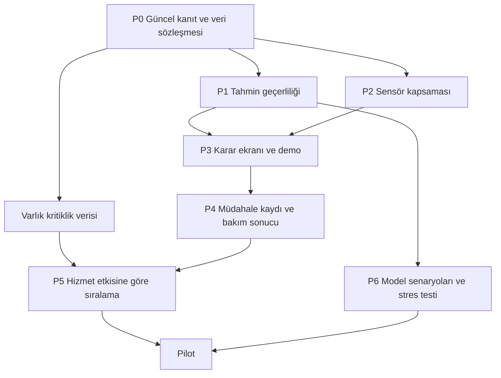

# Grid Up — inovasyon uygulama planı

18 Eylül 2026 · Dayanak: [araştırma raporu](INOVASYON-SEKTOR-TASARIM-RAPORU-2026-09-18.md) · [Görsel kaynak rehberi](TASARIM-INCELEME-REHBERI.md)

## 1. Hedef ve kapsam kararı

**İlk hedef:** sistemin erken uyarısını, veri güvenilirliğini ve sensör kapsamasını aynı karar ekranında göstermek. **İkinci hedef:** bakım kaydı ile müdahale sonrası sonucu bağlamak. **Üçüncü hedef:** hizmet etkisine göre açıklanabilir bakım sırası oluşturmak.

İki ayrı teslim hattı öneriyorum:

- **Yarışma paketi:** mevcut iç plana göre 20 Eylül'e kadar kanıt tutarlılığı, dar kapsamlı güvenilirlik kartı ve tekrarlanabilir demo. Kapsama görünümü yalnız zaman kalırsa.
- **Ürün geliştirme paketi:** teslim sonrasında yaklaşık 3–4 haftalık geliştirme ve ardından 4–6 haftalık saha pilotu. Süreler tahmin; saha erişimi bu süreye dahil değil.

Resmî açık takvim ile ekip içi teslim tarihi arasındaki ayrım araştırma raporunda açıklanıyor. Buradaki 20 Eylül tarihi yeni doğrulanmış organizatör taahhüdü değil, mevcut ekip planının varsayımıdır.

Bu belge görev planıdır; kutucuklar henüz tamamlanmış işleri göstermiyor. Önceki backlog'da mevcut olan özellikler yeniden geliştirilmez. Önerilen sahiplik, README'deki uzmanlık dağılımına dayanır: **A/Tuna: algoritma; B/Ahmet: platform; C/Berke: arayüz, donanım ve teslim.** Bu dağılım ekipte teyit edilecek bir öneridir.

## 2. İş sırası ve bağımlılıklar

**Kritik yol:** P0 → P1 → P3. P2 bunu geciktirmemeli. P4–P6 yarışma için zorunlu kapsam değil.

## 3. P0 — Güncel durumu sabitle ve iddiaları ölçümle eşle

**Sahip:** A + B; rapor/sunum C. **Efor:** 0,5–1 kişi-gün; beklenmedik mevcut hata düzeltmeleri ayrıca.

- [x] Mevcut commit, senaryo seed'i, yapılandırma ve veri sürümünü kaydet.
- [x] `docs/12` prognoz sonuçlarını geçici çıktıya yeniden üret; eski raporun üzerine kontrolsüz yazma.
- [x] S1 erken uyarısı ile süre tahmininin doğruluğunu ayrı karşılaştır.
- [x] S8 sensör arızası ve sınır aşımı sonrasında sonlu TTL üretiminin güncel durumunu doğrula.
- [x] README/sunumdaki toplam maliyet, bildirim teslimi ve saha doğrulaması ifadelerini kanıt kapsamıyla eşle.
- [x] Mevcut başarılı demo yapılandırmasını ve geri dönüş noktasını kaydet.

**Çıktı:** tek sayfalık “iddia → test/ölçüm → sınır” tablosu; güncel başarım raporu; bilinen açıkların kısa listesi. → [docs/20-p0-kanit-ve-sinir-raporu.md](docs/20-p0-kanit-ve-sinir-raporu.md) (18 Eylül 2026).

**Bitti ölçütü:** her sayının hangi veri ve sürümden geldiği bulunabiliyor; simülasyon ile saha iddiası ayrılıyor. Bu aşama bitmeden “model şu kadar güvenilir” rozeti tasarlanmaz.

## 4. P1 — Tahmin geçerliliği ve kanıt kartı

**Rapor karşılığı:** I-01. **Sahip:** A karar mantığı, B taşıma/sözleşme, C görünüm. **Toplam efor:** 1–2 kişi-gün; P0 dışında.

### İşler

- [x] Geçerlilik nedenlerini sözleşmede tanımla: öğreniyor, veri yetersiz, sensör şüphesi, model kapsamı dışında, tahmin geçerli, sınır aşıldı.
- [x] Alarm şiddeti ile tahmin geçerliliğini ayrı tut. Ölçülen sınır ihlali varken ayrıca sensör şüphesi de gösterilebilsin.
- [x] Sensör şüphesi, bayat veri ve geçersiz model koşullarında TTL davranışını kaynağında düzenle; yalnız UI'da saklama.
- [x] Ham ölçüm, türetilmiş gösterge, tahmin ve varsayımı kartta ayır.
- [x] API → UI → bildirim/SCADA temsillerindeki tutarlılığı kontrol et. Protokol geçersiz-değer temsilini mevcut sözleşmeye göre ele al.
- [x] Varsayılan “%95 güven” gibi kalibrasyonsuz oranlar kullanma; önce koşul ve neden göster.

**Başlangıç dosyaları:** `libs/panoalgo/panoalgo/{detect,edge,quality}.py`, `contracts/changes/`, `backend/app/api/views.py`, `frontend/src/components/AlarmNedeni.tsx`, `frontend/src/pages/PanoDetay.tsx`.

### Kabul senaryoları

| Durum | Beklenen davranış |
|---|---|
| Sağlıklı ölçüm, öğrenme tamamlanmamış | Öğrenme bilgisi; doğrulanmamış süre tahmini yok |
| Gevşek bağlantı belirtisi, yeterli veri | Erken uyarı korunur, dayanaklar görünür |
| Sensör sapması | Şüphe nedeni ve geçersiz tahmin durumu; yanıltıcı geri sayım yok |
| Veri kopması | Son veri zamanı ve izleme kaybı; son değer canlı gibi görünmez |
| Sınır aşılmış | “Sınır aşıldı”; kritik ölçüm alarmı bağımsız kalır |

**Çıktı:** panoalgo → backend → frontend uçtan uca `gecerlilik` alanı ve Türkçe metinleri; 5 kabul senaryosunun tümünü kanıtlayan uçtan uca testler; S8 bilinen sınırının ölçülüp dürüstçe kayıtlı güncellemesi. → [docs/21-p1-tahmin-gecerliligi-tamamlandi.md](docs/21-p1-tahmin-gecerliligi-tamamlandi.md) (19 Eylül 2026).

**Teslim kapısı:** bu senaryolar geçmeden yeni demo sürümüne alınmaz. Eski sürümde sorun yoksa davranış gereksiz değiştirilmez; kart ve kanıt kapsamı tamamlanır.

## 5. P2 — Sensör kapsamasını 2D/3D'ye bağla

**Rapor karşılığı:** I-05. **Sahip:** C; nokta envanteri/sözleşme için B. **Efor:** 1–2 kişi-gün.

- [ ] Pano tipine göre beklenen kritik noktaların listesini tanımla.
- [ ] “Ölçüm mevcut”, “modelden çıkarım”, “bayat”, “ölçüm yok” durumlarını ayrı göster.
- [ ] Kapsama paydasını beklenen fiziksel noktalardan üret; gelen sensör sayısını payda yapma.
- [ ] 2D ve 3D aynı veri kaynağını kullansın; seçilen nokta liste/trendle eşleşsin.
- [ ] Nokta ayrıntısına sensör kimliği, faz, son geçerli veri ve veri türünü ekle.

**Başlangıç:** `panelGeometry.ts`, `OnGorunus.tsx`, `Ikiz3D.tsx`, `CihazSagligi.tsx`.

**Bitti ölçütü:** ölçülmeyen nokta normal/yeşil görünmüyor; bir sensör kopunca kapsama azalıyor; aynı noktanın kimliği bütün görünümlerde aynı.

**Kapsam sınırı:** ilk sürümde otomatik sensör yerleşimi optimizasyonu ve yeni donanım tedariki yok.

## 6. P3 — Karar ekranı, tasarım ve yarışma demosu

**Sahip:** C; uçtan uca doğrulama B/A. **Efor:** 1–2 kişi-gün. Tasarım incelemesi bu efora dahil kısa bir çalışma; tam tema yenilemesi değil.

### Tasarım sırası

- [ ] [Kaynak rehberindeki](TASARIM-INCELEME-REHBERI.md) ilk beş referansı 60–90 dakikada incele; her biri için alınacak bir davranış seç.
- [ ] Üç ekran taslağı hazırla: filo öncelik listesi, alarm kanıt paneli, nokta/kapsama ayrıntısı.
- [ ] Mevcut Barlow, açık yüzey ve grafit gezinmeyi koru; alarm ve marka renklerini görev olarak ayır.
- [ ] Öncelik tablosunda “neden bu sırada”, veri durumu ve son veri zamanını görünür yap.
- [ ] Dar ekranda liste → ayrıntı akışı; klavye erişimi; yalnız renge dayanmayan durumlar.

### Demo sırası

1. Sağlıklı yük artışı: sistem bunu bozulmayla karıştırıyor mu?
2. S1 bağlantı bozulması: fiziksel gösterge ve sabit eşik karşılaştırması.
3. S8 sensör şüphesi/veri kopması: sistem neden tahmin vermiyor?
4. Aynı olayın API, SCADA ve seçilen bildirim kanalındaki izi.
5. Gerçekleşen ölçümler ile henüz planlanan özelliklerin ayrımı.

**Bitti ölçütü:** aynı kayıtlı yapılandırmayla üç ardışık demo tamamlanır; varsa başarısızlık gizlenmez ve kapsam daraltılır. Yedek video aynı sürümden kaydedilir. 3–5 kişinin “en acil pano / alarm nedeni / veri bayat mı?” görevleriyle hızlı kullanılabilirlik kontrolü yapılır.

## 7. Teslim öncesi uygulanabilir dar takvim

| Zaman bloğu | A | B | C | Çıkış koşulu |
|---|---|---|---|---|
| İlk yarım gün | Prognoz/kalite tekrar ölçümü | API/protokol ve bildirim kanıtı | Kaynak incelemesi, kanıt kartı taslağı | P0 açıkları sınıflandı |
| Sonraki gün | P1 geçerlilik mantığı | P1 sözleşme ve veri aktarımı | P1 kanıt kartı, boş/bayat durumlar | P1 kabul senaryoları geçti |
| Son blok | Kontrol senaryoları | Uçtan uca demo | Sunum, video, okunabilirlik | Tek sürümden tekrarlanabilir teslim |

Bu tabloda ekip işleri aynı zaman penceresinde yapabilir; fakat entegrasyon seri bağımlılık taşır. **P2 ancak P1/demo hazırsa alınır.** İlk blokta mevcut sistemi bozan önemli hata çıkarsa yeni özellik bütçesi o hataya aktarılır. 20 Eylül 18:00 ekip içi paketleme hedefi korunabilir; kesin organizatör saatinin yerine geçmez.

## 8. Teslim sonrası geliştirme

| Paket | Kapsam | Efor | Bağımlılık | Bitti ölçütü |
|---|---|---:|---|---|
| **P4 Bakım sonucu** | Müdahale kaydı; eşlenmiş yük/ortamda önce/sonra; taban sürümü | 2–4 kişi-gün | P1, kayıt ve yetki modeli | Sadece yük düşüşü başarı sayılmıyor; veri yetersiz sonucu var |
| **P5 Hizmet etkisi** | Varlık kütüğü; kritiklik; aynı öncelik içinde açıklanabilir sıra | 2–3 kişi-gün | İşletmenin gerçek verisi | Eksik bilgi uydurulmuyor; P1 ekonomik puanla geriye düşmüyor |
| **P6 Stres testi** | Ayrı seed/profil seti; kalite kaybı ve model dışı koşul | 2–4 kişi-gün | P0/P1 | Yanlış olay, gecikme, geçersiz tahmin ve kaçınma birlikte raporlu |
| **P7 Yük senaryosu** | Aynı modelle varsayımlı yük/ortam deneyi | 2–4 kişi-gün | Geçerli model | Ölçüm ve model çizgileri ayrılıyor; saha komutu üretilmiyor |
| **P8 Filo vakası** | Ortak zaman/saha/türde olay gruplama | 2–4 kişi-gün | Saha kimliği ve alarm geçmişi | Alt olaylar kaybolmuyor; bağımsız kritik olay korunuyor |
| **P9 İlk 100 pano** | Ölçüm açığına göre paket ve toplam maliyet planı | 3–5 kişi-gün | P2, envanter/BOM | Var olan cihaz tekrar satın alınmıyor; kapsam dışı riskler açık |

Bu altı paket **13–24 kişi-gün** geliştirme tahminidir; kurumsal entegrasyon, saha tedariki ve kapsamlı yetkilendirme kurulumu dahil değildir. Yaklaşık %25 entegrasyon tamponuyla 17–30 kişi-gün ayırmak daha gerçekçi. Üç kişi olsa da bağımlılıklar nedeniyle bunu kişi sayısına bölüp kesin takvim çıkarmamak gerekir.

Önerilen sıra: **1. hafta P4**, **2. hafta gerçek veri varsa P5 + P6**, **3. hafta P7/P8**, **4. hafta P9 ve pilot hazırlığı**. Varlık verisi gecikirse P5 yerine P6 ilerler; sahte veri yalnız açıkça etiketlenmiş tasarım prototipinde kullanılır.

## 9. Pilot ve ölçüm planı

4–6 haftalık pilot önerisi: önce 10–20 pano, gölge izleme, operatör inceleme kayıtları ve planlı bakım karşılaştırması. Genişletme kararı aşağıdaki metriklere dayanmalı; eşikler işletmeyle pilot başlamadan belirlenmeli.

- Veri kapsaması ve bayat veri süresi.
- Yanlış olay/pano-gün; kullanıcıya düşen vaka ve bildirim sayısı ayrı.
- Geçersiz TTL gösterimi; tahminden kaçınma oranı ve nedeni.
- Alarmı anlama/inceleme süresi; gereksiz saha ziyareti.
- Gerçek saha incelemesiyle doğrulanan bulgular.
- Karşılaştırılabilir bakım vakaları ve iyileşme/veri-yetersiz dağılımı.

Nadir arıza gerçekleşmemiş kısa pilotta saha recall değeri üretilmez. “Alarm kapandı” bakımın işe yaradığını tek başına kanıtlamaz.

## 10. Ortak tamamlanma tanımı

Her iş paketinde şu dört çıktı olmalı:

1. **Çalışan davranış:** normal, eksik veri ve hata durumlarıyla.
2. **Anlaşılır ekran:** kullanıcı ölçüm/tahmin ayrımını yapabiliyor.
3. **Kanıt:** test veya ölçüm, veri ve sürüm bilgisiyle tekrar üretilebiliyor.
4. **Dürüst doküman:** uygulanan, simüle edilen ve yol haritasında olan ayrılıyor.

Planın ilk uygulanacak işi **P0**, ardından **P1**. Daha fazla ekran veya yeni AI modeli eklemek bu sıranın önüne geçmemeli.
