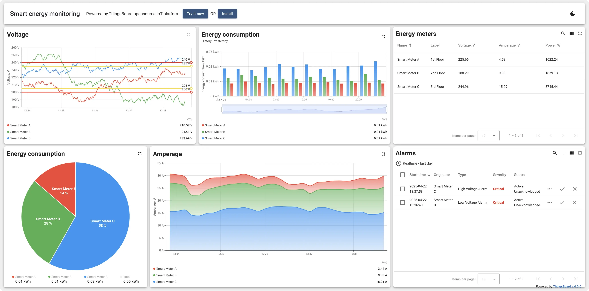
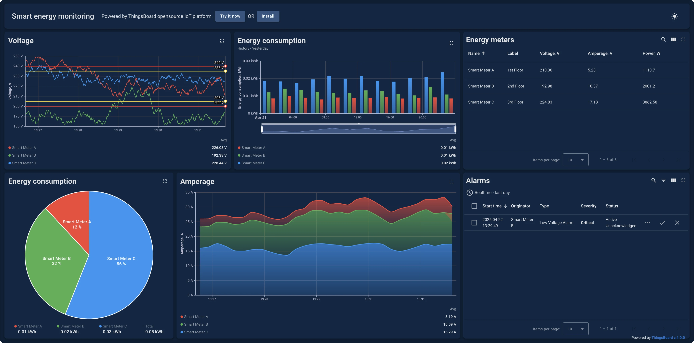
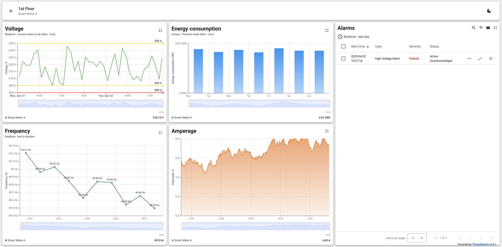
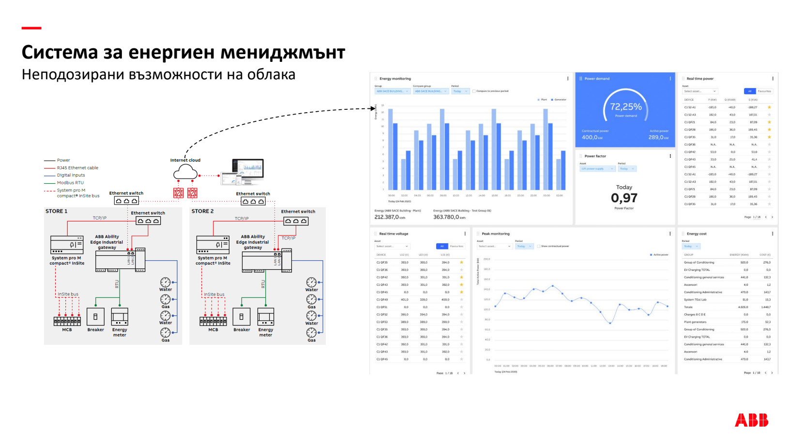
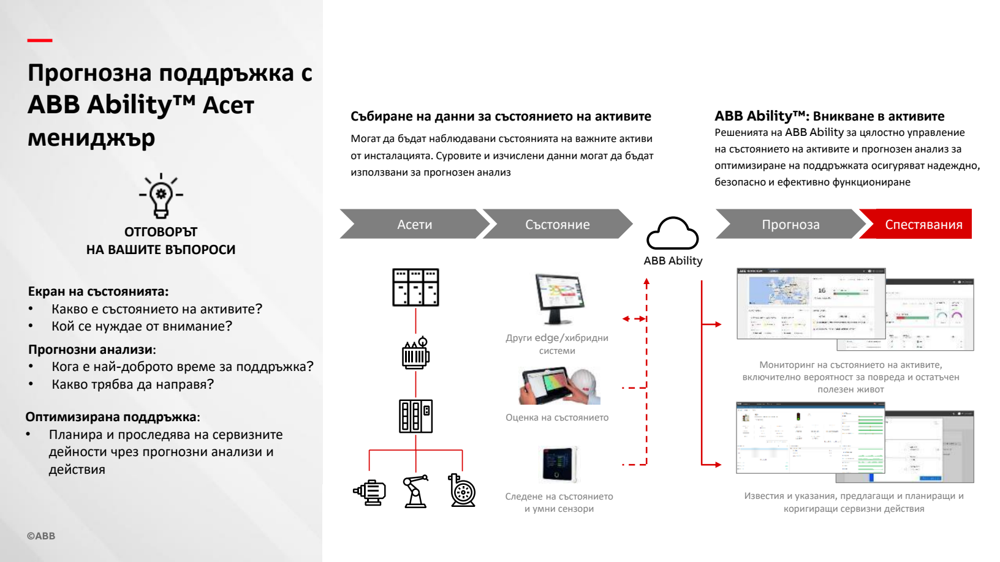

# Grid Up — tasarım inceleme rehberi ve görsel kaynaklar

18 Eylül 2026 · [Uygulama planı](INOVASYON-UYGULAMA-PLANI.md) · [Sektör raporu](INOVASYON-SEKTOR-TASARIM-RAPORU-2026-09-18.md)

**Başlangıç önerim: Schneider PME → ThingsBoard → Siemens iX → ABB → Hitachi.** İlk ikisinde ürün etkileşimine, Siemens'te bileşenlere, ABB ve Hitachi'de varlık sağlığı/bakım anlatımına bak.

Kaynaklar resmî ürün, doküman veya tasarım sistemi sayfalarıdır. Canlı demoların bağlantıları doğrulandı; bu araştırmada bütün ekranları oturum açarak test edilmedi. Üretici görselleri ayrı klasöre kaydedildi; bizim arayüzümüz veya ürün içinde kullanılacak özgün varlıklar değiller. ABB PDF'i 2021 tarihli tarihsel referanstır; güncel ürün arayüzünün birebir görünümü sayılmamalı.

## 1. Hızlı bağlantı listesi

| Öncelik | Kaynak | Açılacak bağlantı | Erişim / içerik | Bizde karşılığı |
|---:|---|---|---|---|
| 1 | **Schneider PME** | [Canlı demo](https://demo.ecostruxure-power-monitoring-expert.se.app/Web/Auth?ReturnUrl=/web) · [Resmî erişim bilgisi](https://www.se.com/us/en/faqs/FA360416/) | Üreticinin yayımladığı demo hesapları; web uygulaması | Alarm, olay, trend ve elektrik sistemi ayrıntısı |
| 2 | **ThingsBoard Smart Energy** | [Ürün ve ekranlar](https://thingsboard.io/use-cases/smart-energy/) · [Canlı panel](https://demo.thingsboard.io/dashboard/e8e409c0-f2b5-11e6-a6ee-bb0136cc33d0?publicId=963ab470-34c9-11e7-a7ce-bb0136cc33d0) | Kamuya açık demo bağlantısı; ekran görselleri yerelde de var | Sayaç listesi → ayrıntı; grafik/alarm birlikteliği |
| 3 | **Siemens iX** | [Bileşen galerisi](https://ix.siemens.io/docs/components/overview) · [Başlangıç uygulamaları](https://ix.siemens.io/docs/home/getting-started/starter-app) | Açık dokümantasyon ve örnekler; bir enerji ürünü değil | Navigasyon, tablo, yan panel, durum işaretleri |
| 4 | **ABB Energy and Asset Manager** | [Ürün anlatımı](https://www.abb.com/global/en/company/innovation/news/granular-visibility) · [Demo talebi](https://campaign-el.abb.com/ability_em/demo) | Demo form/davet istiyor; 2021 sunumu aşağıda yerel | Varlık sağlığı, enerji/varlık görünümü ayrımı |
| 5 | **Hitachi Lumada APM** | [Video ve demo merkezi](https://go.hitachienergy.com/Lumada-APM-introduction) | Tanıtım/video sayfası; bazı içeriklerde form akışı var | Bakım, onarım, değişim karar akışı |
| 6 | **Siemens Electrification X** | [Asset Management](https://www.siemens.com/de-ch/products/electrification-x/asset-management/) | Ürün sayfası; arayüz görseli arama sonucunda görüldü, tam sayfa araçta açılamadı | Filo → varlık → olay hiyerarşisi |
| 7 | **ENTES** | [Enerji izleme ürünleri ve demo bağlantısı](https://www.entes.com.tr/entes-enerji-izleme-yazilimlari/) | Üretici sayfasında “Enerji Doktoru DEMO”; iç demo oturumu test edilmedi | Türkçe terimler ve yerel enerji yönetimi akışı |
| 8 | **Grafana Play** | [Demo ortamı](https://play.grafana.org/) · [Resmî inceleme rehberi](https://grafana.com/docs/grafana-cloud/visualizations/simplified-exploration/traces/get-started/example-investigation/) | Kamuya açık demo; örnek veriler değişebilir | Zaman filtresi, grafik inceleme, mühendislik görünümü |
| 9 | **ABB SWICOM** | [Ürün sayfası](https://electrification.us.abb.com/products/grid-automation/swicom) | Donanım/yerel HMI bağlamı; açık tam uygulama demosu doğrulanmadı | Fiziksel pano ile dijital durumun ilişkisi |
| 10 | **Dynamic Ratings** | [Switchgear Monitor](https://www.dynamicratings.com/products/switchgear-monitor/) | Ürün ve görseller; filo yazılımı açıklaması | OG durum izleme ve cihaz ayrıntıları |

Bu kaynakların bazıları bulut ürünü. Burada ekran/iş akışı referansı olarak kullanılıyor; projenin şirket içi kurulum gereksinimini değiştirmiyor.

## 2. Schneider PME — önce bunu dene

Schneider'ın [resmî demo erişim sayfası](https://www.se.com/us/en/faqs/FA360416/) şu kamuya açık hesapları yayımlıyor:

| Kullanıcı adı | Parola | Görünüm |
|---|---|---|
| `demo` | `demo` | Genel |
| `utility` | `utility` | Elektrik dağıtım/utility örneği |
| `info` | `info` | Uygulama açıklamaları ve örnekler |

**İnceleme görevi:** önce genel görünümden bir alarmı bul; ilgili cihazın ölçümüne ulaş; aynı zaman aralığındaki olayı incele. Menülerin kaç adım gerektirdiğini not al. Bu bir önerilen keşif rotasıdır; mevcut demo oturumunun bütün adımları burada test edilmedi.

Ek kaynaklar:

- [PME 2024 Web Applications Guide](https://www.se.com/us/en/download/document/7EN02-0502/) — uygulama kullanımı ve yapılandırması için doküman indirme sayfası.
- [Schneider'ın dashboard oluşturma videosu](https://www.youtube.com/watch?v=ezaMFFYoMXI) — 2018 tarihli; etkileşim mantığı için tarihsel referans, güncel görsel stil için değil.

**Projeye uyarlama:** alarm → ölçüm → olay geçişini kısa tut. Genel enerji yönetiminin bütün ekranlarını bizim uygulamaya taşımak yerine alarm inceleme akışını seç.

## 3. ThingsBoard — gerçek ekran görselleri

Aşağıdaki üç görsel, [ThingsBoard Smart Energy](https://thingsboard.io/use-cases/smart-energy/) sayfasındaki üretici görsellerinin yerel kopyalarıdır. AI ile üretilmedi, bizim uygulamadan alınmadı. Statik örnek veriler içerir.

### Açık tema / genel görünüm



[Tam boy yerel görsel](assets/tasarim-referanslari/thingsboard-acik.webp) · [Orijinal görsel](https://img.thingsboard.io/usecases/smart-energy/smart-energy-1.webp)

**Bakılacak yer:** cihaz tablosu, alarm tablosu ve zaman serilerinin aynı çalışma alanındaki ilişkisi. **Bizim tasarım kararımız:** grafik yoğunluğunu ana sayfada azaltıp öncelikli işi öne çıkar; bu yoğunluğu analiz görünümüne taşı.

### Koyu tema



[Tam boy yerel görsel](assets/tasarim-referanslari/thingsboard-koyu.webp) · [Orijinal görsel](https://img.thingsboard.io/usecases/smart-energy/smart-energy-2.webp)

**İnceleme sorusu:** seri renkleri ve alarm işaretleri koyu zeminde aynı kolaylıkla ayırt ediliyor mu? Koyu tema bizim için ayrı tasarım/kontrast çalışması gerektirir.

### Tek sayaç ayrıntısı



[Tam boy yerel görsel](assets/tasarim-referanslari/thingsboard-sayac.webp) · [Orijinal görsel](https://img.thingsboard.io/usecases/smart-energy/smart-energy-3.webp)

**Projeye uyarlama:** filo → pano → sensör ayrıntısı geçişi. Seçili varlığın kimliği ve filtre bağlamı ayrıntı ekranında kaybolmasın.

## 4. Siemens iX — doğrudan kullanılabilir tasarım referansı

Bir ürün ekranını taklit etmek yerine bileşen davranışını incelemek için:

| Bağlantı | İncelenecek şey | Bizim kullanımımız |
|---|---|---|
| [Application](https://ix.siemens.io/docs/components/application) | Uygulama çerçevesi ve yerleşim | Menü + çalışma alanı |
| [Event list](https://ix.siemens.io/docs/components/event-list) | Olayların düzenli listelenmesi | Alarm/vaka listesi |
| [Panes](https://ix.siemens.io/docs/components/panes) | Bağlamsal ayrıntı alanı | Listeyi kaybetmeden kanıt açma |
| [Tüm bileşenler](https://ix.siemens.io/docs/components/overview) | Durum, veri gösterimi, filtre ve gezinme | Ortak etkileşim dili |
| [Tasarım rehberi](https://ix.siemens.io/docs/guidelines/overview) | Sadelik, erişilebilirlik, mobil ve metin dili | Tutarlı ekran davranışı |

Figma kütüphanesi herkese doğrudan açık kabul edilmemeli: [resmî giriş sayfası](https://ix.siemens.io/docs/home/overview), ana kütüphaneyi Siemens hesabıyla ilişkilendiriyor ve misafir/klasik kütüphane erişimini talebe bağlı açıklıyor. Bileşen dokümanları ise açık.

**Önerim:** projeyi iX'e topluca taşımayalım. Mevcut React/CSS sisteminde uygulama çerçevesi, olay listesi ve yan panel davranışlarından yararlanalım.

## 5. ABB — enerji paneli ve bakım anlatımı

### Enerji paneli düzeni



[Görseli aç](assets/tasarim-referanslari/abb-sayfa-16.png) · [Yerel PDF, sayfa 16](assets/tasarim-referanslari/abb-energy-asset-2021.pdf#page=16) · [ABB orijinal PDF](https://library.e.abb.com/public/f445c3ac05e44146adf2c5b26a59ff84/Energy-Asset-Management-31-03-2021.pdf)

Kaynak: ABB'nin 2021 tarihli Bulgarca sunumu; ekran içi etiketler büyük ölçüde İngilizce. PDF sayfası görsele çevrildi; değiştirilmedi. **Bakılacak yer:** kart boyutları, KPI ile tablonun dengesi, dönem filtresi ve karşılaştırma.

### Durumdan bakım aksiyonuna



[Görseli aç](assets/tasarim-referanslari/abb-sayfa-23.png) · [Yerel PDF, sayfa 23](assets/tasarim-referanslari/abb-energy-asset-2021.pdf#page=23)

Bu sayfa piksel düzeyinde UI incelemesinden çok ürün akışını anlamak için yararlı. **Bizim karşılığı:** durum → kanıt → müdahale → bakım sonrası sonuç. Güncel ürün anlatımı için [ABB yazısı](https://www.abb.com/global/en/company/innovation/news/granular-visibility); etkileşimli deneme için [form/davetli demo](https://campaign-el.abb.com/ability_em/demo).

## 6. Hitachi, Siemens Electrification X ve yerel çözümler

**Hitachi:** [Lumada APM demo merkezi](https://go.hitachienergy.com/Lumada-APM-introduction) içinde özellikle “Asset Maintenance” ve “Asset Replacement” bölümlerine bak. Tasarım sorusu: sistem hangi varlığın ne zaman incelenmesi gerektiğini nasıl açıklıyor? Ürün yönü için iyi kaynak; bütün videoların formsuz oynadığı doğrulanmadı.

**Siemens:** [Electrification X Asset Management](https://www.siemens.com/de-ch/products/electrification-x/asset-management/) filo/varlık hiyerarşisi için. [İngilizce kullanım kılavuzu](https://support.industry.siemens.com/cs/attachments/109972744/Electrification_X_Asset_Management_User_Manual_V01.05_en_US.pdf) önceki araştırmada bulundu; bu tur doğrudan erişim 403 döndürdü. Bu nedenle yerel görsel pakete alınmadı; tarayıcında erişim farklı olabilir.

**ENTES:** [resmî enerji izleme sayfasındaki](https://www.entes.com.tr/entes-enerji-izleme-yazilimlari/) “Enerji Doktoru DEMO” bağlantısından ilerle. Özellikle Türkçe elektriksel terimler, tesis seçimi ve rapor adlarını incele. Bizim pano sağlığı ekranı için yerel dil referansı; tam ürün kapsamı aynı değil.

**Grafana:** [Play ortamı](https://play.grafana.org/) zaman filtresi, veri serisi seçimi ve ayrıntılı mühendislik analizi için iyi inceleme alanı. Bizde ana operasyon ekranının yerine değil, trend/olay incelemesinde referans alınmalı. [Grafana'nın demo inceleme rehberi](https://grafana.com/docs/grafana-cloud/visualizations/simplified-exploration/traces/get-started/example-investigation/).

## 7. 75 dakikalık inceleme rotası

| Süre | Kaynak | Not alacağın konu |
|---|---|---|
| 0–20 dk | PME demo; erişim olmazsa uygulama kılavuzu | Alarmdan ölçüme geçiş ve zaman bağlamı |
| 20–35 dk | ThingsBoard canlı panel + yerel görseller | Cihaz listesi, ayrıntı, grafik/alarm düzeni |
| 35–50 dk | Siemens iX | Menü, olay listesi, yan panel, durum bileşenleri |
| 50–60 dk | ABB PDF ve ürün yazısı | Varlık sağlığı ile enerji tüketiminin ayrımı |
| 60–70 dk | Hitachi demo merkezi | Bakım kararına götüren bilgi sırası |
| 70–75 dk | Kendi uygulamamız | Alınacak üç davranış; alınmayacak üç yaklaşım |

Her kaynak için aynı mini formu doldur:

```text
Kaynak / ekran:
Kullanıcının verdiği karar:
İlk fark edilen bilgi:
Ana işlem ve ona ulaşma adımı:
Veri bayat/eksik olduğunda gösterim:
Bizim projeye alınacak davranış:
Alınmayacak yaklaşım ve gerekçesi:
```

## 8. Bu projeye önerdiğim sentez

**Siemens iX'ten düzenli uygulama çerçevesi ve bağlamsal panel; PME'den olay–ölçüm ilişkisi; ThingsBoard'dan hızlı cihaz ayrıntısı; ABB/Hitachi'den varlık durumu ve bakım kararı akışı.** Görsel dil mevcut grafit/açık yüzey/turuncu sistemde kalabilir.

İlk üç tasarım çıktısı: **filo öncelik tablosu**, **alarm kanıt paneli**, **sensör kapsama görünümü**. Tasarım seçimini “hangisi daha gösterişli?” yerine “alarmı daha hızlı ve doğru anlamayı hangisi sağlıyor?” sorusuyla yapalım.

Görsellerin hakları ilgili üreticilere aittir. Yerel kopyalar kaynaklı tasarım incelemesi içindir; ürün varlığı veya bizim tarafımızdan tasarlanmış ekran olarak kullanılmamalıdır.
