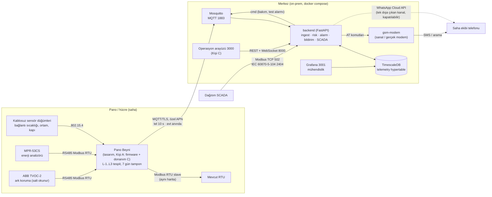
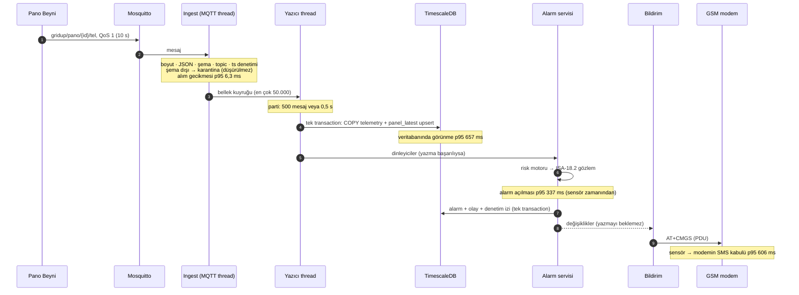
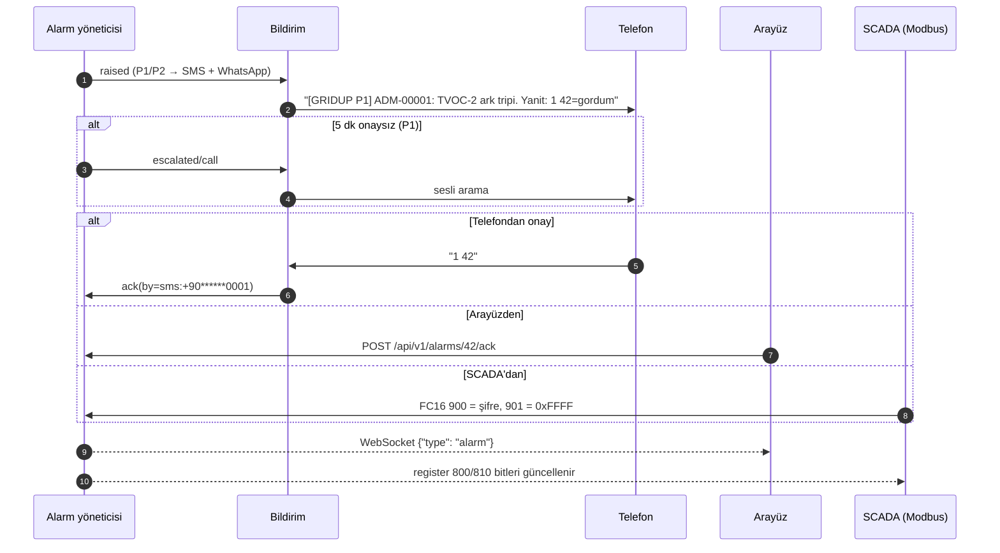
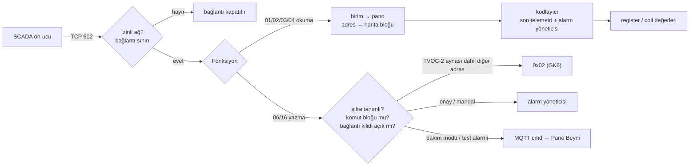

# 02 — Mimari

> **Sahip:** Kişi B · **Kaynak:** rapor §6 · **Kod:** `backend/`, `deploy/` · **Sözleşmeler:** `contracts/`
> Diyagramlardaki gecikmeler 13 Eylül 2026'da **1.000 sanal pano** yük testinde ölçülmüştür (`docs/09-olceklenebilirlik.md`).
> Henüz kodu olmayan bileşenler **(tasarım, Kişi A/C)** diye işaretlidir; burada yalnızca arayüzleri anlatılır.

## 1. Bir bakışta

**Tasarım ilkesi — tespit kenarda, yönetim merkezde.** Pano Beyni ölçer ve karar verir (`alarms` alanı, nokta `q` bitleri); merkez
bu kararı açıklar (Neden / Ne yapmalı / Ne kadar acil), ISA-18.2'ye göre yönetir, insanlara ulaştırır ve SCADA'ya açar. Merkez algoritmayı
yeniden yazmaz. Kenarın kendi başına bilemeyeceği tek şeyi üretir: **haberleşme kopukluğu** (`ALM-COMMS-LOST`).

## 2. Bileşenler

| Bileşen | Sorumluluk | Kod | Kulvar |
|---|---|---|---|
| Sensör düğümleri, Pano Beyni donanımı | Ölçüm, izolasyon, güç, montaj | `hardware/` | C (tasarım) |
| Pano Beyni firmware'i | RS485 master (MPR-53CS, TVOC-2), L-1..L3 tespit, Modbus slave, MQTT, 7 gün halka tampon | `firmware/` | A (tasarım) |
| Veri üreteci, cihaz simülatörleri | Donanım yerine fizik tabanlı telemetri, MPR-53CS/TVOC-2 register simülatörleri | `sim/`, `libs/panoalgo/` | A |
| **Ingest** | MQTT aboneliği, şema/topic/zaman denetimi, karantina, toplu `COPY` | `backend/app/ingest.py` | B |
| **Risk motoru** | Kenar kodlarını noktaya bağlar, sinyal + eşik + öneri + kalan süre | `backend/app/risk.py` | B |
| **Alarm yöneticisi** | ISA-18.2 yaşam döngüsü, histerezis, gruplama, raf, bakım modu, eskalasyon | `backend/app/alarm_manager.py`, `alarm_service.py` | B |
| **Bildirim ağ geçidi** | SMS (PDU) + arama, WhatsApp, çift yönlü SMS onayı, denetim izi | `backend/app/notify/` | B |
| **SCADA ağ geçidi** | Modbus TCP 502: her pano bir birim, aynı harita, şifreli komut bloğu, GK6 filtresi. IEC 60870-5-104 2404: aynı değerler, kendiliğinden zaman etiketli gönderim, salt okunur | `backend/app/scada/` | B |
| **API** | Filo, pano detayı, seri, alarm konsolu, kara kutu, KPI, WebSocket | `backend/app/api/` | B |
| Veritabanı | Telemetri (uzun format hypertable), son durum, alarmlar, olaylar, denetim izi | `deploy/initdb/*.sql` | B |
| Operasyon arayüzü | Filo, pano detayı, dijital ikiz, alarm konsolu, trend, kara kutu | `frontend/` | C |
| Grafana | Ölçek ve alarm KPI panoları (mühendislik görünümü) | `deploy/grafana/`, `scripts/gen_grafana_dashboards.py` | B |

## 3. Bir telemetri mesajının yolculuğu

Yazıcı başka dinleyicileri de besler: WebSocket (arayüz canlı güncellenir) ve SCADA ağ geçidinin bellek görüntüsü. **Ağ thread'i veritabanını
hiç beklemez**: DB yavaşlarsa kuyruk dolar, MQTT keepalive bozulmaz. Veritabanı kapalıyken backend ayağa kalkar, API 503 döner, ingest tekrar
dener; alarm kimliği depodaki en büyük kimlikten devam etmek zorunda olduğu için DB gelene kadar alarm üretilmez (docs/06 §8).

Görünme gecikmesinin tabanı yazıcının 0,5 s parti aralığıdır (ayarlanabilir). Alarm açılması bu aralığın içinde kalır, çünkü alarm servisi
aynı partinin yazımından hemen sonra çalışır.

## 4. Alarm ve onay akışı

Üç onay yolu da aynı alarm yöneticisine gider ve aynı denetim izine yazılır; eskalasyon zinciri hangisi önce gelirse durur. Öncelik matrisi,
yaşam döngüsü ve eskalasyon süreleri: `docs/06-alarm-matrisi.md`.

## 5. SCADA entegrasyonu

Merkez, SCADA için her panoyu bir Modbus birimi olarak sunar ve her birimde **kenardaki Pano Beyni'nin haritasının aynısını** gösterir.
Böylece SCADA mühendisi panonun yanındaki RTU'dan da merkezden de aynı adresi okur. Okuma veritabanına gitmez (bellek görüntüsü). Harita,
kodlama kuralları, istisna kodları ve yazma güvenliği: `docs/03-modbus-haritasi.md`.

Dağıtım SCADA'ları çoğunlukla **IEC 60870-5-104** konuştuğu için aynı görüntü TCP 2404'te kontrollü istasyon olarak da sunulur: ortak
adres = Modbus birimi, IOA = 1000 + PDU adresi, değerler fiziksel kayan nokta, "yok" değeri IV kalite bayrağı. Ana istasyon genel
sorgulama yapar; sonrasında değişen değerler zaman etiketli olarak kendiliğinden gelir (yoklama gerekmez). İstasyon salt okunurdur, kontrol
komutları COT 44 ile reddedilir. İki protokol aynı kodlayıcıyı kullandığı için aynı panoda farklı değer gösteremez (canlıda 139 adreste
0 fark). Nokta planı ve zamanlayıcılar: `docs/04-iec104-haritasi.md`.

## 6. Dağıtım

Tek komut: `docker compose -f deploy/compose.yaml up -d`. İnternet kablosu çıkarılmış halde çalışır (GK4); imajlar bir kez çekilir.

| Servis | İmaj / kaynak | Port (makine) | Sahip | Kalıcı veri |
|---|---|---|---|---|
| `mosquitto` | eclipse-mosquitto:2.0 | 1883 | B | `mqttdata` (QoS 1 kuyruğu) |
| `timescaledb` | timescale/timescaledb:latest-pg16 | 5432 | B | `tsdata` |
| `backend` | `backend/Dockerfile` | 8000 (API/WS), 502 (Modbus TCP), 2404 (IEC 104) | B | — (sözleşmeler salt okunur bağlı) |
| `gsm-modem` | `scripts/virtual_gsm_modem.py` | 127.0.0.1:7001 (yalnızca gelen SMS enjeksiyonu) | B | `deploy/runtime/sms-log.txt` |
| `grafana` | grafana/grafana:11.2.0 | 3001 | B | `grafanadata` |
| `panosim`, cihaz simülatörleri | `sim/` | — | A | — |
| `frontend` | `frontend/` | 3000 | C | — |

Compose dosyası üç parçadır (PLAN.md kural 6): `compose.yaml` (B) `compose.sim.yaml` (A) ve `compose.frontend.yaml` (C) dosyalarını
`include` eder; herkes kendi servisini kendi dosyasında tutar. Sözleşmeler (`contracts/`) backend'e salt okunur bağlanır: bir eşik
değişince yeniden derleme gerekmez, yeniden başlatmak yeter. Bozuk sözleşme veya harita servisi **hiç başlatmaz** (yanlış eşikle
çalışmaktansa gürültülü hata).

Üretim boyutlandırması ölçümle: 1.000 pano × 7 noktada backend ortalama **0,16 çekirdek**, TimescaleDB **0,05 çekirdek** ve en çok
**635 MiB** RAM kullandı (docs/09 §4).

## 7. Dayanıklılık

| Arıza | Davranış | Kanıt |
|---|---|---|
| Hücresel hat koptu | Kenar 7 gün tamponlar (tasarım, A); merkez 5 dk sonra `ALM-COMMS-LOST` (SYS) açar; veri gelince geri doldurma son durumu ezmez | `test_api_alarms`, `test_alarm_manager`, `test_db_integration` |
| Veritabanı kapalı | Backend açılır, API 503; ingest partiyi saklayıp tekrar dener; alarm yazımları sırayla bekletilir, telefon yazmayı beklemez | `test_api_panels`, `test_db_integration`, docs/06 §8 |
| Tek bozuk mesaj | Parti tek tek yazılır; bozuk mesaj ayıklanır, sağlamlar yazılır | `test_ingest` |
| Şema dışı mesaj | Düşürülmez, nedeniyle karantinaya yazılır | `test_ingest`, canlı broker doğrulaması |
| Backend yeniden başladı | MQTT oturumu kalıcı (QoS 1 mesajlar bekler); açık alarmlar aynı kimlikle geri gelir; SCADA görüntüsü depodan tazelenir | `test_alarm_store`, `test_scada_gateway` |
| Modem koptu / takıldı | Sürücü yeniden bağlanır, yarım SMS'i iptal eder; zaman aşımı bildirim thread'ini kilitlemez | `test_sms_modem` |
| İnternet yok | WhatsApp işleri geri çekilmeli tekrar; SMS ve SCADA etkilenmez | `test_notifier` |
| Modbus portu dolu | Backend durmaz; `/health` → `scada.error` | `test_scada_app` |

Yazılım/sistem FMEA'sı: `docs/07b-fmea-yazilim-sistem.md`.

## 8. Güvenlik sınırları

- **Sahada gelen bağlantı yok:** Pano Beyni yalnızca dışarı (MQTT) bağlanır; özel APN/VPN (rapor §7.4).
- **Merkezde dışa çıkan tek kanal WhatsApp'tır:** yalnızca saha kodu, öncelik, tek satır metin ve iç portal bağlantısı; kapatılabilir (GK4).
- **Modbus güvensizdir:** ağ geçidi varsayılan salt okunur, izinli ağlar dışından bağlantıyı keser, koruma cihazına (TVOC-2) yazmayı
  şifreyle bile reddeder (GK6).
- **Kişisel veri:** telefon numaraları yalnızca `.env`'de; denetim izinde maskeli (KVKK). Ayrıntı: `docs/15-guvenlik-kvkk.md`.

## 9. Sözleşmeler — bileşenlerin tek ortak dili

| Dosya | Üreten | Tüketen |
|---|---|---|
| `mqtt-telemetry.schema.json` | Pano Beyni / veri üreteci (A) | ingest (B), yük testi (B) |
| `alarm-codes.yaml` | üçü birlikte | kenar tespiti (A), alarm yöneticisi + bildirim + SCADA kodlayıcı + Grafana (B), arayüz (C) |
| `modbus-map.yaml` | üçü birlikte | firmware (A), Modbus TCP ağ geçidi + docs/03 (B) |
| `openapi.yaml` | backend (B) | arayüz (C) |
| `scenario-labels.schema.json` | senaryo üreteci (A) | doğrulama (A), yük testi (B) |

Sözleşmeler donmuştur (PLAN.md kural 3); değişiklik `contracts/changes/` altında yeni dosya ve üç onayla yapılır.
