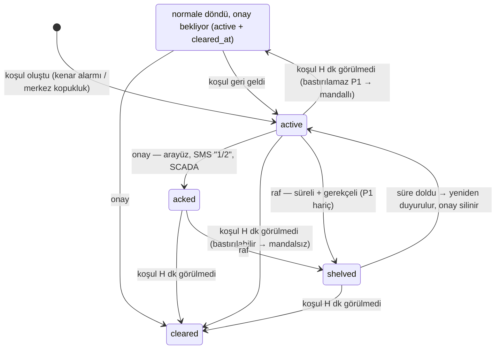

# 06 — Alarm Matrisi, ISA-18.2 Alarm Yönetimi ve Bildirim

> **Sahip:** Kişi B · **Tek kaynak:** `contracts/alarm-codes.yaml` (v1, donmuş).
> §2 ve §9'daki tablolar o dosyadan **üretilir** (`python scripts/gen_alarm_doc.py`), elle düzenlenmez (PLAN.md kural 10).
> **Kod:** `backend/app/alarm_manager.py` (yaşam döngüsü), `risk.py` (açıklama), `alarm_service.py` (kalıcılık, zamanlayıcı),
> `notify/` (SMS sürücüsü, WhatsApp, bildirim ağ geçidi), `scripts/virtual_gsm_modem.py` (sanal GSM modem).

## 1. Neden bir alarm yöneticisi?

Sabit eşik ile "her ihlalde SMS" yaklaşımı kontrol odasında **alarm seli** üretir. EEMUA 191'e göre operatör başına
günde ~150 alarm kabul edilebilir, ~300 yönetilebilir üst sınırdır; bunun üstünde operatör alarmları okumadan
onaylamaya başlar ve kritik olan kaybolur. Bu nedenle tespit (kenarda) ile alarm yönetimi (merkezde) ayrıdır:

| Katman | Nerede | Ne yapar |
|---|---|---|
| L-1…L3 tespit | Kenar (Pano Beyni firmware / `panoalgo`) | Veri kalitesi, mutlak limitler, ısıl direnç indeksi, füzyon → telemetride `alarms` + nokta `q` bitleri |
| L4 açıklama | Merkez, `risk.py` | Her kodu noktaya bağlar: **Neden?** (sinyal + eşik), **Ne yapmalı?** (hipotez önerisi), **Ne kadar acil?** (`ttl_h`) |
| Alarm yönetimi | Merkez, `alarm_manager.py` | ISA-18.2 yaşam döngüsü, histerezis, gruplama, bakım modu, raf, eskalasyon |
| Bildirim | Merkez, `notify/` | Öncelik tablosuna göre SMS / WhatsApp / arama, çift yönlü onay, denetim izi |

Merkez algoritmayı yeniden yazmaz: kenarın kararını açıklar ve yönetir. Merkezde yalnızca kenarın kendi başına
bilemeyeceği tek şey üretilir: **haberleşme kopukluğu** (`ALM-COMMS-LOST`, §7).

## 2. Öncelik matrisi (üretilmiş)

<!-- URETILMIS:oncelik-matrisi -->
| Oncelik | Ad | Kod sayisi | Ekran | Is emri | SMS | WhatsApp | Arama (dk) | Eskalasyon (dk) | SCADA | Yerel role | Bastirilabilir |
|---|---|---|---|---|---|---|---|---|---|---|---|
| **P1** | Kritik | 3 | audible | evet | evet | evet | 5 | 15 | evet | siren | **hayir** |
| **P2** | Alarm | 8 | evet | evet | evet | evet | - | 30 | evet | heater_fan | evet |
| **P3** | Uyari | 6 | evet | planned | - | - | - | - | optional | - | evet |
| **SYS** | Sistem | 5 | evet | evet | digest_only | - | - | - | - | - | evet |
| **INFO** | Bilgi | 0 | evet | - | - | - | - | - | - | - | evet |
<!-- /URETILMIS:oncelik-matrisi -->

Hedef dağılım (ISA-18.2 / EEMUA 191): **%5 yüksek, %15 orta, %80 düşük** (`thresholds.target_distribution_pct`).
"SMS: digest_only" ve "daily_digest" anında kimseyi aramaz; anlık kanal yalnızca `sms: true` / `whatsapp: true` olan önceliklerdir.

## 3. ISA-18.2 yaşam döngüsü



| Kural | Değer (sözleşmeden) | Gerekçe |
|---|---|---|
| Histerezis **H** | `hysteresis_clear_min` = 5 dk | Eşik çevresinde salınan sinyal yeni alarm ve yeni SMS üretmez (chattering) |
| Mandallama | `suppressible: false` (P1) | Bastırılamayan alarm operatör görmeden kaybolamaz: ark tripi tek mesajlık bir olaydır |
| Raf süresi | 1 – `shelve_max_min` = 480 dk, gerekçe ≥ 3 karakter | ISA-18.2: raf süreli ve gerekçelidir; P1 rafa **alınamaz** (API 403) |
| Zaman tabanı | Histerezis/gruplama **olay** zamanı (`ts`); raf/eskalasyon **duvar** saati | Hızlandırılmış senaryo oynatmada fizik aynı kalır; operatör tepki süresi gerçek dakikadır |
| Backfill | Panonun son işlenen `ts`'inden eski örnek canlı durumu değiştirmez | 7 günlük tamponun geç gelmesi eski alarmları "şimdi" açmaz; veri yine de saklanır |
| Yeniden başlatma | Açık alarmlar aynı kimlik ve durumla DB'den yüklenir; histerezis ilk örnekle başlar | Kesinti boyunca koşulun ne olduğu bilinmez: doğrulanmadan temizlenmez |

API karşılıkları (`contracts/openapi.yaml`): `GET /api/v1/alarms` (varsayılan `state=active,acked`),
`POST /api/v1/alarms/{id}/ack` (404 yok · 409 zaten onaylı/temizlenmiş · 422 eksik alan),
`POST /api/v1/alarms/{id}/shelve` (403 P1 · 409 · 422), pano detayında `active_alarms`, WebSocket `{"type": "alarm"}`.

## 4. Alarm seli önlemleri

1. **Histerezis** (§3): koşul 5 dk görülmeden alarm kapanmaz; dönerse aynı alarm sürer.
2. **Olay gruplama** (`group_window_min` = 10 dk, aynı pano): yeni alarm, penceredeki bir olaya şu durumlarda katılır:
   - aynı **hipotezin kanıtı** ise (ör. `ALM-K-WARN` ve `ALM-THR-PHASE-DIF` → `HYP-LOOSE-CONN`),
   - **aynı bağlantı noktasında** ise (hipotezi olmayan 50 K terminal uyarısı, aynı noktanın K alarmıyla),
   - olay bir **P1 ile açılmışsa** (ilk-çıkan / first-out: ark tripinden sonraki sıcaklık alarmları olayın altına girer).
3. **Telefonu çağırma kuralı:** olayın **ilk** alarmı, olaydakilerden **daha acil** bir alarm ve **her P1** telefonu çağırır;
   aynı olayın eşit/düşük öncelikli tekrarları çağırmaz. (Koruma sağlığı kaybından 3 dk sonra gelen ark tripi yine arar.)
4. **Bakım modu** (`health.maint_mode`): bastırılabilir alarm oluşmaz, açık olanların eskalasyonu bekler; **P1 asla bastırılmaz**.
5. **Raf:** süreli, gerekçeli, P1 hariç; süre dolunca alarm onaysız olarak yeniden duyurulur ve eskalasyon zinciri baştan başlar.
6. **Öncelik matrisi:** P3 günlük özete, SYS toplu özete gider; saha ekibinin telefonuna yalnızca P1/P2 düşer.

## 5. Açıklanabilirlik — her alarm kartı üç soruyu cevaplar

Canlı yığında 13 Eylül 2026'da üretilmiş gerçek bir alarm (`GET /api/v1/alarms`, kısaltılmış):

```json
{
  "id": "2", "event_id": "EVT-1", "pano_id": "TST-99001", "code": "ALM-K-WARN", "prio": "P3", "state": "active",
  "text": "Isil direnc indeksi K/K0 > 1.3 — baglanti direnci artisi suphesi",
  "reason": {
    "signals": [{"tag": "t_conn.GIRIS_L2.k_ratio", "value": 1.45, "threshold": 1.3, "unit": "K/K0"}],
    "layer": "L1", "point": "GIRIS_L2", "basis": "Rapor 6.5 L1-1"
  },
  "advice": "Planli bakimda tork kontrolu ve temizlik; kritik evrede yuk azaltma onerisi",
  "ttl_h": 150.5
}
```

- **Neden?** `reason.signals`: eşiği aşan noktanın gerçek telemetri etiketi, değeri ve sözleşmedeki eşik. Kenar kararını 1 s
  veriyle verip 10 s özette değer eşiğin hemen altında kalsa bile alarm en yakın noktaya bağlanır, kimliği kaymaz.
  Faz farkı en sıcak fazı en soğuk faz + 15 K ile kıyaslar; nötr faz sayılmaz.
- **Ne yapmalı?** `advice`: kodun kanıtı olduğu hipotezlerden kenarın baskın modu; yoksa en ağır hipotez
  (ör. `ALM-PD-TREND` hem yoğuşma hem izolasyon kanıtıdır).
- **Ne kadar acil?** `ttl_h`: noktanın 70 K sınırına kalan saat tahmini; pano düzeyindeki alarmda kenarın `risk.ttl_h`'si.

## 6. Bildirim kanalları ve eskalasyon

| Kanal | Nasıl | On-prem uyumu | Dayanıklılık |
|---|---|---|---|
| **SMS (birincil)** | Üretim sürücüsü `notify/sms_modem.py`: AT komutları, **PDU modu** (3GPP TS 23.040), birleşik SMS | Tam: veri şirket dışına yalnızca operatör şebekesiyle çıkar | Kopan modeme yeniden bağlanır, yarım kalan SMS girişini ESC ile iptal eder, geri çekilmeli tekrar |
| **Sesli arama** | Aynı modem, `ATD<numara>;` → `ATH` | Tam | P1 eskalasyonu |
| **WhatsApp (ikincil)** | Meta **Cloud API** `v25.0/<PHONE_ID>/messages` | Kısmi: şirket dışına çıkan **tek** kanal; yalnızca saha kodu + öncelik + tek satır + iç portal bağlantısı | 5xx/429/ağ yok → tekrar; yetki/pencere dışı → bir kez kaydedilir. Kapatılabilir |
| **Ekran** | WebSocket `{"type": "alarm"}` | Tam | Veritabanı yazımını beklemez |

**Donanımsız doğrulama.** Modem satın alınmadı (GK3). `scripts/virtual_gsm_modem.py` gerçek bir modemin AT arayüzünü TCP üzerinden
taklit eder; üretim sürücüsü onu pyserial `socket://` URL'siyle açar. Gerçek modemde **yalnızca bir satır** değişir:

```
SMS_DEVICE=socket://gsm-modem:7000      # sanal modem (demo)
SMS_DEVICE=socket://ser2net-host:7000   # veri merkezinde terminal sunucusu arkasındaki gerçek modem
SMS_DEVICE=/dev/ttyUSB2                 # USB GSM modem
```

Sanal modem gerçek modem kadar katıdır: `AT+CMGS` uzunluğu tutmayan PDU'yu `+CMS ERROR: 304` ile reddeder, dolayısıyla sürücünün
uzunluk hesabı gerçekten sınanır. Her komut, yanıt ve SMS'in **PDU dökümü** `deploy/runtime/sms-log.txt`'ye yazılır. Numara maskelidir,
dosya git dışıdır; PDU'lar herhangi bir çevrimiçi PDU çözücüsüyle doğrulanabilir.

**Eskalasyon** (onaysız alarm, duyuru anından itibaren duvar saatiyle; `priorities` tablosundan):

| Süre | P1 Kritik | P2 Alarm |
|---|---|---|
| 0 | SMS + WhatsApp → `ALERT_RECIPIENTS` | SMS + WhatsApp → `ALERT_RECIPIENTS` |
| `call_after_min` = 5 dk | Sesli arama → `ALERT_RECIPIENTS` | — |
| `escalate_after_min` | 15 dk: SMS (+WhatsApp) → `ALERT_ESCALATION` | 30 dk: SMS (+WhatsApp) → `ALERT_ESCALATION` |

Onay (arayüz, SMS veya SCADA) zinciri durdurur. Gecikmiş zamanlayıcı birikmiş adımların hepsini sırayla atar.

**Mesaj metinleri** (`notify/templates.py`). SMS tek parça GSM-7'ye sığar: Türkçe karakter ASCII'ye katlanır, `[ ]` gibi uzantı
karakterleri iki septet sayılır. Canlı yığından gerçek örnekler:

```
[GRIDUP P1] TST-99002: TVOC-2 ark tripi. Yanit: 1 4=gordum 2 4=ekip yolda
[GRIDUP P2] TST-99003: Ciy noktasi marji 1 K altinda - yogusma riski. Yanit: 1 5=gordum 2 5=ekip yolda
[GRIDUP P1 ESKALASYON] ADM-00001: TVOC-2 ark tripi. 15 dk onaysiz. Yanit: 1 42=gordum 2 42=ekip yolda
GRIDUP P1 alarm: ADM-00001 - TVOC-2 ark tripi. Detay (VPN): http://gridup.local/alarmlar/42
```

**Çift yönlü onay.** Gelen SMS `1 <id>` (gördüm) veya `2 <id>` (ekip yönlendirildi) alarmı onaylar. Kimliksiz `1`/`2` o numaraya en son
giden alarmı onaylar. Yalnızca `ALERT_RECIPIENTS` / `ALERT_ESCALATION` numaralarından kabul edilir; onaylayan `sms:+90******0001`
olarak denetim izine yazılır. Demo: `python scripts/virtual_gsm_modem.py inject --control localhost:7001 --sender +905550000001 --text "1 5"`.

**WhatsApp teslim kuralı (Meta).** Serbest metin yalnızca alıcı son 24 saatte işletme numarasına yazdıysa teslim edilir; pencere dışında
yalnızca onaylı **şablon** gönderilebilir (`WHATSAPP_TEMPLATE`, gövde parametreleri: öncelik, pano, metin). Demo telefonu önce test
numarasına bir mesaj atar. SMS alıcıları demoda hayali numaralar olduğu için WhatsApp'ın ayrı, doğrulanmış alıcı listesi vardır
(`WHATSAPP_RECIPIENTS`).

## 7. Haberleşme denetimi — `ALM-COMMS-LOST`

Kenar, merkeze ulaşamadığını merkeze bildiremez; bu alarm yalnızca merkezde üretilir. Alarm zamanlayıcısı (5 sn) her panonun son
mesajından beri geçen süreyi `heartbeat_timeout_min` (5 dk) ile karşılaştırır. Aşan pano için SYS alarmı açılır; gerekçesi
`last_rx_age_min`, önerisi `HYP-SELF-FAULT` ("arıza alarmı değil") olur. Veri geri gelince histerezisle kapanır. Hiç veri
göndermemiş (devreye alınmamış) pano ve **bakım modundaki** pano (teknisyen cihazı kapattı) alarm üretmez.

## 8. Dayanıklılık ve denetim izi

| Durum | Davranış |
|---|---|
| Veritabanı açılışta kapalı | Backend yine ayağa kalkar (API 503, ingest tekrar dener); açık alarmlar DB gelince bir kez yüklenir |
| Alarm yazımı başarısız | Değişiklikler sırayla bekletilir, her tick'te tekrar denenir; **ekran ve telefon yazmayı beklemez** |
| İki iş parçacığı aynı alarmda (ingest "raised", API "acked") | Yönetici işlemi + yazma + yayın tek seri kilit altında: kayıtlar DB'ye ters sırada gidemez |
| Backend yeniden başladı | Açık alarmlar aynı kimlik/durumla geri gelir; yeni kimlik eskisinin üstüne yazmaz |
| Modem kablosu çıktı / terminal sunucusu yeniden başladı | Sürücü yeniden bağlanır, modemde yarım kalan SMS girişini ESC ile iptal eder |
| Takılmış modem | Zaman aşımı; bildirim iş parçacığı kilitlenmez |
| İnternet yok | WhatsApp işleri geri çekilmeli tekrar denenir; SMS yolu etkilenmez |

Denetim izi: `alarm_journal` (kim, ne zaman, ne yaptı; onay notu, raf gerekçesi, eskalasyon adımı, kanal) ve `notifications`
(her teslim denemesi, **maskeli** alıcı, sonuç). Şema: `deploy/initdb/001_schema.sql`, `003_alarms.sql`.

## 9. Alarm kataloğu (üretilmiş)

<!-- URETILMIS:alarm-katalogu -->
| Bit | Kod | Oncelik | Katman | Metin | Esik | Hipotez kaniti | Dayanak |
|---|---|---|---|---|---|---|---|
| 0 | `ALM-THR-TERM-WARN` | P3 | L0 | Terminal sicaklik artisi 50 K ustu | `term_rise_warn_k` = 50 | - | IEC 61439-1 Tablo 6 (harici iletken terminali, ortam <=35 degC) |
| 1 | `ALM-THR-TERM-ALM` | P2 | L0 | Terminal sicaklik artisi 70 K ustu | `term_rise_alarm_k` = 70 | HYP-LOOSE-CONN | IEC 61439-1 Tablo 6 |
| 2 | `ALM-THR-BUS-ALM` | P1 | L0 | Bara sicaklik artisi 105 K ustu | `bus_rise_alarm_k` = 105 | - | IEC 61439-1 (ciplak bakir bara tavlanma siniri) |
| 3 | `ALM-THR-PHASE-DIF` | P2 | L0 | Benzer yukte fazlar arasi fark 15 K ustu | `phase_diff_alarm_k` = 15 | HYP-LOOSE-CONN | NETA MTS termografi rehberi |
| 4 | `ALM-K-WARN` | P3 | L1 | Isil direnc indeksi K/K0 > 1.3 — baglanti direnci artisi suphesi | `k_ratio_warn` = 1.3 | HYP-LOOSE-CONN | Rapor 6.5 L1-1 |
| 5 | `ALM-K-ALM` | P2 | L1 | Isil direnc indeksi K/K0 > 1.6 — gevsek/oksitlenmis baglanti | `k_ratio_alarm` = 1.6 | HYP-LOOSE-CONN | Rapor 6.5 L1-1 |
| 6 | `ALM-TTL-14D` | P3 | L1 | 70 K sinirina tahmini 14 gunden az kaldi | `ttl_warn_days` = 14 | HYP-LOOSE-CONN | Rapor 6.5 L1-2 / 15.1 sinira kalan sure |
| 7 | `ALM-DEW-WARN` | P3 | L1 | Ciy noktasi marji 3 K altinda | `dew_margin_warn_k` = 3.0 | HYP-CONDENSE | Magnus formulu; rapor 15.1 |
| 8 | `ALM-DEW-ALM` | P2 | L1 | Ciy noktasi marji 1 K altinda — yogusma riski | `dew_margin_alarm_k` = 1.0 | HYP-CONDENSE | Magnus formulu |
| 9 | `ALM-I-OVER` | P2 | L0 | Faz akimi anma degerinin ustunde | `current_alarm_ratio` = 1.0 | HYP-OVERLOAD | EK-I/8 Tablo 8 (DSYA 250/400 A, giris 2312 A) |
| 10 | `ALM-NEUTRAL-THD` | P3 | L1 | Notr akimi ve akim THD birlikte artti — harmonik kaynakli notr isinmasi |  | HYP-HARMONIC | Rapor 6.5 L1-7 |
| 11 | `ALM-ARC-TRIP` | P1 | L0 | TVOC-2 ark tripi |  | HYP-ARC | TVOC-2 PDU 149 trip sayaci degisimi |
| 12 | `ALM-PROT-HEALTH` | P1 | L0 | Ark korumasi dedektor arizasi — pano sessizce korumasiz |  | HYP-PROT-LOSS | TVOC-2 PDU 222/223 sensor status, PDU 1300 hata biti |
| 13 | `ALM-PD-TREND` | P3 | L1 | PD darbe sayisi/genligi trendi artiyor (OG) |  | HYP-CONDENSE, HYP-PD | EA Technology kalici HFCT trend yaklasimi |
| 14 | `ALM-DQ-FROZEN` | SYS | L-1 | Sensor degeri donmus (N ornek ayni) | `dq_frozen_samples` = 30 | HYP-SELF-FAULT | - |
| 15 | `ALM-DQ-JUMP` | SYS | L-1 | Fiziksel olmayan degisim hizi | `dq_max_rate_k_per_min` = 10.0 | HYP-SELF-FAULT | Verilen Excel'deki 15 dk'da 438 A siciramalari bu katmanda isaretlenir |
| 16 | `ALM-DQ-BELOW-AMBIENT` | SYS | L-1 | Baglanti sicakligi ortamin altinda — sensor yerinden dusmus olabilir |  | HYP-SELF-FAULT | - |
| 17 | `ALM-NODE-LOST` | SYS | L-1 | Dugum sessiz | `node_silent_min` = 15 | HYP-SELF-FAULT | - |
| 18 | `ALM-COMMS-LOST` | SYS | L-1 | Merkez baglantisi koptu (heartbeat yok) | `heartbeat_timeout_min` = 5 | HYP-SELF-FAULT | - |
| 19 | `ALM-DOOR-UNAUTH` | P2 | L0 | Planli is emri olmadan kapak acildi | `door_grace_min` = 2 | - | - |
| 20 | `ALM-LASTGASP` | P2 | L0 | Besleme kesildi (son nefes mesaji) |  | - | - |
| 21 | `ALM-PANEL-TEMP` | P2 | L0 | Pano ic ortam sicakligi 45 degC ustu | `panel_temp_alarm_c` = 45 | - | TEDAS sartname Tablo 1 (maks. 40 degC) |
<!-- /URETILMIS:alarm-katalogu -->

## 10. Doğrulama (ölçülmüş, 13 Eylül 2026)

**Otomatik testler:** 214 backend testinin 151'i TB2'ye ait. Veritabanı testleri gerçek TimescaleDB'ye, SMS testleri gerçek TCP
üzerinden sanal modeme karşı koşar.

| Dosya | Test | Kapsam |
|---|---|---|
| `test_alarm_manager.py` | 44 | Yaşam döngüsü, histerezis, mandallama, raf, bakım modu, gruplama, eskalasyon, yeniden başlatma |
| `test_risk.py` | 26 | 22 kodun sinyal/eşik/nokta açıklaması, öneri seçimi, veri kalitesi bitleri |
| `test_api_alarms.py` | 23 | Uçlar ve sözleşme şeması, WebSocket, kopukluk denetimi, DB kapalıyken açılış, yazma hatası |
| `test_notifier.py` | 13 | Kanal kuralı, eskalasyon kanalları, çift yönlü onay, tekrar deneme, modem yeniden bağlanma |
| `test_pdu.py` | 13 | Referans PDU vektörleri, UCS-2, uzantı tablosu, birleşik SMS dolgu bitleri, alfanümerik gönderici |
| `test_sms_modem.py` | 11 | Sürücü ↔ sanal modem (TCP), istem sırası, takılmış/kopmuş modem |
| `test_whatsapp.py` | 8 | Cloud API istek gövdesi (metin/şablon), hata sınıfları |
| `test_alarm_store.py` | 7 | TimescaleDB kalıcılığı, denetim izi, bildirim kaydı |
| `test_templates.py` | 6 | Tek parça GSM-7 garantisi, Türkçe katlama |

**Mutasyon denetimi:** Testlerin gerçekten hata yakaladığını ölçmek için üretim koduna 106 elle tanımlı hata (yanlış eşik, ters koşul,
atlanan adım…) tek tek enjekte edildi. Son turda her mutasyonu en az bir test yakaladı. İlk turda hayatta kalan 6 mutasyon eksik
testleri gösterdi (ör. nötrün faz farkına katılması, istem beklenmeden PDU yazılması); bunlar için test eklendi.

**Canlı yığın** (`docker compose up`, 13 Eylül 2026 10:08 UTC):
- MQTT'ye basılan P1 (`ALM-ARC-TRIP`) ve P2 (`ALM-DEW-ALM`) telemetrisi: iki alarm, iki alıcıya dört SMS **~1 sn içinde** sanal modemde
  (PDU dökümüyle), `notified: ["sms"]`, `notifications` tablosunda dört maskeli satır.
- Kayıtlı numaradan `1 5` → alarm 5 `acked_by = sms:+90******0001`, not "gordum"; kayıtsız numaradan `1 4` → yok sayıldı, alarm açık kaldı.
- Sessiz kalan test panosu 5,1 dk sonra `ALM-COMMS-LOST` (SYS) açtı.
- Backend konteyneri yeniden başlatıldı: onaylı ve raftaki alarmlar aynı kimlik ve durumla geri geldi.
