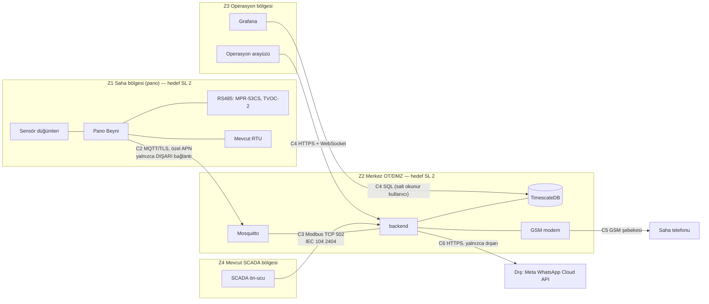

# 15 — Siber Güvenlik ve KVKK

> **Sahip:** Kişi B · **Kaynak:** rapor §7.4, §6.6c · **Kod:** `backend/app/scada/`, `backend/app/ingest.py`, `backend/app/notify/`, `deploy/`
> Durum etiketleri `docs/07b` ile aynıdır: ✅ uygulandı (testiyle) · 🟡 kısmen · 📐 tasarım (Kişi A/C) · 🧭 yol haritası ·
> ⚠️ **demo yığınında bilinçli olarak yok** (üretimde zorunlu).
>
> Bu belge hukuki görüş değildir. KVKK değerlendirmesini şirketin KVKK birimi yapar; tasarım yalnızca veri minimizasyonu, amaçla
> sınırlılık ve saklama sınırlaması ilkelerine göre kuruldu.

## 1. Neyi koruyoruz?

| Varlık | Neden kritik | En kötü senaryo |
|---|---|---|
| **Koruma devresi (ABB TVOC-2)** | Ark korumasıdır; yanlış bir yazma pano koruması olmadan çalışır demektir | Uzaktan reset/diagnostik komutu → koruma devre dışı (FMEA #11) |
| **Alarm bütünlüğü** | Operatör alarma güvenmezse sistem işe yaramaz | Sahte "normal" veri gerçek arızayı gizler; sahte alarm seli operatörü körleştirir |
| **Bildirim erişilebilirliği** | P1'de telefon çalmalı | Merkez veya kanal düşer, kimse haberdar olmaz (FMEA #5, Y7) |
| **Kişisel veri** | Saha ekibinin telefon numaraları, onaylayan kişi | Numara listesinin sızması; yurt dışına kontrolsüz aktarım |
| **SCADA ağı** | Mevcut dağıtım işletmesi | Bizim bileşenimiz OT ağına giriş kapısı olur |

## 2. IEC 62443 bölgeler ve iletkenler

| İletken | Protokol | Kontroller | Durum |
|---|---|---|---|
| C1 sensör → Pano Beyni | IEEE 802.15.4 | Bağlantı katmanı AES-CCM, cihaz eşleme | 📐 (A/C) |
| C2 Pano Beyni → broker | MQTT | Cihaz sertifikasıyla **mTLS**, cihaz başına topic ACL (`gridup/pano/<kendi-id>/#`), özel APN/VPN, sahada **gelen port yok** | ✅ **mtls profilinde ölçüldü** (18 Eylül, F-27; §5.1) · ⚠️ **varsayılan demo yolunda yok**: broker düz **1883 ve anonim** · 📐 özel APN/VPN |
| C2 merkez → Pano Beyni komutu | MQTT `cmd` | Yalnızca bakım modu ve test alarmı; koruma cihazına komut yolu yok; kopukken kuyruğa alınmaz | ✅ `test_mqtt_subscriber`, `test_scada_gateway` |
| C3 SCADA → backend | Modbus TCP | İzinli ağ listesi, bağlantı sınırı, boşta zaman aşımı, varsayılan salt okunur, şifreli ve bağlantıya bağlı komut kilidi, 3 yanlış şifrede IP kilidi, **koruma cihazı aynasına yazma şifreyle bile yok** | ✅ `test_modbus_tcp`, `test_scada_gateway` (mutasyon 35/35 + 19/19) |
| C3 SCADA → backend | IEC 60870-5-104 | İzinli ağ listesi, en çok 8 bağlantı, **salt okunur** (tüm kontrol komutları COT 44 ile reddedilir ve sayılır), protokol ihlalinde ve t1 onay zaman aşımında bağlantı kapatılır, saat senkronu sistem saatini değiştirmez | ✅ `test_iec104_server` (mutasyon 37/37), 13 Eylül canlı |
| C4 arayüz → backend | HTTP + WebSocket | TLS, kurumsal kimlik (OIDC/SSO), rol (izleyici / operatör / mühendis), CORS | ⚠️ demo'da **kimlik doğrulama yok**, `by` alanı serbest metin · 🧭 |
| C5 backend → modem | AT komutları (seri / ser2net) | Terminal sunucusu yalnızca merkez OT ağında; gelen SMS'ten yalnızca kayıtlı numaraların onayı | ✅ `test_notifier::test_reply_from_an_unregistered_number_is_ignored` |
| C6 backend → Meta | HTTPS | Yalnızca dışarı; mesajda yalnızca saha kodu + öncelik + tek satır + iç portal bağlantısı; kanal kapatılabilir | ✅ `test_templates`, `test_whatsapp` |
| C7 Pano Beyni → TVOC-2 | Modbus RTU | FC06/16'yı firmware'de filtreleme (harita `access: read_only`) | 📐 (A) |

## 3. Kontroller — ayrıntı ve durum

### 3.1 Girdi doğrulama (sahte veya bozuk veri)

| Kontrol | Durum | Kanıt |
|---|---|---|
| Her mesaj `contracts/mqtt-telemetry.schema.json`'a göre doğrulanır; uymayan **düşürülmez, karantinaya** nedeniyle yazılır (sahte yük görünür olur) | ✅ | `test_ingest::test_schema_violation_is_quarantined_not_dropped` |
| Topic'teki pano kimliği ile yükteki kimlik aynı olmalı (başka panonun adına yayın reddedilir) | ✅ | `test_ingest::test_payload_pano_id_must_match_topic` |
| Mesaj boyutu sınırı 64 KB; JSON'da `NaN`/`Infinity` ve metinde NUL karakteri reddedilir | ✅ | `test_ingest` |
| Veri hatalı tek mesaj partiyi durduramaz | ✅ | `test_ingest::test_data_error_is_isolated_to_the_offending_message` |
| Topic ACL ile bir cihazın yalnızca kendi topic'ine yazabilmesi (yukarıdaki kontrolün broker tarafı) | ✅ (18 Eylül, F-27) · ⚠️ varsayılan demo yolunda yok | `deploy/mosquitto.acl`; **canlı ölçüm** `scripts/mtls_yetki_testi.py` → §5.1. Kural **kalıptır** (`pattern write gridup/pano/%u/tel`): filoya pano eklemek ACL dosyasını değiştirmez, `test_mqtt_acl.py::test_yeni_pano_eklemek_acl_dosyasini_degistirmez` bunu kilitler |

### 3.2 Modbus (rapor §7.4: "Modbus güvensizdir")

Modbus'ta kimlik doğrulama yoktur; bu yüzden kontrol **ağ ve ağ geçidi** katmanındadır. Merkezdeki ağ geçidi:

1. İzinli ağlar dışından gelen bağlantıyı kabul eder etmez kapatır (`MODBUS_ALLOWED_CLIENTS`; sahada SCADA ön-ucunun /32 adresi).
2. `MODBUS_WRITE_PASSWORD` tanımlı değilse **hiçbir yazmayı** kabul etmez.
3. Yazmayı yalnızca komut bloğunda (900–909) kabul eder; TVOC-2 aynası dahil diğer adreslere yazma **doğru şifreyle bile** 0x02 döner.
4. Şifre bir **TCP bağlantısının** kilidini 60 s açar; başka bağlantı ayrıca şifre yazmalıdır. Aynı IP'den 3 yanlış şifre o IP'nin yazmasını
   5 dk kilitler (16 bitlik şifre kaba kuvvete tek başına dayanmaz; ağ listesi ile birlikte anlamlıdır).
5. Her komutu (onay, mandal sıfırlama, bakım modu, test alarmı) istemci IP'si ve birimle kaydeder; onaylar alarm denetim izine
   `SCADA Modbus <ip> (birim N)` olarak düşer.

Kanıt: 13 Eylül canlı yığında TVOC-2 aynasına geçici şifreyle yazma **0x02**, yanlış şifre 0x03, kilidi açılmamış komut 0x01 döndü
(docs/03 §14). Seçilen Modbus sunucusu kütüphanesinin bağlantı başına port sızdırdığı ölçüldü ve kullanılmadı (docs/07b Y2).

### 3.3 Kimlik, yetki ve denetim izi

| Kontrol | Durum | Not |
|---|---|---|
| Alarm onayı, rafa alma, eskalasyon, bildirim: **kim, ne zaman, ne yaptı, not/gerekçe** → `alarm_journal` | ✅ | `test_alarm_store` |
| **Denetim izinde kurcalama kanıtı** (hash zinciri, F-20) | ✅ (18 Eylül) | Her satır bir öncekinin özetini içine alarak özetlenir (`backend/app/journal_chain.py`; göç `deploy/initdb/007_journal_chain.sql`). Bağımsız doğrulayıcı `scripts/verify_journal.py` backend'i çalıştırmaz, yalnızca DB okur. **Ölçüldü (gerçek TimescaleDB):** bir satırın `by_user` alanı psql ile değiştirilince doğrulayıcı **2. halkada** durup `saglam: 1 halka` diyor; aradan bir satır silinince **silinenin ardındaki** halkada durup `SILINMIS` diyor; çıkış kodu 1. Testler: `test_journal_chain.py` (18) + `test_verify_journal.py` (7). **Kapsamadığı iki şey — yazılı ve testle kilitli:** (a) *kuyruk kesme* görülemez (son satırlar silinirse kalan zincir kendi içinde tutarlıdır; zincir başını dışarıya yayınlamak gerekir, **yapılmadı**); (b) özet **anahtarsızdır** (HMAC değil), yazma yetkisi olan biri zinciri baştan hesaplayabilir. Göç öncesi satırların hash'i NULL ve bilerek üretilmedi |
| Her bildirim denemesi, kanal, **maskeli** alıcı, sonuç → `notifications` | ✅ | `test_notifier` |
| SMS onayı yalnızca kayıtlı numaralardan; onaylayan `sms:+90******0001` | ✅ | `test_notifier::test_reply_from_an_unregistered_number_is_ignored` |
| Rafa alma gerekçesi zorunlu, süresi sınırlı (≤ 480 dk), P1 rafa alınamaz | ✅ | `test_alarm_manager`, `test_api_alarms` |
| REST API kimlik doğrulaması ve rol | 🟡 **kısmen** (18 Eylül, F-19) | **Onaylayanın kimliği artık istemciden gelmiyor**: `by` alanı gövdeden kaldırıldı (`openapi` v1.2.0) ve doğrulanmış `Authorization: Bearer` başlığından türer (`backend/app/auth.py`). Roller izleyici < operator < muhendis. **Kurumsal SSO/OIDC DEĞİLDİR**: belirteçler yapılandırmada duran paylaşılan sırlardır; parola, oturum süresi, yenileme, iptal listesi yok. Yalnızca yazma uçlarını korur. `GRIDUP_OPERATORS` boşsa kimlik doğrulama **kapalıdır** ve bu `GET /health` `auth.enabled` alanında görünür | `test_auth.py` (23 test); kilit: `test_body_by_is_ignored_and_journal_gets_the_token_identity` |
| Modbus komutlarının veritabanına yazılması | 🟡 | Onay DB'de; bakım modu ve test alarmı yalnızca kayıtta (log) |
| Grafana | ⚠️ | İç ağda anonim **izleyici**; düzenleme ve veri kaynağı yönetimi kapalı değil (demo). Üretimde SSO + salt okunur DB kullanıcısı |

### 3.4 Sırlar ve yapılandırma

| Kontrol | Durum | Kanıt |
|---|---|---|
| Token, şifre ve telefon numaraları yalnızca `deploy/.env`'de; `.env` git dışı (GK9) | ✅ | `.gitignore` |
| 13 Eylül git geçmişi taraması: Meta erişim anahtarı (`EAA…`) izi **0**; commit edilmiş `.env` **yok**; atanmış şifre/anahtar satırı **yok** | ✅ | `git log -p --all` taraması |
| Aynı taramada test fikstürlerinde demo serisi dışında iki numara bulundu (`test_notifier.py`); demo serisine (`+90555000000x`) çekildi. Geçmişte duruyorlar: repo public olacaksa temiz repo açılır (PLAN.md §12.1) | ✅ | bu commit |
| SMS kaydı (`deploy/runtime/sms-log.txt`) PDU içinde numara taşır → git dışı; kayıtta numara maskeli | ✅ | docs/06 §6 |
| Bozuk sözleşme veya birim eşlemesi servisi başlatmaz (yanlış eşikle çalışmaz) | ✅ | `test_scada_app::test_invalid_unit_map_fails_at_startup` |
| İmaj ve bağımlılık sabitleme | 🟡 | Python bağımlılıkları küçük sürüm düzeyinde sabit; `timescale/timescaledb:latest-pg16` etiketi **sabit değil** → 🧭 özet (digest) ile sabitlenecek |

### 3.5 Cihaz güvenliği (kenar)

📐 Kişi A/C kulvarında: güvenli eleman (secure element) ile cihaz kimliği, secure boot, imzalı OTA ve A/B bölümlü geri dönüş, debug
portunun üretimde kapatılması, RS485'te koruma cihazına yazma filtresi. Merkez bu kontrollerin **tamamlayıcısıdır**: kenar
ele geçirilse bile kendi topic'i dışına yazamaz (ACL — **mtls profilinde ✅ ölçüldü**, varsayılan demo yolunda ⚠️ yok; §5.1),
sözleşme dışı veri karantinaya düşer (✅) ve merkez hiçbir yoldan koruma cihazına komut göndermez (✅).

**Sertifikanın nereden geldiği hâlâ 📐'dir ve bu fark önemlidir.** F-27 sertifikaları `scripts/sertifika-uret.sh` ile **elle**
üretir; anahtar dosya sisteminde düz durur, BOM'daki güvenli elemana (ATECC608A) **hiçbir akış bağlanmaz**. Yani doğrulanan şey
cihazın kendisi değil, **bizim ürettiğimiz bir addır**. Donanıma bağlı cihaz kimliği F-28'in konusudur — aşağıda.

## 4. KVKK (6698 sayılı Kanun)

### 4.1 Kişisel veri envanteri

| Veri | Kimin | Nerede | Neden | Minimizasyon |
|---|---|---|---|---|
| Telefon numarası (saha ekibi, üst amir) | Çalışan | `deploy/.env` (yapılandırma); veritabanında **maskeli** | Alarm bildirimi, eskalasyon, SMS onayı | Denetim izinde ve kayıtta `+90******0001`; SMS kaydı git dışı |
| Onaylayan / rafa alan kişi (`acked_by`, `by_user`) | Çalışan | `alarms`, `alarm_journal` | Denetim izi (kim onayladı) | Yalnızca kullanıcı adı veya maskeli numara |
| SMS yanıtı gönderen numara | Çalışan | Yalnızca bellekte eşleşme; denetim izinde maskeli | Onayın kimden geldiği | Kayıtlı olmayan numaranın yanıtı işlenmez |
| Pano telemetrisi | — | `telemetry` | Arıza tespiti | Trafo merkezi ölçeğinde, yüzlerce abonenin toplam yükü; tekil aboneye ait tüketim verisi toplanmaz |
| Pano konumu | Şirket varlığı | `panels` | Harita, saha ekibi yönlendirme | Kişisel veri değil |

### 4.2 Yurt dışına aktarım — WhatsApp

WhatsApp Cloud API Meta'nın bulutudur. Mesajın içeriği kişisel veri taşımasa da (saha kodu, öncelik, tek satır, iç portal
bağlantısı), **alıcının telefon numarası Meta'ya iletilir**: bu bir yurt dışına aktarımdır. Bu yüzden:

- **SMS birincil kanaldır** ve tamamen yurt içindedir (operatör şebekesi).
- WhatsApp **ikincil ve kapatılabilir** bir kanaldır (`WHATSAPP_TOKEN` boş = kapalı). Açılması şirketin KVKK birimi kararına bağlıdır
  (KVKK md. 9 kapsamındaki aktarım araçları ve çalışan bilgilendirmesi).
- WhatsApp alıcı listesi SMS listesinden **ayrıdır** (`WHATSAPP_RECIPIENTS`): yalnızca bu kanala açıkça dahil edilen numaralar.

### 4.3 Saklama ve güvenlik tedbirleri

| Tedbir | Durum |
|---|---|
| Alarm ve bildirim denetim izi için saklama süresi ve süre sonunda anonimleştirme | 🧭 (öneri: 2 yıl, sonra kişi alanları silinir) |
| Telemetri saklama (ham 90 gün → 1 dk özet 2 yıl) | 🧭 politika docs/09 §5'te hesaplandı |
| Veritabanı diskinin şifrelenmesi, yedeklerin şifrelenmesi | 🧭 |
| Aktarımda şifreleme (MQTT/TLS, HTTPS) | 📐 · ⚠️ demo'da yok — **bu tedbirin durumu F-27 ile DEĞİŞMEDİ**; gerekçesi aşağıdaki dipnotta |
| Kişisel veriye erişimin kaydı (kim, hangi numarayı gördü) | 🧭 — numara zaten veritabanında maskeli olduğu için erişim yalnızca `.env`'e erişimle mümkün |

> **"Aktarımda şifreleme" satırı neden ✅ olmadı?** F-27 MQTT telemetrisini şifreler, ama §4.1'e göre **pano telemetrisi kişisel
> veri taşımaz**. Kişisel veri taşıyan kanallar REST/WS (`acked_by`, `by_user`), bildirim (telefon numarası) ve denetim izidir;
> bunların üçü de her iki kipte de **düz metindir**. Bu hücreye ✅ yazmak, KVKK bağlamında yapılmamış bir işi yapılmış göstermek
> olurdu. Tedbirin kapsamı daraldı, durumu değişmedi.

## 5. Demo yığını ile üretim arasındaki farklar

Jüri bu soruyu soracak; cevabımız bu tablodur. **Varsayılan demo yolu** bilinçli olarak tek makinede, internet olmadan ve
**sertifika gerektirmeden** çalışacak şekilde sadeleştirildi (GK4). Sadeleştirmelerin hiçbiri koddaki kontrolleri kapatmaz;
eksik olan altyapıdır.

18 Eylül'de (F-27) MQTT tarafı için **ayrı bir compose profili** eklendi: `--profile mtls`. Varsayılan `docker compose up -d`
onu **başlatmaz** ve varsayılan yol bit düzeyinde aynı kaldı. Bu yüzden MQTT satırı artık iki değil **üç** değerlidir.

| Konu | Varsayılan demo yolu | `--profile mtls` (F-27) | Üretim |
|---|---|---|---|
| MQTT | 1883, anonim | **8883, mTLS, cihaz başına topic ACL — ölçüldü (§5.1)**; sertifikalar elle üretilir, **iptal (CRL/OCSP) ve şifre takımı politikası yok** | Aynısı + sertifika **güvenli elemandan** (IDevID/LDevID), kayıt/yenileme/iptal işletimi, şifre takımı politikası — **F-28** |
| REST/WS API | HTTP (**TLS yok**); yazma uçlarında operatör belirteci ve rol **var**, okuma uçları ve WS akışı açık | **F-27 kapsamı dışı — aynen HTTP** | HTTPS, kurumsal OIDC/SSO, okuma uçlarında da yetki, belirteç yaşam döngüsü (süre, yenileme, iptal) |
| Grafana | Anonim izleyici | değişmedi | SSO, salt okunur veritabanı kullanıcısı |
| Modbus TCP | Özel ağların tamamı izinli, salt okunur | **F-27 kapsamı dışı — düz TCP 502** | SCADA ön-ucunun /32 adresi; komut gerekiyorsa uzun rastgele şifre + ayrı VLAN |
| IEC 60870-5-104 | Özel ağların tamamı izinli, düz TCP 2404, salt okunur | **F-27 kapsamı dışı — düz TCP 2404** | SCADA ön-ucunun /32 adresi; ön-uç destekliyorsa IEC 62351-3 (TLS), desteklemiyorsa ayrı VLAN / VPN |
| Veritabanı şifresi | `gridup` (varsayılan) | değişmedi | Sır yöneticisinden, rotasyonlu |
| İmajlar | `latest-pg16` etiketi | değişmedi | Özet (digest) ile sabit, imaj taraması |
| Sırlar | `deploy/.env` | + `deploy/certs/` (git dışı, `deploy/certs/.gitignore`) | Sır yöneticisi (Vault vb.); anahtar güvenli elemanda |

### 5.1 F-27 — MQTT taşımasında mTLS ve cihaz başına topic yetkisi (18 Eylül, ölçüldü)

**Ne yapıldı.** Ayrı bir compose profili (`--profile mtls`) 8883'te ikinci bir broker kaldırır: TLS zorunlu, istemci sertifikası
zorunlu (`require_certificate`), anonim erişim kapalı. Broker kullanıcı adını **CONNECT paketinden almaz**, istemci sertifikasının
CN alanından türetir (`use_identity_as_username`) ve topic yetkisini `deploy/mosquitto.acl` içindeki kalıplara bağlar. Merkezin
MQTT istemcisi (`backend/app/ingest.py`) artık `MQTT_TLS_CA/_CERT/_KEY` verildiğinde mTLS konuşur; üçü de boşsa TLS **kapalıdır**
ve bu `GET /health` → `mqtt_tls` alanında **görünür** (F-19'daki `auth.enabled` refleksinin aynısı).

**Varsayılan demo yolunun davranışı değişmedi — ve bu ölçüldü, iddia edilmedi.** `deploy/mosquitto.conf` yalnızca başlık
yorumunda değişti; `sim/`, `contracts/` ve `backend/app/scada/` hiç değişmedi. `deploy/compose.yaml`'ın `backend` servis
**tanımı değişti**: üç boş varsayılanlı TLS değişkeni (`${MQTT_TLS_CA:-}` vb.) ve `./certs/backend:/certs:ro` bağlaması
eklendi, `MQTT_HOST`/`MQTT_PORT` sabit değerden varsayılanlı interpolasyona geçti. Üçünün de boş/varsayılan hâlinde
davranış aynıdır ve bu ölçüldü (sertifika dizini yokken bile `/health` → `mqtt: true, mqtt_tls: false`, duman testi
26/0/1; mTLS kipinde 31/0/0). **Bir uyarı buradan doğuyor ve `deploy/.env.example`'da yazılı:** `MQTT_HOST` artık kabuktan ezilebilir, yani
ortamında `MQTT_HOST` ihraç edilmiş bir makinede bayraksız `up` başka bir broker'a bağlanır. `compose.mtls.yaml` başka
hiçbir servise yama yazmaz ve varsayılan profildeki hiçbir servis ona `depends_on` ile bağlanmaz (bağlansaydı profil
kapalıyken **bütün** compose komutları çalışmazdı — ölçüldü).

**Kabul ölçütü ve ölçüm.** Backlog'un istediği kanıt tek cümledir: *"bir panonun sertifikasıyla başka bir panonun topic'ine
yayın denemesinin broker tarafından reddedilmesi."* `scripts/mtls_yetki_testi.py` bunu **dört sinyalle** ölçer ve herhangi
ikisi ayrışırsa kırmızı döner: PUBACK reason code, abonenin mesajı almaması, broker logundaki `Denied PUBLISH` satırı ve
broker imajının **kendi** `mosquitto_pub` aracıyla alınan ikinci PUBACK. **Bağımsızlık derecesi abartılmamalı:** PUBACK ile
log satırı aynı yetki denetiminin iki farklı çıktı kanalıdır (aynı süreç, aynı karar), dolayısıyla birbirlerini bağımsız
teyit etmezler; gerçekten farklı bir şey ölçen ikisi teslim edilmemesi ve paho dışı ikinci istemcidir. Aşağıdaki sayılar 18 Eylül'de `eclipse-mosquitto:2.0@sha256:212f89e1…`, **mosquitto 2.0.22**,
**TLS 1.3**, paho-mqtt 2.1.0 ile alındı:

| # | Vaka | Beklenen | PUBACK reason code | Aboneye ulaştı mı | Broker logu | Karar |
|---|---|---|---|---|---|---|
| 1 | **Pozitif kontrol** — ADM-00001 kendi telemetrisine yayınlar | izin | 0 | **evet** | — | geçti |
| 2 | **KABUL ÖLÇÜTÜ** — ADM-00001, ADM-00002'nin telemetrisine yayınlar | ret | **135 "Not authorized"** | **hayır** | `Denied PUBLISH` | geçti |
| 3 | **Kontrol grubu** — aynı topic'e sahibi (ADM-00002) yayınlar | izin | 0 | **evet** | — | geçti |
| 4 | ADM-00001 kendi komut topic'ine yazar | ret | 135 | hayır | `Denied PUBLISH` | geçti |
| 5 | Merkez pano telemetrisine yazar | ret | 135 | hayır | `Denied PUBLISH` | geçti |
| 6 | Merkez komut yazar | izin | 0 | evet | — | geçti |
| 7 | Merkez kendi adına telemetri yazar (ACL'deki `deny` satırı) | ret | 135 | hayır | `Denied PUBLISH` | geçti |

Bağlantı katmanı: **sertifikasız** bağlantı reddedildi; **yabancı bir CA'nın imzaladığı** `CN=ADM-00001` sertifikası reddedildi.
Okuma yetkisi (kabul ölçütünün dışında, ayrıca ölçüldü): ADM-00001, ADM-00002'nin telemetrisine abone olabildi — mosquitto
SUBACK'te **reddetmiyor, "Granted QoS 1" dönüyor** — ama sahibi yayın yaptığında ADM-00001'e **0 mesaj teslim edildi**. Yani
okuma yetkisi abonelikte değil **teslimde** uygulanıyor; abonelik reddini SUBACK'ten okumaya güvenilemez.

**Merkez konteyneri de mTLS ile ölçüldü.** Yukarıdaki ölçüm merkezin *sınıfını* (`app.ingest.MqttSubscriber`) kullanır; ayrıca
`deploy/.env.example`'daki reçete **gerçek backend konteyneriyle** bir kez koşturuldu: `MQTT_HOST=mosquitto-mtls MQTT_PORT=8883`
+ üç sertifika yolu ile `GET /health` → `mqtt: true, mqtt_tls: true` döndü ve broker logu kimliğin **sertifikadan** türediğini
gösterdi (istemci kimliği `gridup-backend-ingest` iken kullanıcı adı `u'gridup-backend'`, yani CN). Aynı satır protokol
sürümünün değişmediğini de doğruluyor: `p2, c0` = MQTT 3.1.1 + `clean_session=False`, yani yeniden başlatmada QoS 1 kuyruğunu
koruyan davranış aynen duruyor. Bu reçetede `sim/panosim.py` düz 1883'e yayın yapmaya devam eder ve backend onu görmez —
sahada her panonun kendi sertifikası olur, simülatörde olmaz.

**Ölçümün yanlış nedenle geçmesine karşı alınanlar.** Her ret iddiasından önce aynı bağlantı üzerinden yapılan yetkili bir
yayının aboneye **ulaştığı** görülür (pozitif kontrol); reddedilen topic'in **aynısına** sahibi yayın yapar ve ulaşır (kontrol
grubu — yanlış yazılmış bir topic de "gelmedi" üretirdi); "gelmedi" kararı sabit bir `sleep` ile değil, `kendi(A) → hedef(X) →
kendi(B)` **sandviç bariyeriyle** verilir (B geldiğinde X'in hiç gelmeyeceği kesinleşir); her yük benzersiz bir nonce taşır
(önceki koşudan kalan mesaj pozitif kontrolü sahte geçiremez); istemci kimlikleri koşuya özgüdür (canlı backend'in oturumu
ele geçirilmez, broker logu başka istemciye atfedilemez). İkinci ve **paho'dan bağımsız** bir ölçüm broker imajının kendi
`mosquitto_pub -V 5` aracıyla alınır, aynı `RC:135`'i basar ve **karara girer** (yalnızca rapora değil: ilk yazımda sadece
basılıyordu, paho ile ters sonuç verse bile koşu yeşil kalırdı).

**Testin kırmızıya dönebildiği gösterildi (mutasyon koşusu).** ACL'deki `pattern write gridup/pano/%u/tel` satırı geçici olarak
`gridup/pano/+/tel` yapılıp broker'a SIGHUP gönderildiğinde **aynı yayın kabul edildi** (PUBACK 0, mesaj aboneye ulaştı); dosya
geri yüklendi ve özetle doğrulandı. Bu koşu olmadan "negatif test geçti" cümlesi hiçbir şey ifade etmezdi: ACL hiç yüklenmemiş
olsaydı da bütün negatifler geçerdi.

**`scripts/mqtt_acl.py` bir broker değildir.** O modül mosquitto'nun ACL semantiğinin *bizim okumamızdır* ve tek başına bu
maddenin kanıtı **sayılmaz**; görevi canlı ölçümün "beklenen" sütununu üretmektir. İki sütun ayrışırsa koşu kırmızı döner ve
düzeltilecek olan modüldür. Birim testleri (`test_mqtt_acl.py`, 56 test) yalnızca okumanın kendi içinde tutarlı olduğunu ve
`deploy/mosquitto.acl`'in bozulmadığını kilitler.

**Standart izi — ne diyoruz, ne demiyoruz.** Güç sistemi protokolleri için TLS profili **IEC 62351-3**'ün konusudur. Bu
standardın metnine **erişilmedi** (GK10); bu yüzden madde/tablo numarası verilmiyor, birebir alıntı yapılmıyor ve **uygunluk
iddia edilmiyor**. Yaptığımız şey, hangi işin hangi standardın konusuna denk düştüğünü göstermektir. Standardın istediklerinin
listesi elimizde olmadığı için **ne kadarının karşılandığı da ölçülemez** — "profile yaklaşıldı" gibi bir mesafe ifadesi
kurmuyoruz, çünkü okumadığımız bir metne olan mesafemizi ölçemeyiz. Uygulanmayanlar açıkça şunlardır: **şifre takımı
politikası** (hangi takımların isteneceğini gösteremeyeceğimiz için bilerek yazılmadı) ve **sertifika iptali** (CRL/OCSP).
mosquitto 2.0'da bir `crlfile` seçeneği vardır ama bu teslimde **hiç denenmedi**: iptal listesi üretilmedi ve iptal edilmiş bir
sertifikanın reddedildiği **ölçülmedi**. Mekanizmanın çalışıp çalışmadığı da, işletiminin (dağıtım, yenileme, takvim) ne
gerektirdiği de F-28'in konusudur.

**Bu ölçümün kanıtlamadığı beş şey.** (a) Pano kimliğinin taklit edilemez olduğunu: CA ve bütün özel anahtarlar aynı makinede,
`deploy/certs/` içinde düz durur; o dizini okuyan geçerli bir sertifika basar — doğrulanan şey kimlik değil, **bizim ürettiğimiz
bir addır**. (b) Sızan bir sertifikanın dışlanabileceğini: iptal yok; elde iki yol var, ACL satırını silmek (bu **yetki
kaldırmadır, iptal değildir**) ya da CA'yı ve tüm sertifikaları yenilemek (**filo çapında kesinti**). (c) Anahtarların güvenli
saklandığını: HSM/güvenli eleman yok. (d) Cihazların birbirinden yalıtıldığını: ölçüm tek süreçte bütün panoların anahtarlarını
okur; sahada her pano ayrı bir cihazdır, burada değil. (e) Ölçekte çalıştığını: GK7 ölçek kanıtı (1.000 pano) **düz 1883'te ve
paylaşılan bağlantılarla** alındı; TLS el sıkışma maliyeti **ölçülmedi** (`docs/09` §8).

**Neden Modbus TCP (502) ve IEC 60870-5-104 (2404) düz kaldı.** Teknik engel değil: iki sunucu da `asyncio.start_server`
kullanıyor, süreç-içi TLS ~45 satır. Yapılmadı, çünkü (a) karşısında TLS konuşan bir SCADA ön-ucu **yok** ve test edilmemiş bir
dinleyici bu depoda "var gibi görünme" üretir; (b) şifre takımı politikası ve iptal olmadan 62351-3 profili zaten tamamlanmaz;
(c) üç ölçülebilir gerileme getirirdi — bugün yabancı bir IP hiç kripto yapılmadan `_handle`'ın ilk satırında reddediliyor,
`ssl=` ile IP beyaz listesi **el sıkışmanın arkasına** düşerdi; el sıkışması başarısız istemci `_handle`'a hiç ulaşmadığı için
`/health`'teki `rejected_clients` sayacı sertifika reddine **kör** kalırdı; ve bozuk bir sertifika yolu `service.py`'nin
"port açılamazsa backend DURMAZ" değişmezini kırardı. Tehdit hücresel hattı geçen C2 bağlantısındadır (§2); şifreleme bütçesi
oraya harcandı. Öndeki bir TLS sonlandırıcı (stunnel/nginx-stream) ise özellikle zararlı olurdu: istemci IP'si hem denetim
izinin kendisi hem kaba kuvvet kilidinin anahtarıdır, vekil hepsini tek IP'ye indirirdi.

**Neden `sim/panosim.py` mTLS profilinde koşmuyor.** Simülatör tek bir süreçte N panonun adına yayın yapar; cihaz başına mTLS
tam da bunu yasaklar. Ona N sertifika verip "her pano kendi kimliğiyle bağlanıyor" demek, sahada olmayan bir yalıtımı
kanıtlanmış gibi gösterirdi. Bunun yerine ölçüm betiği **gerçek pano sertifikalarıyla** gerçek cihaz kimlikleri gibi bağlanır;
abone ise merkezin **kendi** `MqttSubscriber` sınıfıdır, yani merkezin mTLS kod yolu da canlı ölçüme girer. mTLS profili düz
yığını kapatmaz, yanına koşar; bu yüzden `GRIDUP_MTLS=1 bash scripts/duman-testi.sh` veri akışı kontrollerini atlamaz.

## 6. Doğrulama özeti

- Modbus ağ geçidi: 35 protokol + 60 politika + 9 uygulama testi; politika kodunda 35/35, sunucuda 19/19 mutasyon yakalandı; canlı yığında GK6
  yazma reddi gösterildi.
- Ingest girdi doğrulama: şema, topic/pano kimliği, boyut, NaN/NUL, zehirli mesaj izolasyonu testleri.
- Bildirim: kayıtsız numaranın SMS onayı yok sayılır; alıcı her kayıtta maskelidir.
- Sır taraması (13 Eylül): token 0, `.env` 0; iki fikstür numarası demo serisine çekildi.
- MQTT topic yetkisi (18 Eylül, F-27): ACL semantiği 56 birim testiyle kilitli; **canlı brokerda 7/7 yayın vakası, 2/2
  bağlantı vakası, okuma yetkisi ve mutasyon koşusu** beklendiği gibi ölçüldü (§5.1). Sızıntı koruması 12 testle kilitli
  (`test_sir_sizintisi.py`): üretilen materyalin tamamı git dışında, izlenen hiçbir dosyada PEM gövdesi yok, geçmişte de yok.
