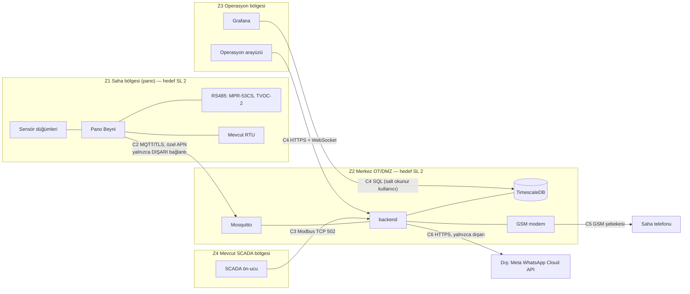

# 15 — Siber Güvenlik ve KVKK

> **Sahip:** Kişi B · **Kaynak:** rapor §7.4, §6.6c · **Kod:** `backend/app/scada/`, `backend/app/ingest.py`, `backend/app/notify/`, `deploy/`
> Durum etiketleri `docs/07b` ile aynıdır: ✅ uygulandı (testiyle) · 🟡 kısmen · 📐 tasarım (Kişi A/C) · 🧭 yol haritası ·
> ⚠️ **demo yığınında bilinçli olarak yok** (üretimde zorunlu).
>
> Bu belge hukuki görüş değildir. KVKK değerlendirmesini şirketin KVKK birimi yapar; tasarım yalnızca veri minimizasyonu, amaçla
> sınırlılık ve saklama sınırlaması ilkelerine göre kuruldu.

## 1. Neyi koruyoruz?

| Varlık | Neden kritik | En kötü senaryo |
|---|---|---|
| **Koruma devresi (ABB TVOC-2)** | Ark korumasıdır; yanlış bir yazma pano koruması olmadan çalışır demektir | Uzaktan reset/diagnostik komutu → koruma devre dışı (FMEA #11) |
| **Alarm bütünlüğü** | Operatör alarma güvenmezse sistem işe yaramaz | Sahte "normal" veri gerçek arızayı gizler; sahte alarm seli operatörü körleştirir |
| **Bildirim erişilebilirliği** | P1'de telefon çalmalı | Merkez veya kanal düşer, kimse haberdar olmaz (FMEA #5, Y7) |
| **Kişisel veri** | Saha ekibinin telefon numaraları, onaylayan kişi | Numara listesinin sızması; yurt dışına kontrolsüz aktarım |
| **SCADA ağı** | Mevcut dağıtım işletmesi | Bizim bileşenimiz OT ağına giriş kapısı olur |

## 2. IEC 62443 bölgeler ve iletkenler

| İletken | Protokol | Kontroller | Durum |
|---|---|---|---|
| C1 sensör → Pano Beyni | IEEE 802.15.4 | Bağlantı katmanı AES-CCM, cihaz eşleme | 📐 (A/C) |
| C2 Pano Beyni → broker | MQTT | Cihaz sertifikasıyla **mTLS**, cihaz başına topic ACL (`gridup/pano/<kendi-id>/#`), özel APN/VPN, sahada **gelen port yok** | 📐 · ⚠️ demo broker'ı düz **1883 ve anonim** |
| C2 merkez → Pano Beyni komutu | MQTT `cmd` | Yalnızca bakım modu ve test alarmı; koruma cihazına komut yolu yok; kopukken kuyruğa alınmaz | ✅ `test_mqtt_subscriber`, `test_scada_gateway` |
| C3 SCADA → backend | Modbus TCP | İzinli ağ listesi, bağlantı sınırı, boşta zaman aşımı, varsayılan salt okunur, şifreli ve bağlantıya bağlı komut kilidi, 3 yanlış şifrede IP kilidi, **koruma cihazı aynasına yazma şifreyle bile yok** | ✅ `test_modbus_tcp`, `test_scada_gateway` (mutasyon 35/35 + 19/19) |
| C4 arayüz → backend | HTTP + WebSocket | TLS, kurumsal kimlik (OIDC/SSO), rol (izleyici / operatör / mühendis), CORS | ⚠️ demo'da **kimlik doğrulama yok**, `by` alanı serbest metin · 🧭 |
| C5 backend → modem | AT komutları (seri / ser2net) | Terminal sunucusu yalnızca merkez OT ağında; gelen SMS'ten yalnızca kayıtlı numaraların onayı | ✅ `test_notifier::test_reply_from_an_unregistered_number_is_ignored` |
| C6 backend → Meta | HTTPS | Yalnızca dışarı; mesajda yalnızca saha kodu + öncelik + tek satır + iç portal bağlantısı; kanal kapatılabilir | ✅ `test_templates`, `test_whatsapp` |
| C7 Pano Beyni → TVOC-2 | Modbus RTU | FC06/16'yı firmware'de filtreleme (harita `access: read_only`) | 📐 (A) |

## 3. Kontroller — ayrıntı ve durum

### 3.1 Girdi doğrulama (sahte veya bozuk veri)

| Kontrol | Durum | Kanıt |
|---|---|---|
| Her mesaj `contracts/mqtt-telemetry.schema.json`'a göre doğrulanır; uymayan **düşürülmez, karantinaya** nedeniyle yazılır (sahte yük görünür olur) | ✅ | `test_ingest::test_schema_violation_is_quarantined_not_dropped` |
| Topic'teki pano kimliği ile yükteki kimlik aynı olmalı (başka panonun adına yayın reddedilir) | ✅ | `test_ingest::test_payload_pano_id_must_match_topic` |
| Mesaj boyutu sınırı 64 KB; JSON'da `NaN`/`Infinity` ve metinde NUL karakteri reddedilir | ✅ | `test_ingest` |
| Veri hatalı tek mesaj partiyi durduramaz | ✅ | `test_ingest::test_data_error_is_isolated_to_the_offending_message` |
| Topic ACL ile bir cihazın yalnızca kendi topic'ine yazabilmesi (yukarıdaki kontrolün broker tarafı) | ⚠️ · 📐 | demo broker'ında yok |

### 3.2 Modbus (rapor §7.4: "Modbus güvensizdir")

Modbus'ta kimlik doğrulama yoktur; bu yüzden kontrol **ağ ve ağ geçidi** katmanındadır. Merkezdeki ağ geçidi:

1. İzinli ağlar dışından gelen bağlantıyı kabul eder etmez kapatır (`MODBUS_ALLOWED_CLIENTS`; sahada SCADA ön-ucunun /32 adresi).
2. `MODBUS_WRITE_PASSWORD` tanımlı değilse **hiçbir yazmayı** kabul etmez.
3. Yazmayı yalnızca komut bloğunda (900–909) kabul eder; TVOC-2 aynası dahil diğer adreslere yazma **doğru şifreyle bile** 0x02 döner.
4. Şifre bir **TCP bağlantısının** kilidini 60 s açar; başka bağlantı ayrıca şifre yazmalıdır. Aynı IP'den 3 yanlış şifre o IP'nin yazmasını
   5 dk kilitler (16 bitlik şifre kaba kuvvete tek başına dayanmaz; ağ listesi ile birlikte anlamlıdır).
5. Her komutu (onay, mandal sıfırlama, bakım modu, test alarmı) istemci IP'si ve birimle kaydeder; onaylar alarm denetim izine
   `SCADA Modbus <ip> (birim N)` olarak düşer.

Kanıt: 13 Eylül canlı yığında TVOC-2 aynasına geçici şifreyle yazma **0x02**, yanlış şifre 0x03, kilidi açılmamış komut 0x01 döndü
(docs/03 §14). Seçilen Modbus sunucusu kütüphanesinin bağlantı başına port sızdırdığı ölçüldü ve kullanılmadı (docs/07b Y2).

### 3.3 Kimlik, yetki ve denetim izi

| Kontrol | Durum | Not |
|---|---|---|
| Alarm onayı, rafa alma, eskalasyon, bildirim: **kim, ne zaman, ne yaptı, not/gerekçe** → `alarm_journal` | ✅ | `test_alarm_store` |
| Her bildirim denemesi, kanal, **maskeli** alıcı, sonuç → `notifications` | ✅ | `test_notifier` |
| SMS onayı yalnızca kayıtlı numaralardan; onaylayan `sms:+90******0001` | ✅ | `test_notifier::test_reply_from_an_unregistered_number_is_ignored` |
| Rafa alma gerekçesi zorunlu, süresi sınırlı (≤ 480 dk), P1 rafa alınamaz | ✅ | `test_alarm_manager`, `test_api_alarms` |
| REST API kimlik doğrulaması ve rol | ⚠️ yok · 🧭 | Demo'da `by` alanını istemci yazar. Üretimde kurumsal SSO (OIDC); **onaylayan kimliği token'dan alınır**, istemciden değil |
| Modbus komutlarının veritabanına yazılması | 🟡 | Onay DB'de; bakım modu ve test alarmı yalnızca kayıtta (log) |
| Grafana | ⚠️ | İç ağda anonim **izleyici**; düzenleme ve veri kaynağı yönetimi kapalı değil (demo). Üretimde SSO + salt okunur DB kullanıcısı |

### 3.4 Sırlar ve yapılandırma

| Kontrol | Durum | Kanıt |
|---|---|---|
| Token, şifre ve telefon numaraları yalnızca `deploy/.env`'de; `.env` git dışı (GK9) | ✅ | `.gitignore` |
| 13 Eylül git geçmişi taraması: Meta erişim anahtarı (`EAA…`) izi **0**; commit edilmiş `.env` **yok**; atanmış şifre/anahtar satırı **yok** | ✅ | `git log -p --all` taraması |
| Aynı taramada test fikstürlerinde demo serisi dışında iki numara bulundu (`test_notifier.py`); demo serisine (`+90555000000x`) çekildi. Geçmişte duruyorlar: repo public olacaksa temiz repo açılır (PLAN.md §12.1) | ✅ | bu commit |
| SMS kaydı (`deploy/runtime/sms-log.txt`) PDU içinde numara taşır → git dışı; kayıtta numara maskeli | ✅ | docs/06 §6 |
| Bozuk sözleşme veya birim eşlemesi servisi başlatmaz (yanlış eşikle çalışmaz) | ✅ | `test_scada_app::test_invalid_unit_map_fails_at_startup` |
| İmaj ve bağımlılık sabitleme | 🟡 | Python bağımlılıkları küçük sürüm düzeyinde sabit; `timescale/timescaledb:latest-pg16` etiketi **sabit değil** → 🧭 özet (digest) ile sabitlenecek |

### 3.5 Cihaz güvenliği (kenar)

📐 Kişi A/C kulvarında: güvenli eleman (secure element) ile cihaz kimliği, secure boot, imzalı OTA ve A/B bölümlü geri dönüş, debug
portunun üretimde kapatılması, RS485'te koruma cihazına yazma filtresi. Merkez bu kontrollerin **tamamlayıcısıdır**: kenar
ele geçirilse bile kendi topic'i dışına yazamaz (ACL, 📐), sözleşme dışı veri karantinaya düşer (✅) ve merkez hiçbir yoldan koruma
cihazına komut göndermez (✅).

## 4. KVKK (6698 sayılı Kanun)

### 4.1 Kişisel veri envanteri

| Veri | Kimin | Nerede | Neden | Minimizasyon |
|---|---|---|---|---|
| Telefon numarası (saha ekibi, üst amir) | Çalışan | `deploy/.env` (yapılandırma); veritabanında **maskeli** | Alarm bildirimi, eskalasyon, SMS onayı | Denetim izinde ve kayıtta `+90******0001`; SMS kaydı git dışı |
| Onaylayan / rafa alan kişi (`acked_by`, `by_user`) | Çalışan | `alarms`, `alarm_journal` | Denetim izi (kim onayladı) | Yalnızca kullanıcı adı veya maskeli numara |
| SMS yanıtı gönderen numara | Çalışan | Yalnızca bellekte eşleşme; denetim izinde maskeli | Onayın kimden geldiği | Kayıtlı olmayan numaranın yanıtı işlenmez |
| Pano telemetrisi | — | `telemetry` | Arıza tespiti | Trafo merkezi ölçeğinde, yüzlerce abonenin toplam yükü; tekil aboneye ait tüketim verisi toplanmaz |
| Pano konumu | Şirket varlığı | `panels` | Harita, saha ekibi yönlendirme | Kişisel veri değil |

### 4.2 Yurt dışına aktarım — WhatsApp

WhatsApp Cloud API Meta'nın bulutudur. Mesajın içeriği kişisel veri taşımasa da (saha kodu, öncelik, tek satır, iç portal
bağlantısı), **alıcının telefon numarası Meta'ya iletilir**: bu bir yurt dışına aktarımdır. Bu yüzden:

- **SMS birincil kanaldır** ve tamamen yurt içindedir (operatör şebekesi).
- WhatsApp **ikincil ve kapatılabilir** bir kanaldır (`WHATSAPP_TOKEN` boş = kapalı). Açılması şirketin KVKK birimi kararına bağlıdır
  (KVKK md. 9 kapsamındaki aktarım araçları ve çalışan bilgilendirmesi).
- WhatsApp alıcı listesi SMS listesinden **ayrıdır** (`WHATSAPP_RECIPIENTS`): yalnızca bu kanala açıkça dahil edilen numaralar.

### 4.3 Saklama ve güvenlik tedbirleri

| Tedbir | Durum |
|---|---|
| Alarm ve bildirim denetim izi için saklama süresi ve süre sonunda anonimleştirme | 🧭 (öneri: 2 yıl, sonra kişi alanları silinir) |
| Telemetri saklama (ham 90 gün → 1 dk özet 2 yıl) | 🧭 politika docs/09 §5'te hesaplandı |
| Veritabanı diskinin şifrelenmesi, yedeklerin şifrelenmesi | 🧭 |
| Aktarımda şifreleme (MQTT/TLS, HTTPS) | 📐 · ⚠️ demo'da yok |
| Kişisel veriye erişimin kaydı (kim, hangi numarayı gördü) | 🧭 — numara zaten veritabanında maskeli olduğu için erişim yalnızca `.env`'e erişimle mümkün |

## 5. Demo yığını ile üretim arasındaki farklar

Jüri bu soruyu soracak; cevabımız bu tablodur. Demo **bilinçli olarak** tek makinede, internet olmadan, sertifika altyapısı kurmadan
çalışacak şekilde sadeleştirildi (GK4). Sadeleştirmelerin hiçbiri koddaki kontrolleri kapatmaz; eksik olan altyapıdır.

| Konu | Demo yığını | Üretim |
|---|---|---|
| MQTT | 1883, anonim | 8883, cihaz sertifikasıyla mTLS, cihaz başına topic ACL |
| REST/WS API | HTTP, kimlik doğrulama yok | HTTPS, OIDC/SSO, rol tabanlı yetki, onaylayan kimliği token'dan |
| Grafana | Anonim izleyici | SSO, salt okunur veritabanı kullanıcısı |
| Modbus TCP | Özel ağların tamamı izinli, salt okunur | SCADA ön-ucunun /32 adresi; komut gerekiyorsa uzun rastgele şifre + ayrı VLAN |
| Veritabanı şifresi | `gridup` (varsayılan) | Sır yöneticisinden, rotasyonlu |
| İmajlar | `latest-pg16` etiketi | Özet (digest) ile sabit, imaj taraması |
| Sırlar | `deploy/.env` | Sır yöneticisi (Vault vb.) |

## 6. Doğrulama özeti

- Modbus ağ geçidi: 35 protokol + 59 politika + 9 uygulama testi; politika kodunda 35/35, sunucuda 19/19 mutasyon yakalandı; canlı yığında GK6
  yazma reddi gösterildi.
- Ingest girdi doğrulama: şema, topic/pano kimliği, boyut, NaN/NUL, zehirli mesaj izolasyonu testleri.
- Bildirim: kayıtsız numaranın SMS onayı yok sayılır; alıcı her kayıtta maskelidir.
- Sır taraması (13 Eylül): token 0, `.env` 0; iki fikstür numarası demo serisine çekildi.
