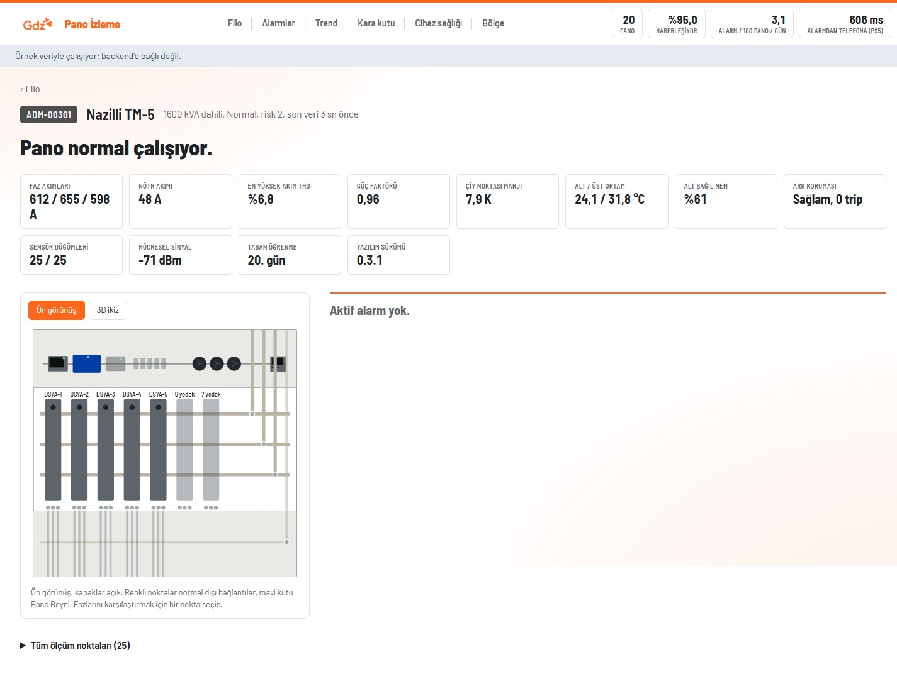
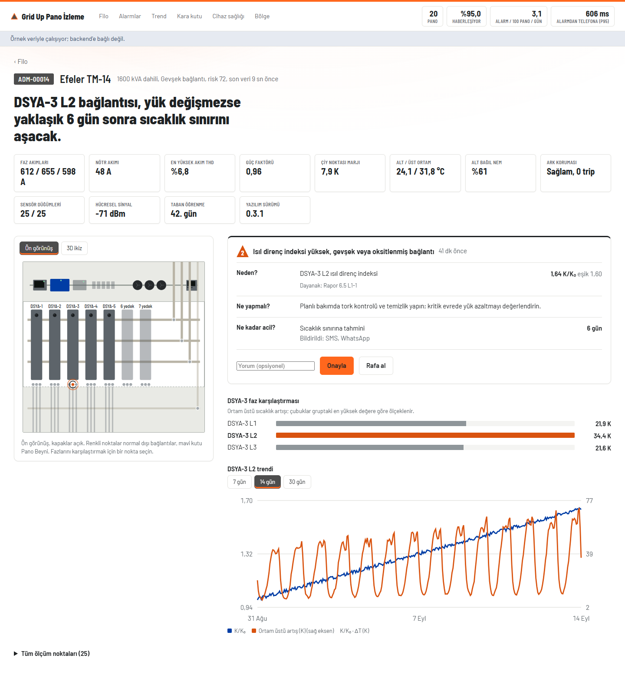
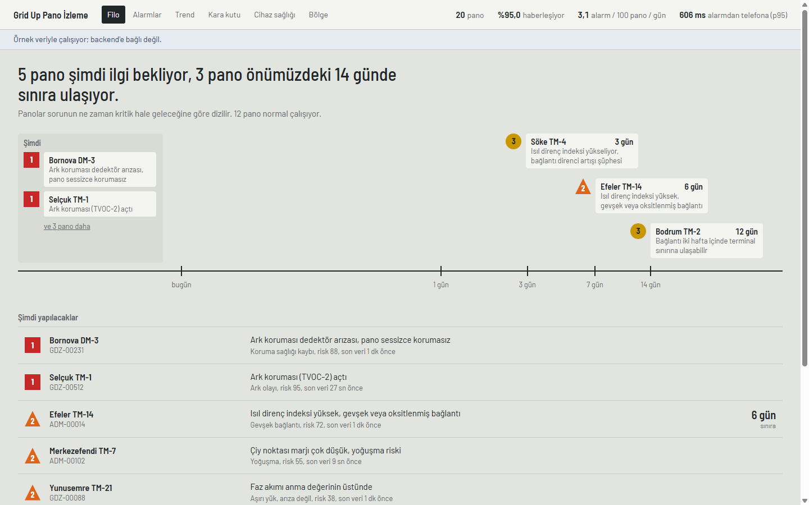
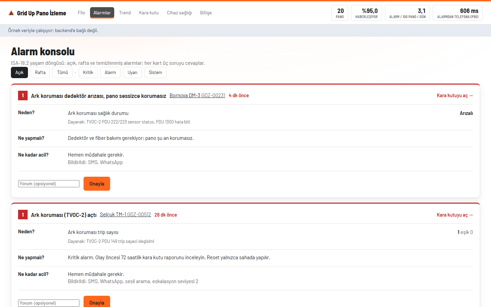
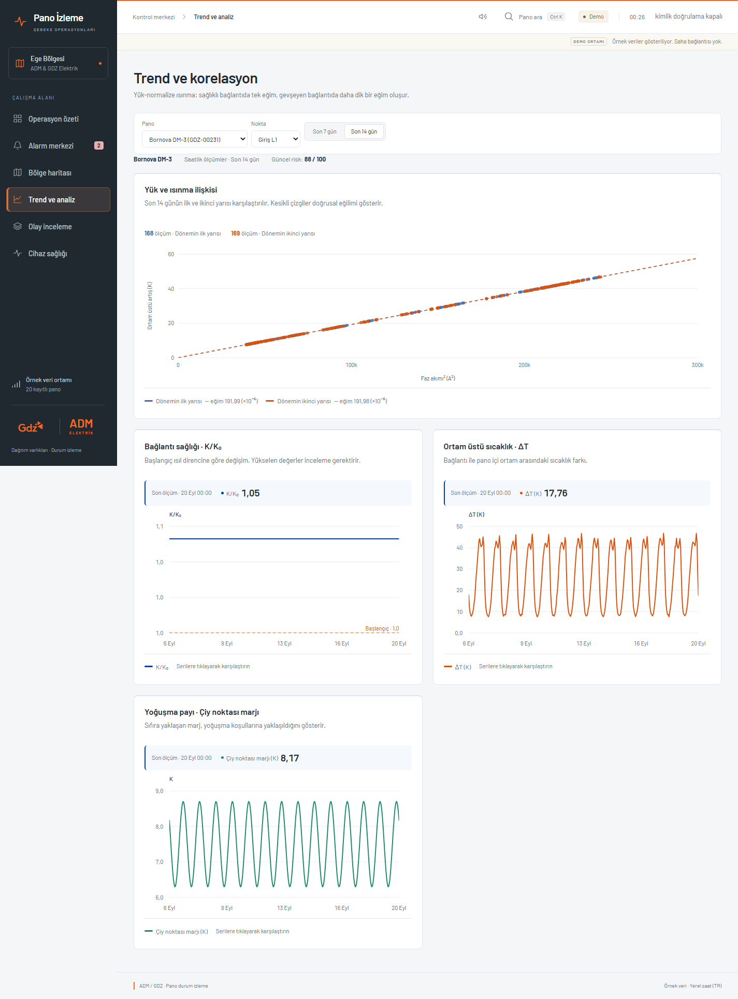
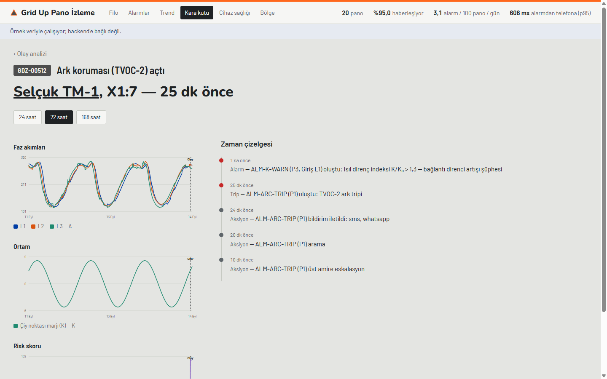
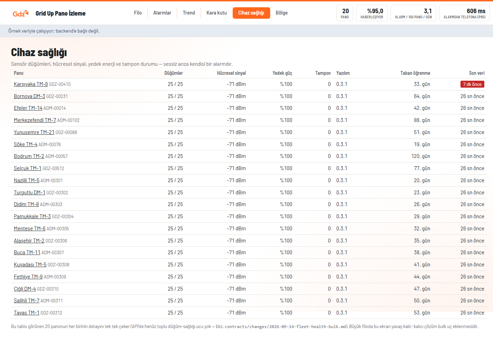
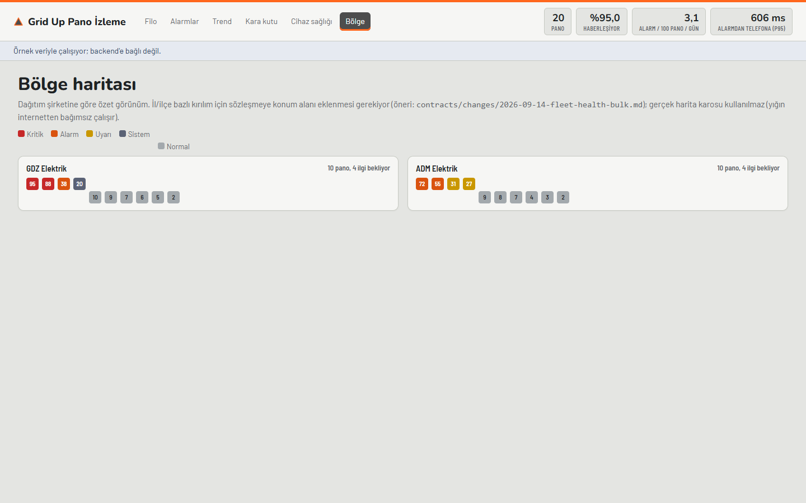

# 16 — UX Tasarımı

> **Sahip:** Kişi C · Kod: `frontend/src/`. Ekran görüntüleri: `assets/ekran/` (bkz. §5).

## 1. Tasarım yönü: "RAL 7035"

> **17 Eylül 2026 arayüz güncellemesi:** Kullanıcının yoğun kontrol merkezi kullanımına yönelik
> talebiyle nötr çalışma yüzeyleri, kompakt envanter/alarmlar ve GDZ turuncusunun küçük gezinme
> vurguları benimsendi. Aşağıdaki ilk tasarım kararları tarihsel bağlamdır; güncel uygulama ve
> araştırma [tasarım notlarında](../frontend/TASARIM-ARASTIRMASI-2026-09.md) açıklanır.
> Bölge haritasındaki il/ilçe araması, paketteki çevrimdışı sınır geometrisi ve plaka kodlarıyla
> çalışır; API sözleşmesine yeni adres alanı eklemez. Mahalle verisi bulunmadığından mahalle
> filtresi sunulmaz. İlçe adları coğrafi alanları içinde, pano noktaları ise gelen koordinatlarda
> gösterilir. Marka vurguları alarm öncelik renklerinden ayrı tutulur.

Üç yön denendi (`frontend/sketches/`, atılabilir): A) pano gövdesinin RAL 7035 açık grisi zemin
alan, ISA-101 tarzı bir kontrol odası ekranı; B) mühendislik çizim kâğıdı üzerinde canlı tek hat
şeması; C) açılışta 14 günlük "sınıra kalan süre" zaman ekseni. **A seçildi**, C'nin zaman ekseni
Filo ekranının açılış öğesi olarak entegre edildi (aşağıda §2.1).

**Gerekçe:**
- Jüride ADM/GDZ'nin saha ve SCADA ekiplerinden kişiler olması muhtemel (rapor §9). Bu kitle her
  gün bir kontrol odası ekranı kullanıyor; ISA-101/yüksek performanslı HMI dilini (gri zemin, renk
  yalnızca anormal durumda) tanıyorlar ve "bilinçli bir seçim" olduğunu anlıyorlar.
- B (tek hat şeması) yalnızca tek pano için anlamlıydı, filo görünümünü taşımıyordu.
- Renk körlüğüne karşı: öncelik her yerde **renk + şekil + karakter** ile gösterilir (`PrioMark.tsx`):
  P1 kare "1", P2 üçgen "2", P3 daire "3", SYS çerçeveli "S". Renk yalnızca normal dışı durumda
  kullanılır (bkz. `frontend/src/theme.css` token'ları).

## 2. Ekran envanteri (rapor §6.7)

| # | Ekran | Dosya | Durum |
|---|---|---|---|
| 1 | Bölge haritası | `pages/BolgeHaritasi.tsx` | Yapıldı (§3'teki kapsam notuyla) |
| 2 | Filo listesi | `pages/FiloListesi.tsx` | Yapıldı (TC1) |
| 3 | Pano detay — dijital ikiz | `pages/PanoDetay.tsx`, `components/OnGorunus.tsx` | Yapıldı (TC1+TC2: nokta trendi eklendi) |
| 4 | Alarm konsolu | `pages/AlarmKonsolu.tsx` | Yapıldı (TC2) |
| 5 | Trend & korelasyon | `pages/TrendKorelasyon.tsx` | Yapıldı (TC3) |
| 6 | Olay analizi (kara kutu) | `pages/OlayAnalizi.tsx` | Yapıldı (TC3) |
| 7 | Cihaz sağlığı | `pages/CihazSagligi.tsx` | Yapıldı (§3'teki kapsam notuyla, TC3) |
| 8 | Mobil saha (PWA) | — | **Won't** (PLAN.md MoSCoW) |
| 9 | Devreye alma sihirbazı | — | **Won't** (PLAN.md MoSCoW) |

**Kabul kriteri karşılandı:** 9 ekranın 7'si çalışıyor (PLAN.md TC3 kabul ölçütü).

## 2.1 Filo ekranı: "sınıra kalan süre" ekseni

Açılış ekranının kahramanı bir dashboard değil, bir zaman eksenidir: paneller sorunun **ne zaman**
kritikleşeceğine göre dizilir (`components/SureEkseni.tsx`). Eksen logaritmiktir (`axisFraction`,
`lib/worklist.ts`) — yakın gelecek geniş, uzak gelecek sıkışık — çünkü operatör için "6 gün" ile
"7 gün" arasındaki fark, "60 gün" ile "61 gün" arasındakinden çok daha önemlidir. Kartlar aynı
zaman diliminde çakışırsa `layoutAxisRows` satırlara dağıtır (birim testli, `worklist.test.ts`).
"Zaman ekseni / Risk matrisi" geçişiyle ikinci bir görünüm de var (`components/RiskMatrisi.tsx`,
Y3): x = sınıra kalan süre, y = API'nin `risk_score`'u — bkz. `frontend/TASARIM-REVIZYONU.md` §7.

## 2.2 Pano detay: olay modu

Bir pano'da onaylanmamış bir P1 alarmı varken ekran "olay moduna" geçer: alarm kartının üst kenarı
kırmızıya döner, geçen süre kalınlaşır, bir "Kara kutuyu aç" kısayolu belirir; diğer bölümler
(faz karşılaştırması, trend, ölçüm özeti) soluklaşır ama kaybolmaz (Y2, `PanoDetay.tsx`, `.quiet`
sınıfı). Dijital ikiz ve karar bilgisi ("Neden? Ne yapmalı? Ne kadar acil?") her zaman tam görünür
kalır — bu, operatörün konum ve eylem bilgisini kaybetmeden dikkatinin en kritik olaya yönlenmesini
sağlar.

## 3. Bilinçli kapsam sınırları (dürüstlük kuralı, Bölüm C)

Bir ekran, sözleşmede eksik bir uç yüzünden tam istenen granülerlikte değil. Bu,
`contracts/changes/2026-09-14-fleet-health-bulk.md` önerisiyle çözülebilir:

1. **Cihaz sağlığı**, toplu bir "filo sağlığı" ucu olmadığı için görünen panoları tek tek
   (sınırlı eşzamanlılıkla, 6) çeker. 20 panoda görünmez, 1.000 panoda yavaşlar; ekranın altında
   bu açıkça yazar.

**Bölge haritası** (15 Eylül güncellemesi): sözleşmede `lat`/`lon` zaten onaylı bir alan (bu,
yukarıdaki bekleyen öneriden farklı — o öneri bunun yerine/ek olarak il/ilçe eklemeyi öneriyor,
ama lat/lon'u kullanmak için o onaya gerek yok). Mock veride (`api/mock.ts`) her panonun adı
zaten gerçek bir ilçe/semt (Efeler, Bornova, Söke...) olduğundan, bu ilçelerin gerçek merkez
koordinatları dolduruldu ve panolar artık gerçek enlem/boylamına göre yerel ölçekli bir konum
grafiğine yerleştiriliyor (`pages/BolgeHaritasi.tsx`). Konum, ilçe merkezi hassasiyetindedir
(gerçek trafo GPS pini değil) — bu ekranda açıkça belirtilir. Gerçek backend'den `lat`/`lon`
gelmeyen panolar (alan opsiyonel) otomatik olarak eski dağıtım-şirketi gruplamasına düşer,
böylece olmayan veri hiçbir zaman olmuş gibi gösterilmez. Ayrıntı:
[`frontend/TASARIM-REVIZYONU.md`](../frontend/TASARIM-REVIZYONU.md) §16.

Gerçek harita karosu hiçbir ekranda kullanılmaz (GK4: yığın internetten bağımsız çalışır).

## 4. Erişilebilirlik

- Tüm etkileşimli SVG noktaları (`OnGorunus.tsx`) `role="button"`, `tabIndex`, klavye (Enter/Space)
  ile de seçilebilir; odak halkası `:focus-visible` ile görünür (tema rengi).
- Grafikler (`CizgiGrafik`, `SacilimGrafik`) `role="img"` + açıklayıcı `aria-label` taşır.
- Hareket: `prefers-reduced-motion: reduce` durumunda nokta halka animasyonu (`og-halo`, `chart`
  öğeleri) durur (`theme.css`).
- Kontrast: gövde metni `--ink` (#212629) / zemin `--bg` (#E2E4DF) ~11:1, WCAG AA'nın üstünde.
- 400 px genişlikte (cep telefonu) yatay taşma yok; tüm tablo/eksen içerikleri kendi
  `overflow-x: auto` kapsayıcısında (`tbl-wrap`).

## 5. Ekran görüntüleri

`assets/ekran/` altında, örnek veri modunda (`npm run dev:mock`) alınmış ekran görüntüleri:

| Ekran | Normal | Alarm / dolu |
|---|---|---|
| Pano detay |  |  |
| Filo listesi | — |  |
| Alarm konsolu | — |  |
| Trend & korelasyon | — |  |
| Olay analizi (kara kutu) | — |  |
| Cihaz sağlığı | — |  |
| Bölge haritası | — |  |

Filo/Alarm konsolu/Bölge gibi filo-genelindeki ekranlarda tek bir "normal" hali anlamlı değildir
(zaten yalnızca ilgi bekleyenler öne çıkar); bu yüzden yalnızca dolu (gerçek veriyle) hali verildi.

## 5.1 3D dijital ikiz ve tasarım revizyonu (14 Eylül)

Pano detay ekranında ön görünüşün yanında **3D ikiz** görünümü var (`components/Ikiz3D.tsx`,
three.js npm'den ayrı parça olarak yüklenir, CDN yok). Aynı geometri kaynağını (`lib/panelGeometry.ts`)
ve aynı API durumlarını kullanır; seçili nokta anormalse altında 14 günlük bir zaman kaydırıcı çıkar
(geçmiş K/K₀ değerini API'nin bugünkü durum rengiyle taban grisi arasında interpolasyonla gösterir).
ADM/GDZ marka analizi, dünyadaki benzer ürünlerin incelemesi ve revize görsel sistem (RAL 7035 +
ADM/GDZ turuncu-grafit-mavi paleti, Nunito başlık tipografisi): kullanıcı tarafından onaylandı ve
uygulandı — bkz. [`frontend/TASARIM-REVIZYONU.md`](../frontend/TASARIM-REVIZYONU.md) §6.

## 6. Sonraki adım

KiCad şeması gibi, "toplu cihaz sağlığı" ucu da bir sonraki iterasyonun ilk maddesidir — üç onay
alırsa Cihaz sağlığı tek bir isteğe düşer (Bölge haritası zaten §3'te anlatıldığı gibi gerçek
`lat`/`lon` kullanıyor; üç onay gelirse yalnızca ilçe merkezi yerine gerçek pano konumuna geçer).
