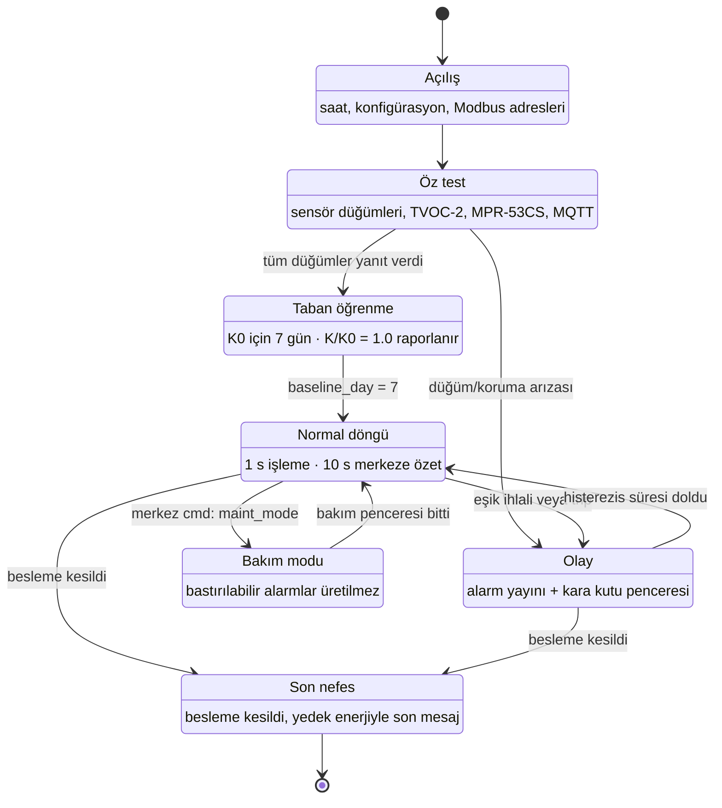
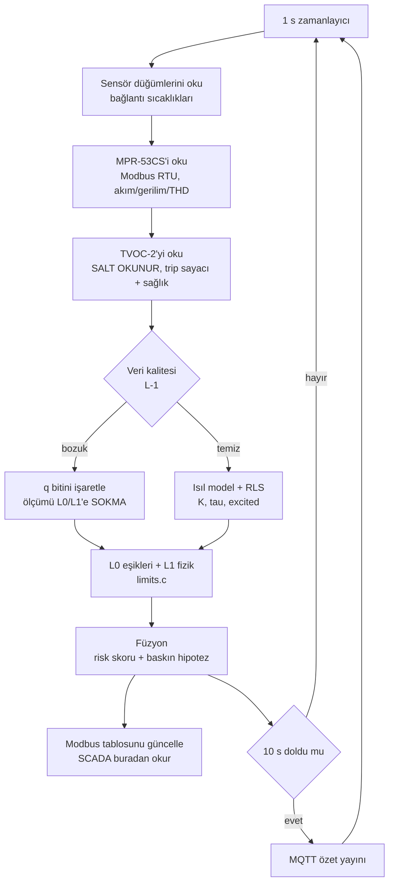
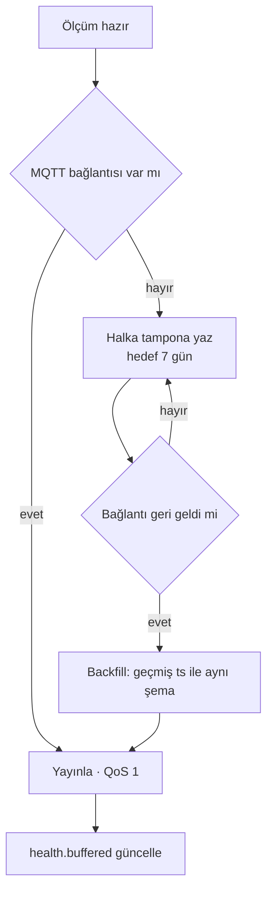
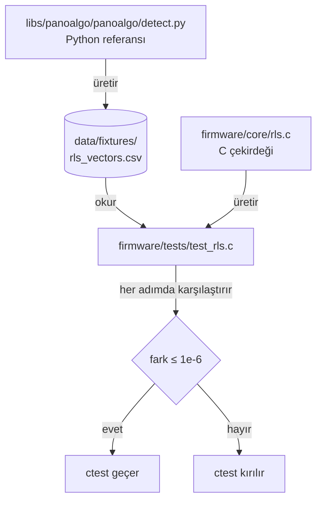

# Pano Beyni — Ana Döngü ve Durum Makinesi

**Sahip:** Kişi A · **Kod:** `firmware/core/`, `firmware/host/` · **Kapsam:** TA3 Adım 8

Bu belge firmware'in **ne zaman ne yaptığını** anlatır. Kod tarafındaki karşılıkları
dosya adlarıyla verilmiştir.

## 1. Durum makinesi



### Durumların anlamı

| Durum | Ne yapar | Telemetrideki izi |
|---|---|---|
| `BOOT` | Saat senkronu, sözleşme sabitlerinin yüklenmesi | — |
| `SELFTEST` | Her sensör düğümü, TVOC-2 ve MPR-53CS yoklanır | `health.nodes_ok` |
| `BASELINE` | K₀ öğrenilir; **K/K₀ = 1.0 raporlanır** | `health.baseline_day` 1…7 |
| `NORMAL` | Kenar 1 s işler, merkeze 10 s özet gönderir | `tel` topic'i |
| `EVENT` | Alarm kodu yayınlanır, olay penceresi saklanır | `evt` topic'i, `alarms[]` |
| `MAINT` | Bastırılabilir alarmlar üretilmez; P1 yine üretilir | `health.maint_mode` |
| `LASTGASP` | Süperkapasitör enerjisiyle son mesaj | `ALM-LASTGASP` |

**Taban öğrenme neden ayrı bir durum:** `K/K₀` ancak K₀ sabitlendikten sonra
anlamlıdır. O ana kadar oran 1.0 raporlanır — devreye alma gününde sahte alarm
yağmuru olmaz. Aynı davranış Python tarafında da vardır
(`pano_rls_k_ratio()` / `KIndexEstimator.state()`).

## 2. 1 saniyelik işleme döngüsü



**Sıranın gerekçesi:** veri kalitesi (L-1) **en başta** çalışır. Bozuk bir ölçüm
L0/L1'e girerse arıza gibi görünür. **Kapsam sınırı:** L-1 kuralları bugün yalnızca
**bağlantı sıcaklığı** (`t_c`) üstünde çalışır — donmuş değer, fiziksel olmayan hız
(`dq_max_rate_k_per_min`), ortam altı, düğüm sessiz. Verilen "İstenen Veriler.xlsx"teki
15 dakikada 438 A'lık akım sıçramaları (rapor §3.4a) **bu katmanda ayıklanmaz**; akım için
bir değişim-hızı kuralı yazılmadı. Ayrıntı ve kapatma yolu: `docs/05` §7.

**TVOC-2 salt okunurdur (GK6).** Ark korumasına yazma yapılmaz; FC06/FC16 ağ geçidinde
filtrelenir. Otomatik açma (trip) yoktur.

## 3. Haberleşme kopması ve tampon



Backfill mesajları **aynı şemayla, geçmiş `ts` ile** gelir. Merkez tarafı bunu bilir:
`panel_latest` eski `ts` ile güncellenmez ve alarm yöneticisi panonun son işlediği
`ts`'ten eski örnekleri yok sayar. Telemetri satırları yine de yazılır.

## 4. Bellek ve hesap bütçesi

Çekirdek **dinamik bellek kullanmaz**; tüm durum çağıranın verdiği yapının içindedir.

| Yapı | `double` | `float` |
|---|---:|---:|
| `pano_rls_t` (nokta başına) | 320 B | 176 B |
| 25 nokta | 8,0 KB | 4,3 KB |

> PLAN.md TA3 Adım 5 "nokta başına ~48 bayt" diyordu. Gerçek sayı daha büyük ve sebebi
> şudur: kalıcı uyarım koşulu 30 örneklik `I²` penceresi ister (`PANO_EXCITATION_WINDOW`)
> ve bu pencere tek başına 240 B (double) yer kaplar. Pencereyi kaldırıp üstel
> düzleştirmeye geçmek belleği ~80 B'ye indirirdi, **ama o zaman C ile Python farklı
> `excited` kararı verirdi** ve ortak test vektörü (`data/fixtures/rls_vectors.csv`)
> artık iki uygulamayı eşleştiremezdi. 8 KB, hedeflenen sınıftaki bir MCU için
> (128–256 KB SRAM) sorun değildir; tek algoritma iddiasının kanıtı ise vazgeçilmezdir.

`PANO_USE_FLOAT` ile tek duyarlıklı derleme mümkündür (FPU'su yalnızca `float` olan
Cortex-M4F gibi hedeflerde belirgin hız kazancı); karşılığında Python ile fark 1e-6'nın
üstüne çıkabilir. Bu bilinçli bir takastır, testte ayrı toleransla doğrulanır.

## 5. Aynı algoritma iddiasının kanıtı



**Ölçülen sonuç:** 240 adımda en büyük göreli fark **K: 1,36e-8 · τ: 1,42e-8** —
istenen eşiğin 73 katı altında. İki uygulamadan biri değişirse test kırılır.

Bu, sentetik vektör üzerindeki eşitliktir. Aynı eşitlik **gerçek üreteç verisinde**
de ölçüldü: 600 ölçüm, 25 nokta, hem Python kenar boru hattı hem `panobeyni-sim`
ikilisi — **K/K₀ farkı 0,0004**, yani register kuantizasyonunun (0,001 çözünürlük)
kendisi. Yol boyunca üç gerçek ayrışma bulundu ve kapatıldı: `lam` örnekleme
periyoduna taşınmıyordu, taban medyanı iki tarafta farklı hesaplanıyordu ve bir
örneklik kayma vardı.

### 5.1 Aynı kaynak, ikinci hedef

MCU emülasyonu (Renode/Wokwi — PLAN.md TA3 Adım 7, **Should**) bu ortamda ARM
araç zinciri bulunmadığı için yapılmadı. Taşınabilirlik iddiasının **ölçülebilir**
kısmı yine de doğrulandı: aynı kaynak ikinci bir sayı hassasiyeti hedefinde
derlenip koşuldu.

| Hedef | En büyük göreli fark | Tolerans | Sonuç |
|---|---|---|---|
| `double` (host) | K 1,36e-8 · τ 1,42e-8 | 1e-6 | geçer |
| `float` (`-DPANO_USE_FLOAT=ON`) | K 6,77e-6 · τ 6,24e-6 | 1e-4 | geçer |

`float` sürümünün farkı bir bozulma değil **bilinçli bir takastır**: FPU'su yalnızca
tek duyarlıklı olan MCU'larda (Cortex-M4F) çok daha hızlı ve küçüktür. 240 adımda
birikmiş 7e-6'lık göreli fark, `K/K₀ = 1,6` eşiğinde 1,1e-5'lik bir kaymaya karşılık
gelir — alarm kararını değiştirmesi fiziksel olarak imkânsızdır. Tolerans sessizce
gevşetilmez; ölçülen fark her koşuda ekrana basılır.

```bash
cmake -S firmware -B firmware/build-float -G Ninja -DPANO_USE_FLOAT=ON
ctest --test-dir firmware/build-float --output-on-failure
```

```bash
python -m panoalgo.vectors --out data/fixtures/rls_vectors.csv
cmake -S firmware -B firmware/build && cmake --build firmware/build
ctest --test-dir firmware/build --output-on-failure
```
