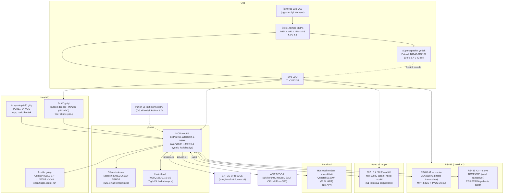

# Pano Beyni — Blok Diyagramı (v1)

> **Sahip:** Kişi C · **Durum:** taslak parça numaralarıyla, üretime hazırlanabilir seviyede.
> `docs/13-donanim-tasarimi.md`'nin kaynağıdır; I/O ayrıntısı `io-tablosu.md`'de, maliyet `bom.csv`'de.
>
> **Neden KiCad şeması yerine bu diyagram?** Bu ortamda internet erişimi ve KiCad kurulu bir makine
> yoktu; gerçek üretici sembollerini (ADM2587E, ATECC608A, …) barındıran doğrulanmış bir `.kicad_sch`
> üretmek riskli olurdu (açılmayan/bozuk sembol → "sahte şema" izlenimi, dürüstlük kuralına aykırı).
> Bu yüzden GK5'i ve "gerçek parça numarası" gereksinimini **blok diyagramı + I/O tablosu + BOM**
> üçlüsüyle karşılıyoruz — Rapor §10'un kendisinin izin verdiği asgari seviye ("en azından şema +
> blok diyagram + BOM + I/O tablosu"). KiCad dosyası ekip KiCad kurulu bir makineye geçtiğinde
> eklenecek; bu diyagramdaki bloklar ve net listesi doğrudan şemaya aktarılabilir haldedir.

## 1. Sistem blok diyagramı

## 2. Fiziksel yerleşim (kutu)

- **Kutu:** DIN raya montajlı, V-0 (UL94) polikarbonat, IP20 (dahili pano içi — şartname 2.2.1.xiii).
- **Konum:** Pano üst bölmesinde, "Modem" kutusunun yanında (şartname 2.2.8.1.iv), ana baralardan
  ≥ 250 mm (bkz. `assets/ek2-14-pano.svg`, `docs/13` manyetik alan hesabı).
- **Genişlik:** ~4 modül (72 mm) DIN ray, 90 mm derinlik.
- **Konformal kaplama:** Kart, nem ve yoğuşmaya karşı akrilik konformal kaplamalı (IPC-CC-830).

## 3. Neden bu seçimler (GK5 — geliştirme kartı değil)

| Blok | Seçim | Neden geliştirme kartı değil |
|---|---|---|
| MCU | ESP32-S3-WROOM-1 **modülü** (kart üzerine SMD lehimli) | DevKit değil, üretim modülü; RAM/Flash entegre, dış bileşen minimum |
| Radyo | Harici nRF52840 modül (ayrı, düşük güçlü 802.15.4) | Metal kabin içi kısa menzil için ESP32'nin dahili 2,4 GHz'inden daha güvenilir aynı bantta çakışma önleme |
| Güvenlik | ATECC608A donanım güvenli eleman | Cihaz kimliği + imzalı OTA (IEC 62443) |
| İzolasyon | ADM2587E (dahili izoleli DC/DC + transceiver) | RS485 hattı pano şebekesinden galvanik izole (rapor 2.4 karşılıklı zarar önleme) |

## 4. Güç bütçesi (taslak)

| Blok | Tipik akım @ 3V3/5V | Not |
|---|---|---|
| MCU (aktif, radyo TX) | 240 mA @ 3V3 | Kısa darbeler, çoğu zaman uyku modu |
| MCU (uyku) | 8 mA @ 3V3 | 1 s döngü arası |
| 2x RS485 izoleli | 2 × 45 mA @ 5V | Sorgu sırasında |
| 802.15.4 modül | 20 mA @ 3V3 (RX) / 30 mA (TX) | |
| Hücresel modem | 250 mA ort. / 2 A tepe (TX burst) | SMPS tepe akımı buna göre seçildi (IRM-10, 2 A) |
| Röle sürücüleri (2x, aktifken) | 2 × 70 mA @ 24V bobin | Yalnızca tetiklendiğinde |
| **Toplam sürekli (tipik)** | **~0,6 A @ 5V ~3 W** | Süperkapasitör kesinti sonrası ≥ 20 s "son nefes" mesajı için yeterli boyutlandırılır (bkz. `docs/13` hesabı) |

## 5. Değişiklik günlüğü

- **v1 (14 Eylül 2026):** İlk taslak, TC2 Adım 3 kapsamında.
