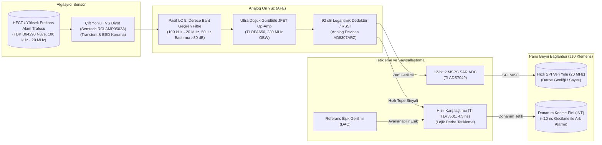

# Kısmi Deşarj (PD) Kartı Sistem Blok Diyagramı

**Sahip:** Kişi C · **Modül:** Yüksek Hızlı Analog Ön Yüz (AFE) ve Kısmi Deşarj Dedektörü

---

## Modülün Çalışma Evreleri

1. **Darbe Tespiti:** Yalıtım çatlağından atlayan mikro-ark akımı (1 ns .. 50 ns genişliğinde) HFCT üzerinden geçer.
2. **Gürültü Ayıklama:** 50 Hz şebeke frekansı ve tristör anahtarlama harmonikleri (0 .. 50 kHz) 5. derece LC Chebyshev filtre ile 80 dB'den fazla sönümlenir.
3. **Logaritmik Sıkıştırma:** Sinyal genliği çok geniş dinamik aralığa sahip olduğu için (10 pC .. 10.000 pC arası), AD8307 logaritmik yükselteç ile $V_{\text{out}} = 25\text{ mV/dB}$ formatında zarfa dönüştürülür.
4. **Hızlı Alarm İletimi:** Önceden kalibre edilmiş pikovolt/pikoCoulomb seviyesini aşan bir olayda TLV3501 karşılaştırıcısı mikrosaniyeden kısa sürede Pano Beyni'nin harici kesme pinini tetikler.
